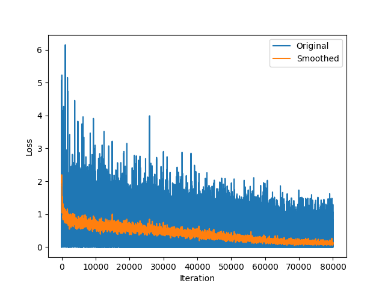
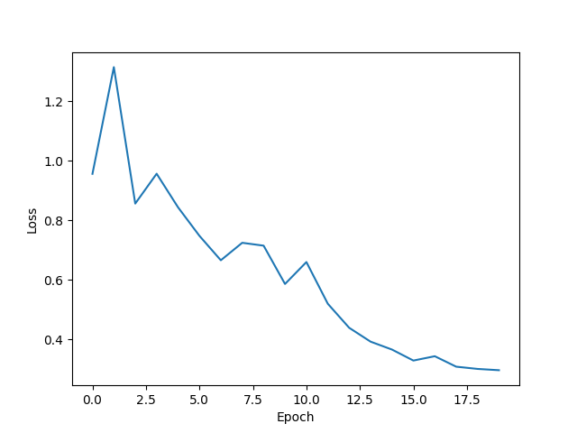
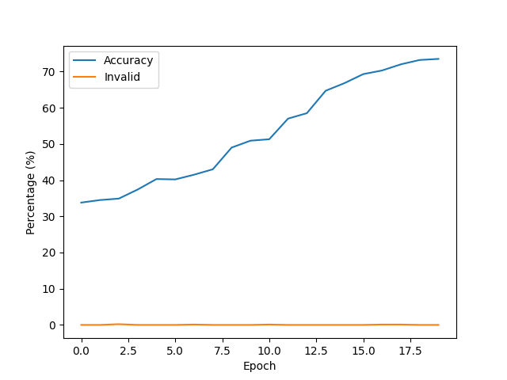

# model-002.pt Report

| Summary | |
|---------|-|
| Epochs | 20 |
| Accuracy | 73.5 % |
| Invalid | 0.0 % |

### Correct Results
| Ground Truth | Model Output |
|--------------|--------------|
| `{expr=}-48{=expr}{result=}-48{=result}` | `{expr=}-48{=expr}{result=}-48{=result}` |
| `{expr=}-42{=expr}{result=}-42{=result}` | `{expr=}-42{=expr}{result=}-42{=result}` |
| `{expr=}9 / 12{=expr}{result=}0{=result}` | `{expr=}9 / 12{=expr}{result=}0{=result}` |
| `{expr=}2 - 34{=expr}{result=}-32{=result}` | `{expr=}2 - 34{=expr}{result=}-32{=result}` |
| `{expr=}7{=expr}{result=}7{=result}` | `{expr=}7{=expr}{result=}7{=result}` |
| `{expr=}0 + 16{=expr}{result=}16{=result}` | `{expr=}0 + 16{=expr}{result=}16{=result}` |
| `{expr=}-2{=expr}{result=}-2{=result}` | `{expr=}-2{=expr}{result=}-2{=result}` |
| `{expr=}40 - 7{=expr}{result=}33{=result}` | `{expr=}40 - 7{=expr}{result=}33{=result}` |
| `{expr=}23{=expr}{result=}23{=result}` | `{expr=}23{=expr}{result=}23{=result}` |
| `{expr=}45 + 27{=expr}{result=}72{=result}` | `{expr=}45 + 27{=expr}{result=}72{=result}` |
| `{expr=}29 - 12{=expr}{result=}17{=result}` | `{expr=}29 - 12{=expr}{result=}17{=result}` |
| `{expr=}43 + 0{=expr}{result=}43{=result}` | `{expr=}43 + 0{=expr}{result=}43{=result}` |
| `{expr=}20 * 30{=expr}{result=}600{=result}` | `{expr=}20 * 30{=expr}{result=}600{=result}` |
| `{expr=}-45{=expr}{result=}-45{=result}` | `{expr=}-45{=expr}{result=}-45{=result}` |
| `{expr=}8{=expr}{result=}8{=result}` | `{expr=}8{=expr}{result=}8{=result}` |
| `{expr=}32 + 34{=expr}{result=}66{=result}` | `{expr=}32 + 34{=expr}{result=}66{=result}` |
| `{expr=}19 - 1{=expr}{result=}18{=result}` | `{expr=}19 - 1{=expr}{result=}18{=result}` |
| `{expr=}38 + 15{=expr}{result=}53{=result}` | `{expr=}38 + 15{=expr}{result=}53{=result}` |
| `{expr=}10 - 46{=expr}{result=}-36{=result}` | `{expr=}10 - 46{=expr}{result=}-36{=result}` |
| `{expr=}25 + 32{=expr}{result=}57{=result}` | `{expr=}25 + 32{=expr}{result=}57{=result}` |
| `{expr=}-37{=expr}{result=}-37{=result}` | `{expr=}-37{=expr}{result=}-37{=result}` |
| `{expr=}19 / 25{=expr}{result=}0{=result}` | `{expr=}19 / 25{=expr}{result=}0{=result}` |
| `{expr=}26 - 2{=expr}{result=}24{=result}` | `{expr=}26 - 2{=expr}{result=}24{=result}` |
| `{expr=}25{=expr}{result=}25{=result}` | `{expr=}25{=expr}{result=}25{=result}` |
| `{expr=}13{=expr}{result=}13{=result}` | `{expr=}13{=expr}{result=}13{=result}` |
| `{expr=}-23{=expr}{result=}-23{=result}` | `{expr=}-23{=expr}{result=}-23{=result}` |
| `{expr=}-37{=expr}{result=}-37{=result}` | `{expr=}-37{=expr}{result=}-37{=result}` |
| `{expr=}34 - 25{=expr}{result=}9{=result}` | `{expr=}34 - 25{=expr}{result=}9{=result}` |
| `{expr=}-21{=expr}{result=}-21{=result}` | `{expr=}-21{=expr}{result=}-21{=result}` |
| `{expr=}-32{=expr}{result=}-32{=result}` | `{expr=}-32{=expr}{result=}-32{=result}` |
| `{expr=}-14{=expr}{result=}-14{=result}` | `{expr=}-14{=expr}{result=}-14{=result}` |
| `{expr=}35 + 9{=expr}{result=}44{=result}` | `{expr=}35 + 9{=expr}{result=}44{=result}` |
| `{expr=}41 - 30{=expr}{result=}11{=result}` | `{expr=}41 - 30{=expr}{result=}11{=result}` |
| `{expr=}20 + 42{=expr}{result=}62{=result}` | `{expr=}20 + 42{=expr}{result=}62{=result}` |
| `{expr=}37 + 2{=expr}{result=}39{=result}` | `{expr=}37 + 2{=expr}{result=}39{=result}` |
| `{expr=}-29{=expr}{result=}-29{=result}` | `{expr=}-29{=expr}{result=}-29{=result}` |
| `{expr=}36{=expr}{result=}36{=result}` | `{expr=}36{=expr}{result=}36{=result}` |
| `{expr=}2 + 15{=expr}{result=}17{=result}` | `{expr=}2 + 15{=expr}{result=}17{=result}` |
| `{expr=}5 - 9{=expr}{result=}-4{=result}` | `{expr=}5 - 9{=expr}{result=}-4{=result}` |
| `{expr=}2 - 17{=expr}{result=}-15{=result}` | `{expr=}2 - 17{=expr}{result=}-15{=result}` |
| `{expr=}46 - 39{=expr}{result=}7{=result}` | `{expr=}46 - 39{=expr}{result=}7{=result}` |
| `{expr=}15 + 19{=expr}{result=}34{=result}` | `{expr=}15 + 19{=expr}{result=}34{=result}` |
| `{expr=}30 - 45{=expr}{result=}-15{=result}` | `{expr=}30 - 45{=expr}{result=}-15{=result}` |
| `{expr=}25{=expr}{result=}25{=result}` | `{expr=}25{=expr}{result=}25{=result}` |
| `{expr=}1{=expr}{result=}1{=result}` | `{expr=}1{=expr}{result=}1{=result}` |
| `{expr=}21{=expr}{result=}21{=result}` | `{expr=}21{=expr}{result=}21{=result}` |
| `{expr=}39 - 12{=expr}{result=}27{=result}` | `{expr=}39 - 12{=expr}{result=}27{=result}` |
| `{expr=}16{=expr}{result=}16{=result}` | `{expr=}16{=expr}{result=}16{=result}` |
| `{expr=}-18{=expr}{result=}-18{=result}` | `{expr=}-18{=expr}{result=}-18{=result}` |
| `{expr=}30 - 27{=expr}{result=}3{=result}` | `{expr=}30 - 27{=expr}{result=}3{=result}` |
| `{expr=}26{=expr}{result=}26{=result}` | `{expr=}26{=expr}{result=}26{=result}` |
| `{expr=}40 / 5{=expr}{result=}8{=result}` | `{expr=}40 / 5{=expr}{result=}8{=result}` |
| `{expr=}11 + 28{=expr}{result=}39{=result}` | `{expr=}11 + 28{=expr}{result=}39{=result}` |
| `{expr=}-0{=expr}{result=}0{=result}` | `{expr=}-0{=expr}{result=}0{=result}` |
| `{expr=}-30{=expr}{result=}-30{=result}` | `{expr=}-30{=expr}{result=}-30{=result}` |
| `{expr=}9{=expr}{result=}9{=result}` | `{expr=}9{=expr}{result=}9{=result}` |
| `{expr=}10 * 39{=expr}{result=}390{=result}` | `{expr=}10 * 39{=expr}{result=}390{=result}` |
| `{expr=}30 / 3{=expr}{result=}10{=result}` | `{expr=}30 / 3{=expr}{result=}10{=result}` |
| `{expr=}-12{=expr}{result=}-12{=result}` | `{expr=}-12{=expr}{result=}-12{=result}` |
| `{expr=}-43{=expr}{result=}-43{=result}` | `{expr=}-43{=expr}{result=}-43{=result}` |
| `{expr=}48 - 19{=expr}{result=}29{=result}` | `{expr=}48 - 19{=expr}{result=}29{=result}` |
| `{expr=}41 + 16{=expr}{result=}57{=result}` | `{expr=}41 + 16{=expr}{result=}57{=result}` |
| `{expr=}45 - 8{=expr}{result=}37{=result}` | `{expr=}45 - 8{=expr}{result=}37{=result}` |
| `{expr=}17 + 36{=expr}{result=}53{=result}` | `{expr=}17 + 36{=expr}{result=}53{=result}` |
| `{expr=}37 + 25{=expr}{result=}62{=result}` | `{expr=}37 + 25{=expr}{result=}62{=result}` |
| `{expr=}14 + 45{=expr}{result=}59{=result}` | `{expr=}14 + 45{=expr}{result=}59{=result}` |
| `{expr=}-0{=expr}{result=}0{=result}` | `{expr=}-0{=expr}{result=}0{=result}` |
| `{expr=}42{=expr}{result=}42{=result}` | `{expr=}42{=expr}{result=}42{=result}` |
| `{expr=}44 + 48{=expr}{result=}92{=result}` | `{expr=}44 + 48{=expr}{result=}92{=result}` |
| `{expr=}42 + 39{=expr}{result=}81{=result}` | `{expr=}42 + 39{=expr}{result=}81{=result}` |
| `{expr=}0 + 37{=expr}{result=}37{=result}` | `{expr=}0 + 37{=expr}{result=}37{=result}` |
| `{expr=}44 / 38{=expr}{result=}1{=result}` | `{expr=}44 / 38{=expr}{result=}1{=result}` |
| `{expr=}36{=expr}{result=}36{=result}` | `{expr=}36{=expr}{result=}36{=result}` |
| `{expr=}18 + 5{=expr}{result=}23{=result}` | `{expr=}18 + 5{=expr}{result=}23{=result}` |
| `{expr=}7 - 32{=expr}{result=}-25{=result}` | `{expr=}7 - 32{=expr}{result=}-25{=result}` |
| `{expr=}17 - 5{=expr}{result=}12{=result}` | `{expr=}17 - 5{=expr}{result=}12{=result}` |
| `{expr=}12{=expr}{result=}12{=result}` | `{expr=}12{=expr}{result=}12{=result}` |
| `{expr=}9{=expr}{result=}9{=result}` | `{expr=}9{=expr}{result=}9{=result}` |
| `{expr=}-23{=expr}{result=}-23{=result}` | `{expr=}-23{=expr}{result=}-23{=result}` |
| `{expr=}9{=expr}{result=}9{=result}` | `{expr=}9{=expr}{result=}9{=result}` |
| `{expr=}25 / 25{=expr}{result=}1{=result}` | `{expr=}25 / 25{=expr}{result=}1{=result}` |
| `{expr=}31 + 19{=expr}{result=}50{=result}` | `{expr=}31 + 19{=expr}{result=}50{=result}` |
| `{expr=}-46{=expr}{result=}-46{=result}` | `{expr=}-46{=expr}{result=}-46{=result}` |
| `{expr=}15{=expr}{result=}15{=result}` | `{expr=}15{=expr}{result=}15{=result}` |
| `{expr=}0{=expr}{result=}0{=result}` | `{expr=}0{=expr}{result=}0{=result}` |
| `{expr=}12 + 29{=expr}{result=}41{=result}` | `{expr=}12 + 29{=expr}{result=}41{=result}` |
| `{expr=}45 - 8{=expr}{result=}37{=result}` | `{expr=}45 - 8{=expr}{result=}37{=result}` |
| `{expr=}13 + 45{=expr}{result=}58{=result}` | `{expr=}13 + 45{=expr}{result=}58{=result}` |
| `{expr=}42 / 25{=expr}{result=}1{=result}` | `{expr=}42 / 25{=expr}{result=}1{=result}` |
| `{expr=}37{=expr}{result=}37{=result}` | `{expr=}37{=expr}{result=}37{=result}` |
| `{expr=}-40{=expr}{result=}-40{=result}` | `{expr=}-40{=expr}{result=}-40{=result}` |
| `{expr=}-4{=expr}{result=}-4{=result}` | `{expr=}-4{=expr}{result=}-4{=result}` |
| `{expr=}-16{=expr}{result=}-16{=result}` | `{expr=}-16{=expr}{result=}-16{=result}` |
| `{expr=}6 - 2{=expr}{result=}4{=result}` | `{expr=}6 - 2{=expr}{result=}4{=result}` |
| `{expr=}34 - 25{=expr}{result=}9{=result}` | `{expr=}34 - 25{=expr}{result=}9{=result}` |
| `{expr=}23 + 34{=expr}{result=}57{=result}` | `{expr=}23 + 34{=expr}{result=}57{=result}` |
| `{expr=}40 + 37{=expr}{result=}77{=result}` | `{expr=}40 + 37{=expr}{result=}77{=result}` |
| `{expr=}30{=expr}{result=}30{=result}` | `{expr=}30{=expr}{result=}30{=result}` |
| `{expr=}-31{=expr}{result=}-31{=result}` | `{expr=}-31{=expr}{result=}-31{=result}` |
| `{expr=}20 - 10{=expr}{result=}10{=result}` | `{expr=}20 - 10{=expr}{result=}10{=result}` |
| `{expr=}29 + 28{=expr}{result=}57{=result}` | `{expr=}29 + 28{=expr}{result=}57{=result}` |
| `{expr=}39 - 11{=expr}{result=}28{=result}` | `{expr=}39 - 11{=expr}{result=}28{=result}` |
| `{expr=}2 + 42{=expr}{result=}44{=result}` | `{expr=}2 + 42{=expr}{result=}44{=result}` |
| `{expr=}30{=expr}{result=}30{=result}` | `{expr=}30{=expr}{result=}30{=result}` |
| `{expr=}-48{=expr}{result=}-48{=result}` | `{expr=}-48{=expr}{result=}-48{=result}` |
| `{expr=}-2{=expr}{result=}-2{=result}` | `{expr=}-2{=expr}{result=}-2{=result}` |
| `{expr=}11 / 43{=expr}{result=}0{=result}` | `{expr=}11 / 43{=expr}{result=}0{=result}` |
| `{expr=}-46{=expr}{result=}-46{=result}` | `{expr=}-46{=expr}{result=}-46{=result}` |
| `{expr=}35{=expr}{result=}35{=result}` | `{expr=}35{=expr}{result=}35{=result}` |
| `{expr=}-43{=expr}{result=}-43{=result}` | `{expr=}-43{=expr}{result=}-43{=result}` |
| `{expr=}30 - 15{=expr}{result=}15{=result}` | `{expr=}30 - 15{=expr}{result=}15{=result}` |
| `{expr=}36 + 25{=expr}{result=}61{=result}` | `{expr=}36 + 25{=expr}{result=}61{=result}` |
| `{expr=}41 + 31{=expr}{result=}72{=result}` | `{expr=}41 + 31{=expr}{result=}72{=result}` |
| `{expr=}-41{=expr}{result=}-41{=result}` | `{expr=}-41{=expr}{result=}-41{=result}` |
| `{expr=}-19{=expr}{result=}-19{=result}` | `{expr=}-19{=expr}{result=}-19{=result}` |
| `{expr=}13{=expr}{result=}13{=result}` | `{expr=}13{=expr}{result=}13{=result}` |
| `{expr=}19 - 8{=expr}{result=}11{=result}` | `{expr=}19 - 8{=expr}{result=}11{=result}` |
| `{expr=}38 + 44{=expr}{result=}82{=result}` | `{expr=}38 + 44{=expr}{result=}82{=result}` |
| `{expr=}33 / 38{=expr}{result=}0{=result}` | `{expr=}33 / 38{=expr}{result=}0{=result}` |
| `{expr=}-26{=expr}{result=}-26{=result}` | `{expr=}-26{=expr}{result=}-26{=result}` |
| `{expr=}47 - 34{=expr}{result=}13{=result}` | `{expr=}47 - 34{=expr}{result=}13{=result}` |
| `{expr=}44{=expr}{result=}44{=result}` | `{expr=}44{=expr}{result=}44{=result}` |
| `{expr=}43{=expr}{result=}43{=result}` | `{expr=}43{=expr}{result=}43{=result}` |
| `{expr=}46{=expr}{result=}46{=result}` | `{expr=}46{=expr}{result=}46{=result}` |
| `{expr=}42{=expr}{result=}42{=result}` | `{expr=}42{=expr}{result=}42{=result}` |
| `{expr=}20{=expr}{result=}20{=result}` | `{expr=}20{=expr}{result=}20{=result}` |
| `{expr=}12 / 37{=expr}{result=}0{=result}` | `{expr=}12 / 37{=expr}{result=}0{=result}` |
| `{expr=}48 - 38{=expr}{result=}10{=result}` | `{expr=}48 - 38{=expr}{result=}10{=result}` |
| `{expr=}36{=expr}{result=}36{=result}` | `{expr=}36{=expr}{result=}36{=result}` |
| `{expr=}39 - 7{=expr}{result=}32{=result}` | `{expr=}39 - 7{=expr}{result=}32{=result}` |
| `{expr=}23 + 29{=expr}{result=}52{=result}` | `{expr=}23 + 29{=expr}{result=}52{=result}` |
| `{expr=}45{=expr}{result=}45{=result}` | `{expr=}45{=expr}{result=}45{=result}` |
| `{expr=}-4{=expr}{result=}-4{=result}` | `{expr=}-4{=expr}{result=}-4{=result}` |
| `{expr=}22 - 10{=expr}{result=}12{=result}` | `{expr=}22 - 10{=expr}{result=}12{=result}` |
| `{expr=}31 - 4{=expr}{result=}27{=result}` | `{expr=}31 - 4{=expr}{result=}27{=result}` |
| `{expr=}39 + 10{=expr}{result=}49{=result}` | `{expr=}39 + 10{=expr}{result=}49{=result}` |
| `{expr=}-16{=expr}{result=}-16{=result}` | `{expr=}-16{=expr}{result=}-16{=result}` |
| `{expr=}5 + 38{=expr}{result=}43{=result}` | `{expr=}5 + 38{=expr}{result=}43{=result}` |
| `{expr=}-16{=expr}{result=}-16{=result}` | `{expr=}-16{=expr}{result=}-16{=result}` |
| `{expr=}31 + 24{=expr}{result=}55{=result}` | `{expr=}31 + 24{=expr}{result=}55{=result}` |
| `{expr=}23 + 7{=expr}{result=}30{=result}` | `{expr=}23 + 7{=expr}{result=}30{=result}` |
| `{expr=}-41{=expr}{result=}-41{=result}` | `{expr=}-41{=expr}{result=}-41{=result}` |
| `{expr=}13 + 24{=expr}{result=}37{=result}` | `{expr=}13 + 24{=expr}{result=}37{=result}` |
| `{expr=}23{=expr}{result=}23{=result}` | `{expr=}23{=expr}{result=}23{=result}` |
| `{expr=}-18{=expr}{result=}-18{=result}` | `{expr=}-18{=expr}{result=}-18{=result}` |
| `{expr=}19 + 4{=expr}{result=}23{=result}` | `{expr=}19 + 4{=expr}{result=}23{=result}` |
| `{expr=}50 + 0{=expr}{result=}50{=result}` | `{expr=}50 + 0{=expr}{result=}50{=result}` |
| `{expr=}45 - 32{=expr}{result=}13{=result}` | `{expr=}45 - 32{=expr}{result=}13{=result}` |
| `{expr=}16 - 38{=expr}{result=}-22{=result}` | `{expr=}16 - 38{=expr}{result=}-22{=result}` |
| `{expr=}31 + 4{=expr}{result=}35{=result}` | `{expr=}31 + 4{=expr}{result=}35{=result}` |
| `{expr=}24 - 34{=expr}{result=}-10{=result}` | `{expr=}24 - 34{=expr}{result=}-10{=result}` |
| `{expr=}-34{=expr}{result=}-34{=result}` | `{expr=}-34{=expr}{result=}-34{=result}` |
| `{expr=}39 - 0{=expr}{result=}39{=result}` | `{expr=}39 - 0{=expr}{result=}39{=result}` |
| `{expr=}-28{=expr}{result=}-28{=result}` | `{expr=}-28{=expr}{result=}-28{=result}` |
| `{expr=}23{=expr}{result=}23{=result}` | `{expr=}23{=expr}{result=}23{=result}` |
| `{expr=}-5{=expr}{result=}-5{=result}` | `{expr=}-5{=expr}{result=}-5{=result}` |
| `{expr=}5 + 50{=expr}{result=}55{=result}` | `{expr=}5 + 50{=expr}{result=}55{=result}` |
| `{expr=}36 + 18{=expr}{result=}54{=result}` | `{expr=}36 + 18{=expr}{result=}54{=result}` |
| `{expr=}0 * 40{=expr}{result=}0{=result}` | `{expr=}0 * 40{=expr}{result=}0{=result}` |
| `{expr=}-8{=expr}{result=}-8{=result}` | `{expr=}-8{=expr}{result=}-8{=result}` |
| `{expr=}-24{=expr}{result=}-24{=result}` | `{expr=}-24{=expr}{result=}-24{=result}` |
| `{expr=}-1{=expr}{result=}-1{=result}` | `{expr=}-1{=expr}{result=}-1{=result}` |
| `{expr=}-28{=expr}{result=}-28{=result}` | `{expr=}-28{=expr}{result=}-28{=result}` |
| `{expr=}-4{=expr}{result=}-4{=result}` | `{expr=}-4{=expr}{result=}-4{=result}` |
| `{expr=}-27{=expr}{result=}-27{=result}` | `{expr=}-27{=expr}{result=}-27{=result}` |
| `{expr=}8{=expr}{result=}8{=result}` | `{expr=}8{=expr}{result=}8{=result}` |
| `{expr=}-35{=expr}{result=}-35{=result}` | `{expr=}-35{=expr}{result=}-35{=result}` |
| `{expr=}41 - 16{=expr}{result=}25{=result}` | `{expr=}41 - 16{=expr}{result=}25{=result}` |
| `{expr=}-28{=expr}{result=}-28{=result}` | `{expr=}-28{=expr}{result=}-28{=result}` |
| `{expr=}-32{=expr}{result=}-32{=result}` | `{expr=}-32{=expr}{result=}-32{=result}` |
| `{expr=}40{=expr}{result=}40{=result}` | `{expr=}40{=expr}{result=}40{=result}` |
| `{expr=}11 + 28{=expr}{result=}39{=result}` | `{expr=}11 + 28{=expr}{result=}39{=result}` |
| `{expr=}-41{=expr}{result=}-41{=result}` | `{expr=}-41{=expr}{result=}-41{=result}` |
| `{expr=}-34{=expr}{result=}-34{=result}` | `{expr=}-34{=expr}{result=}-34{=result}` |
| `{expr=}-33{=expr}{result=}-33{=result}` | `{expr=}-33{=expr}{result=}-33{=result}` |
| `{expr=}-1{=expr}{result=}-1{=result}` | `{expr=}-1{=expr}{result=}-1{=result}` |
| `{expr=}17 + 23{=expr}{result=}40{=result}` | `{expr=}17 + 23{=expr}{result=}40{=result}` |
| `{expr=}18 + 48{=expr}{result=}66{=result}` | `{expr=}18 + 48{=expr}{result=}66{=result}` |
| `{expr=}17 + 32{=expr}{result=}49{=result}` | `{expr=}17 + 32{=expr}{result=}49{=result}` |
| `{expr=}20 + 42{=expr}{result=}62{=result}` | `{expr=}20 + 42{=expr}{result=}62{=result}` |
| `{expr=}13{=expr}{result=}13{=result}` | `{expr=}13{=expr}{result=}13{=result}` |
| `{expr=}8 + 37{=expr}{result=}45{=result}` | `{expr=}8 + 37{=expr}{result=}45{=result}` |
| `{expr=}31 + 44{=expr}{result=}75{=result}` | `{expr=}31 + 44{=expr}{result=}75{=result}` |
| `{expr=}25 + 18{=expr}{result=}43{=result}` | `{expr=}25 + 18{=expr}{result=}43{=result}` |
| `{expr=}49 + 47{=expr}{result=}96{=result}` | `{expr=}49 + 47{=expr}{result=}96{=result}` |
| `{expr=}44 * 10{=expr}{result=}440{=result}` | `{expr=}44 * 10{=expr}{result=}440{=result}` |
| `{expr=}45 - 0{=expr}{result=}45{=result}` | `{expr=}45 - 0{=expr}{result=}45{=result}` |
| `{expr=}31 - 33{=expr}{result=}-2{=result}` | `{expr=}31 - 33{=expr}{result=}-2{=result}` |
| `{expr=}20 * 2{=expr}{result=}40{=result}` | `{expr=}20 * 2{=expr}{result=}40{=result}` |
| `{expr=}-30{=expr}{result=}-30{=result}` | `{expr=}-30{=expr}{result=}-30{=result}` |
| `{expr=}7 * 40{=expr}{result=}280{=result}` | `{expr=}7 * 40{=expr}{result=}280{=result}` |
| `{expr=}28 + 43{=expr}{result=}71{=result}` | `{expr=}28 + 43{=expr}{result=}71{=result}` |
| `{expr=}3 - 1{=expr}{result=}2{=result}` | `{expr=}3 - 1{=expr}{result=}2{=result}` |
| `{expr=}-6{=expr}{result=}-6{=result}` | `{expr=}-6{=expr}{result=}-6{=result}` |
| `{expr=}13 + 33{=expr}{result=}46{=result}` | `{expr=}13 + 33{=expr}{result=}46{=result}` |
| `{expr=}25 - 35{=expr}{result=}-10{=result}` | `{expr=}25 - 35{=expr}{result=}-10{=result}` |
| `{expr=}-17{=expr}{result=}-17{=result}` | `{expr=}-17{=expr}{result=}-17{=result}` |
| `{expr=}-0{=expr}{result=}0{=result}` | `{expr=}-0{=expr}{result=}0{=result}` |
| `{expr=}-21{=expr}{result=}-21{=result}` | `{expr=}-21{=expr}{result=}-21{=result}` |
| `{expr=}47 + 29{=expr}{result=}76{=result}` | `{expr=}47 + 29{=expr}{result=}76{=result}` |
| `{expr=}-39{=expr}{result=}-39{=result}` | `{expr=}-39{=expr}{result=}-39{=result}` |
| `{expr=}43 / 30{=expr}{result=}1{=result}` | `{expr=}43 / 30{=expr}{result=}1{=result}` |
| `{expr=}25 + 31{=expr}{result=}56{=result}` | `{expr=}25 + 31{=expr}{result=}56{=result}` |
| `{expr=}12{=expr}{result=}12{=result}` | `{expr=}12{=expr}{result=}12{=result}` |
| `{expr=}30 + 23{=expr}{result=}53{=result}` | `{expr=}30 + 23{=expr}{result=}53{=result}` |
| `{expr=}-40{=expr}{result=}-40{=result}` | `{expr=}-40{=expr}{result=}-40{=result}` |
| `{expr=}-31{=expr}{result=}-31{=result}` | `{expr=}-31{=expr}{result=}-31{=result}` |
| `{expr=}26 - 23{=expr}{result=}3{=result}` | `{expr=}26 - 23{=expr}{result=}3{=result}` |
| `{expr=}13 - 7{=expr}{result=}6{=result}` | `{expr=}13 - 7{=expr}{result=}6{=result}` |
| `{expr=}15 + 9{=expr}{result=}24{=result}` | `{expr=}15 + 9{=expr}{result=}24{=result}` |
| `{expr=}45 + 28{=expr}{result=}73{=result}` | `{expr=}45 + 28{=expr}{result=}73{=result}` |
| `{expr=}42 / 27{=expr}{result=}1{=result}` | `{expr=}42 / 27{=expr}{result=}1{=result}` |
| `{expr=}43{=expr}{result=}43{=result}` | `{expr=}43{=expr}{result=}43{=result}` |
| `{expr=}-45{=expr}{result=}-45{=result}` | `{expr=}-45{=expr}{result=}-45{=result}` |
| `{expr=}33 + 7{=expr}{result=}40{=result}` | `{expr=}33 + 7{=expr}{result=}40{=result}` |
| `{expr=}46 / 15{=expr}{result=}3{=result}` | `{expr=}46 / 15{=expr}{result=}3{=result}` |
| `{expr=}40 + 1{=expr}{result=}41{=result}` | `{expr=}40 + 1{=expr}{result=}41{=result}` |
| `{expr=}-4{=expr}{result=}-4{=result}` | `{expr=}-4{=expr}{result=}-4{=result}` |
| `{expr=}6 - 8{=expr}{result=}-2{=result}` | `{expr=}6 - 8{=expr}{result=}-2{=result}` |
| `{expr=}16 + 30{=expr}{result=}46{=result}` | `{expr=}16 + 30{=expr}{result=}46{=result}` |
| `{expr=}22{=expr}{result=}22{=result}` | `{expr=}22{=expr}{result=}22{=result}` |
| `{expr=}49 + 17{=expr}{result=}66{=result}` | `{expr=}49 + 17{=expr}{result=}66{=result}` |
| `{expr=}10 - 46{=expr}{result=}-36{=result}` | `{expr=}10 - 46{=expr}{result=}-36{=result}` |
| `{expr=}46 + 34{=expr}{result=}80{=result}` | `{expr=}46 + 34{=expr}{result=}80{=result}` |
| `{expr=}8 - 1{=expr}{result=}7{=result}` | `{expr=}8 - 1{=expr}{result=}7{=result}` |
| `{expr=}36{=expr}{result=}36{=result}` | `{expr=}36{=expr}{result=}36{=result}` |
| `{expr=}44 - 13{=expr}{result=}31{=result}` | `{expr=}44 - 13{=expr}{result=}31{=result}` |
| `{expr=}-9{=expr}{result=}-9{=result}` | `{expr=}-9{=expr}{result=}-9{=result}` |
| `{expr=}47 + 39{=expr}{result=}86{=result}` | `{expr=}47 + 39{=expr}{result=}86{=result}` |
| `{expr=}-15{=expr}{result=}-15{=result}` | `{expr=}-15{=expr}{result=}-15{=result}` |
| `{expr=}32 + 28{=expr}{result=}60{=result}` | `{expr=}32 + 28{=expr}{result=}60{=result}` |
| `{expr=}3 + 34{=expr}{result=}37{=result}` | `{expr=}3 + 34{=expr}{result=}37{=result}` |
| `{expr=}47 + 49{=expr}{result=}96{=result}` | `{expr=}47 + 49{=expr}{result=}96{=result}` |
| `{expr=}31 - 16{=expr}{result=}15{=result}` | `{expr=}31 - 16{=expr}{result=}15{=result}` |
| `{expr=}14 + 2{=expr}{result=}16{=result}` | `{expr=}14 + 2{=expr}{result=}16{=result}` |
| `{expr=}24 + 24{=expr}{result=}48{=result}` | `{expr=}24 + 24{=expr}{result=}48{=result}` |
| `{expr=}21 + 11{=expr}{result=}32{=result}` | `{expr=}21 + 11{=expr}{result=}32{=result}` |
| `{expr=}41 + 16{=expr}{result=}57{=result}` | `{expr=}41 + 16{=expr}{result=}57{=result}` |
| `{expr=}3 + 14{=expr}{result=}17{=result}` | `{expr=}3 + 14{=expr}{result=}17{=result}` |
| `{expr=}6{=expr}{result=}6{=result}` | `{expr=}6{=expr}{result=}6{=result}` |
| `{expr=}32 / 7{=expr}{result=}4{=result}` | `{expr=}32 / 7{=expr}{result=}4{=result}` |
| `{expr=}43 + 6{=expr}{result=}49{=result}` | `{expr=}43 + 6{=expr}{result=}49{=result}` |
| `{expr=}35 / 33{=expr}{result=}1{=result}` | `{expr=}35 / 33{=expr}{result=}1{=result}` |
| `{expr=}-36{=expr}{result=}-36{=result}` | `{expr=}-36{=expr}{result=}-36{=result}` |
| `{expr=}6 + 19{=expr}{result=}25{=result}` | `{expr=}6 + 19{=expr}{result=}25{=result}` |
| `{expr=}9 - 9{=expr}{result=}0{=result}` | `{expr=}9 - 9{=expr}{result=}0{=result}` |
| `{expr=}27{=expr}{result=}27{=result}` | `{expr=}27{=expr}{result=}27{=result}` |
| `{expr=}6{=expr}{result=}6{=result}` | `{expr=}6{=expr}{result=}6{=result}` |
| `{expr=}17 + 42{=expr}{result=}59{=result}` | `{expr=}17 + 42{=expr}{result=}59{=result}` |
| `{expr=}-43{=expr}{result=}-43{=result}` | `{expr=}-43{=expr}{result=}-43{=result}` |
| `{expr=}11 / 35{=expr}{result=}0{=result}` | `{expr=}11 / 35{=expr}{result=}0{=result}` |
| `{expr=}-39{=expr}{result=}-39{=result}` | `{expr=}-39{=expr}{result=}-39{=result}` |
| `{expr=}11 + 30{=expr}{result=}41{=result}` | `{expr=}11 + 30{=expr}{result=}41{=result}` |
| `{expr=}25 + 0{=expr}{result=}25{=result}` | `{expr=}25 + 0{=expr}{result=}25{=result}` |
| `{expr=}0 * 9{=expr}{result=}0{=result}` | `{expr=}0 * 9{=expr}{result=}0{=result}` |
| `{expr=}19 + 2{=expr}{result=}21{=result}` | `{expr=}19 + 2{=expr}{result=}21{=result}` |
| `{expr=}49 - 28{=expr}{result=}21{=result}` | `{expr=}49 - 28{=expr}{result=}21{=result}` |
| `{expr=}-0{=expr}{result=}0{=result}` | `{expr=}-0{=expr}{result=}0{=result}` |
| `{expr=}4{=expr}{result=}4{=result}` | `{expr=}4{=expr}{result=}4{=result}` |
| `{expr=}11 - 49{=expr}{result=}-38{=result}` | `{expr=}11 - 49{=expr}{result=}-38{=result}` |
| `{expr=}23 - 4{=expr}{result=}19{=result}` | `{expr=}23 - 4{=expr}{result=}19{=result}` |
| `{expr=}15 - 13{=expr}{result=}2{=result}` | `{expr=}15 - 13{=expr}{result=}2{=result}` |
| `{expr=}14{=expr}{result=}14{=result}` | `{expr=}14{=expr}{result=}14{=result}` |
| `{expr=}-29{=expr}{result=}-29{=result}` | `{expr=}-29{=expr}{result=}-29{=result}` |
| `{expr=}36 / 18{=expr}{result=}2{=result}` | `{expr=}36 / 18{=expr}{result=}2{=result}` |
| `{expr=}14 + 7{=expr}{result=}21{=result}` | `{expr=}14 + 7{=expr}{result=}21{=result}` |
| `{expr=}-7{=expr}{result=}-7{=result}` | `{expr=}-7{=expr}{result=}-7{=result}` |
| `{expr=}32{=expr}{result=}32{=result}` | `{expr=}32{=expr}{result=}32{=result}` |
| `{expr=}-29{=expr}{result=}-29{=result}` | `{expr=}-29{=expr}{result=}-29{=result}` |
| `{expr=}47 - 36{=expr}{result=}11{=result}` | `{expr=}47 - 36{=expr}{result=}11{=result}` |
| `{expr=}-48{=expr}{result=}-48{=result}` | `{expr=}-48{=expr}{result=}-48{=result}` |
| `{expr=}36{=expr}{result=}36{=result}` | `{expr=}36{=expr}{result=}36{=result}` |
| `{expr=}30 + 33{=expr}{result=}63{=result}` | `{expr=}30 + 33{=expr}{result=}63{=result}` |
| `{expr=}10 - 15{=expr}{result=}-5{=result}` | `{expr=}10 - 15{=expr}{result=}-5{=result}` |
| `{expr=}39 / 7{=expr}{result=}5{=result}` | `{expr=}39 / 7{=expr}{result=}5{=result}` |
| `{expr=}-31{=expr}{result=}-31{=result}` | `{expr=}-31{=expr}{result=}-31{=result}` |
| `{expr=}-41{=expr}{result=}-41{=result}` | `{expr=}-41{=expr}{result=}-41{=result}` |
| `{expr=}-34{=expr}{result=}-34{=result}` | `{expr=}-34{=expr}{result=}-34{=result}` |
| `{expr=}9 / 21{=expr}{result=}0{=result}` | `{expr=}9 / 21{=expr}{result=}0{=result}` |
| `{expr=}41 / 16{=expr}{result=}2{=result}` | `{expr=}41 / 16{=expr}{result=}2{=result}` |
| `{expr=}-14{=expr}{result=}-14{=result}` | `{expr=}-14{=expr}{result=}-14{=result}` |
| `{expr=}11 + 35{=expr}{result=}46{=result}` | `{expr=}11 + 35{=expr}{result=}46{=result}` |
| `{expr=}33 + 21{=expr}{result=}54{=result}` | `{expr=}33 + 21{=expr}{result=}54{=result}` |
| `{expr=}6 + 19{=expr}{result=}25{=result}` | `{expr=}6 + 19{=expr}{result=}25{=result}` |
| `{expr=}17{=expr}{result=}17{=result}` | `{expr=}17{=expr}{result=}17{=result}` |
| `{expr=}-3{=expr}{result=}-3{=result}` | `{expr=}-3{=expr}{result=}-3{=result}` |
| `{expr=}34 / 44{=expr}{result=}0{=result}` | `{expr=}34 / 44{=expr}{result=}0{=result}` |
| `{expr=}32{=expr}{result=}32{=result}` | `{expr=}32{=expr}{result=}32{=result}` |
| `{expr=}13 + 41{=expr}{result=}54{=result}` | `{expr=}13 + 41{=expr}{result=}54{=result}` |
| `{expr=}28 / 38{=expr}{result=}0{=result}` | `{expr=}28 / 38{=expr}{result=}0{=result}` |
| `{expr=}16 / 12{=expr}{result=}1{=result}` | `{expr=}16 / 12{=expr}{result=}1{=result}` |
| `{expr=}-26{=expr}{result=}-26{=result}` | `{expr=}-26{=expr}{result=}-26{=result}` |
| `{expr=}0 - 0{=expr}{result=}0{=result}` | `{expr=}0 - 0{=expr}{result=}0{=result}` |
| `{expr=}39 / 35{=expr}{result=}1{=result}` | `{expr=}39 / 35{=expr}{result=}1{=result}` |
| `{expr=}43 - 4{=expr}{result=}39{=result}` | `{expr=}43 - 4{=expr}{result=}39{=result}` |
| `{expr=}6 + 39{=expr}{result=}45{=result}` | `{expr=}6 + 39{=expr}{result=}45{=result}` |
| `{expr=}50 * 19{=expr}{result=}950{=result}` | `{expr=}50 * 19{=expr}{result=}950{=result}` |
| `{expr=}39 + 9{=expr}{result=}48{=result}` | `{expr=}39 + 9{=expr}{result=}48{=result}` |
| `{expr=}23 + 16{=expr}{result=}39{=result}` | `{expr=}23 + 16{=expr}{result=}39{=result}` |
| `{expr=}43{=expr}{result=}43{=result}` | `{expr=}43{=expr}{result=}43{=result}` |
| `{expr=}20 / 30{=expr}{result=}0{=result}` | `{expr=}20 / 30{=expr}{result=}0{=result}` |
| `{expr=}3 - 44{=expr}{result=}-41{=result}` | `{expr=}3 - 44{=expr}{result=}-41{=result}` |
| `{expr=}18 / 39{=expr}{result=}0{=result}` | `{expr=}18 / 39{=expr}{result=}0{=result}` |
| `{expr=}-35{=expr}{result=}-35{=result}` | `{expr=}-35{=expr}{result=}-35{=result}` |
| `{expr=}11 - 44{=expr}{result=}-33{=result}` | `{expr=}11 - 44{=expr}{result=}-33{=result}` |
| `{expr=}-4{=expr}{result=}-4{=result}` | `{expr=}-4{=expr}{result=}-4{=result}` |
| `{expr=}37 / 27{=expr}{result=}1{=result}` | `{expr=}37 / 27{=expr}{result=}1{=result}` |
| `{expr=}44 - 11{=expr}{result=}33{=result}` | `{expr=}44 - 11{=expr}{result=}33{=result}` |
| `{expr=}27 + 11{=expr}{result=}38{=result}` | `{expr=}27 + 11{=expr}{result=}38{=result}` |
| `{expr=}-0{=expr}{result=}0{=result}` | `{expr=}-0{=expr}{result=}0{=result}` |
| `{expr=}-32{=expr}{result=}-32{=result}` | `{expr=}-32{=expr}{result=}-32{=result}` |
| `{expr=}28{=expr}{result=}28{=result}` | `{expr=}28{=expr}{result=}28{=result}` |
| `{expr=}-31{=expr}{result=}-31{=result}` | `{expr=}-31{=expr}{result=}-31{=result}` |
| `{expr=}-22{=expr}{result=}-22{=result}` | `{expr=}-22{=expr}{result=}-22{=result}` |
| `{expr=}15{=expr}{result=}15{=result}` | `{expr=}15{=expr}{result=}15{=result}` |
| `{expr=}31 + 8{=expr}{result=}39{=result}` | `{expr=}31 + 8{=expr}{result=}39{=result}` |
| `{expr=}18 + 17{=expr}{result=}35{=result}` | `{expr=}18 + 17{=expr}{result=}35{=result}` |
| `{expr=}29 + 5{=expr}{result=}34{=result}` | `{expr=}29 + 5{=expr}{result=}34{=result}` |
| `{expr=}26 + 25{=expr}{result=}51{=result}` | `{expr=}26 + 25{=expr}{result=}51{=result}` |
| `{expr=}16{=expr}{result=}16{=result}` | `{expr=}16{=expr}{result=}16{=result}` |
| `{expr=}49 + 27{=expr}{result=}76{=result}` | `{expr=}49 + 27{=expr}{result=}76{=result}` |
| `{expr=}-7{=expr}{result=}-7{=result}` | `{expr=}-7{=expr}{result=}-7{=result}` |
| `{expr=}46 + 49{=expr}{result=}95{=result}` | `{expr=}46 + 49{=expr}{result=}95{=result}` |
| `{expr=}44 - 24{=expr}{result=}20{=result}` | `{expr=}44 - 24{=expr}{result=}20{=result}` |
| `{expr=}38 - 24{=expr}{result=}14{=result}` | `{expr=}38 - 24{=expr}{result=}14{=result}` |
| `{expr=}43 - 34{=expr}{result=}9{=result}` | `{expr=}43 - 34{=expr}{result=}9{=result}` |
| `{expr=}34 - 11{=expr}{result=}23{=result}` | `{expr=}34 - 11{=expr}{result=}23{=result}` |
| `{expr=}-4{=expr}{result=}-4{=result}` | `{expr=}-4{=expr}{result=}-4{=result}` |
| `{expr=}10 + 21{=expr}{result=}31{=result}` | `{expr=}10 + 21{=expr}{result=}31{=result}` |
| `{expr=}48{=expr}{result=}48{=result}` | `{expr=}48{=expr}{result=}48{=result}` |
| `{expr=}17 - 13{=expr}{result=}4{=result}` | `{expr=}17 - 13{=expr}{result=}4{=result}` |
| `{expr=}-45{=expr}{result=}-45{=result}` | `{expr=}-45{=expr}{result=}-45{=result}` |
| `{expr=}21 + 38{=expr}{result=}59{=result}` | `{expr=}21 + 38{=expr}{result=}59{=result}` |
| `{expr=}12{=expr}{result=}12{=result}` | `{expr=}12{=expr}{result=}12{=result}` |
| `{expr=}30{=expr}{result=}30{=result}` | `{expr=}30{=expr}{result=}30{=result}` |
| `{expr=}-22{=expr}{result=}-22{=result}` | `{expr=}-22{=expr}{result=}-22{=result}` |
| `{expr=}38 + 34{=expr}{result=}72{=result}` | `{expr=}38 + 34{=expr}{result=}72{=result}` |
| `{expr=}38 * 2{=expr}{result=}76{=result}` | `{expr=}38 * 2{=expr}{result=}76{=result}` |
| `{expr=}50 + 1{=expr}{result=}51{=result}` | `{expr=}50 + 1{=expr}{result=}51{=result}` |
| `{expr=}36{=expr}{result=}36{=result}` | `{expr=}36{=expr}{result=}36{=result}` |
| `{expr=}44 + 28{=expr}{result=}72{=result}` | `{expr=}44 + 28{=expr}{result=}72{=result}` |
| `{expr=}-43{=expr}{result=}-43{=result}` | `{expr=}-43{=expr}{result=}-43{=result}` |
| `{expr=}-45{=expr}{result=}-45{=result}` | `{expr=}-45{=expr}{result=}-45{=result}` |
| `{expr=}42 + 46{=expr}{result=}88{=result}` | `{expr=}42 + 46{=expr}{result=}88{=result}` |
| `{expr=}23 - 29{=expr}{result=}-6{=result}` | `{expr=}23 - 29{=expr}{result=}-6{=result}` |
| `{expr=}32{=expr}{result=}32{=result}` | `{expr=}32{=expr}{result=}32{=result}` |
| `{expr=}5 + 7{=expr}{result=}12{=result}` | `{expr=}5 + 7{=expr}{result=}12{=result}` |
| `{expr=}47 + 0{=expr}{result=}47{=result}` | `{expr=}47 + 0{=expr}{result=}47{=result}` |
| `{expr=}13 + 48{=expr}{result=}61{=result}` | `{expr=}13 + 48{=expr}{result=}61{=result}` |
| `{expr=}-1{=expr}{result=}-1{=result}` | `{expr=}-1{=expr}{result=}-1{=result}` |
| `{expr=}25{=expr}{result=}25{=result}` | `{expr=}25{=expr}{result=}25{=result}` |
| `{expr=}-44{=expr}{result=}-44{=result}` | `{expr=}-44{=expr}{result=}-44{=result}` |
| `{expr=}36 + 26{=expr}{result=}62{=result}` | `{expr=}36 + 26{=expr}{result=}62{=result}` |
| `{expr=}35 - 7{=expr}{result=}28{=result}` | `{expr=}35 - 7{=expr}{result=}28{=result}` |
| `{expr=}40 / 46{=expr}{result=}0{=result}` | `{expr=}40 / 46{=expr}{result=}0{=result}` |
| `{expr=}12{=expr}{result=}12{=result}` | `{expr=}12{=expr}{result=}12{=result}` |
| `{expr=}6 + 37{=expr}{result=}43{=result}` | `{expr=}6 + 37{=expr}{result=}43{=result}` |
| `{expr=}-24{=expr}{result=}-24{=result}` | `{expr=}-24{=expr}{result=}-24{=result}` |
| `{expr=}10 - 13{=expr}{result=}-3{=result}` | `{expr=}10 - 13{=expr}{result=}-3{=result}` |
| `{expr=}45 - 21{=expr}{result=}24{=result}` | `{expr=}45 - 21{=expr}{result=}24{=result}` |
| `{expr=}23 + 4{=expr}{result=}27{=result}` | `{expr=}23 + 4{=expr}{result=}27{=result}` |
| `{expr=}33{=expr}{result=}33{=result}` | `{expr=}33{=expr}{result=}33{=result}` |
| `{expr=}-43{=expr}{result=}-43{=result}` | `{expr=}-43{=expr}{result=}-43{=result}` |
| `{expr=}-46{=expr}{result=}-46{=result}` | `{expr=}-46{=expr}{result=}-46{=result}` |
| `{expr=}38 / 6{=expr}{result=}6{=result}` | `{expr=}38 / 6{=expr}{result=}6{=result}` |
| `{expr=}45 + 9{=expr}{result=}54{=result}` | `{expr=}45 + 9{=expr}{result=}54{=result}` |
| `{expr=}-3{=expr}{result=}-3{=result}` | `{expr=}-3{=expr}{result=}-3{=result}` |
| `{expr=}43 - 18{=expr}{result=}25{=result}` | `{expr=}43 - 18{=expr}{result=}25{=result}` |
| `{expr=}-14{=expr}{result=}-14{=result}` | `{expr=}-14{=expr}{result=}-14{=result}` |
| `{expr=}28 + 33{=expr}{result=}61{=result}` | `{expr=}28 + 33{=expr}{result=}61{=result}` |
| `{expr=}3{=expr}{result=}3{=result}` | `{expr=}3{=expr}{result=}3{=result}` |
| `{expr=}11 - 39{=expr}{result=}-28{=result}` | `{expr=}11 - 39{=expr}{result=}-28{=result}` |
| `{expr=}20 + 39{=expr}{result=}59{=result}` | `{expr=}20 + 39{=expr}{result=}59{=result}` |
| `{expr=}12 - 41{=expr}{result=}-29{=result}` | `{expr=}12 - 41{=expr}{result=}-29{=result}` |
| `{expr=}39 + 5{=expr}{result=}44{=result}` | `{expr=}39 + 5{=expr}{result=}44{=result}` |
| `{expr=}50{=expr}{result=}50{=result}` | `{expr=}50{=expr}{result=}50{=result}` |
| `{expr=}-30{=expr}{result=}-30{=result}` | `{expr=}-30{=expr}{result=}-30{=result}` |
| `{expr=}-37{=expr}{result=}-37{=result}` | `{expr=}-37{=expr}{result=}-37{=result}` |
| `{expr=}25 + 28{=expr}{result=}53{=result}` | `{expr=}25 + 28{=expr}{result=}53{=result}` |
| `{expr=}5 + 42{=expr}{result=}47{=result}` | `{expr=}5 + 42{=expr}{result=}47{=result}` |
| `{expr=}11 - 8{=expr}{result=}3{=result}` | `{expr=}11 - 8{=expr}{result=}3{=result}` |
| `{expr=}47 + 23{=expr}{result=}70{=result}` | `{expr=}47 + 23{=expr}{result=}70{=result}` |
| `{expr=}-19{=expr}{result=}-19{=result}` | `{expr=}-19{=expr}{result=}-19{=result}` |
| `{expr=}6{=expr}{result=}6{=result}` | `{expr=}6{=expr}{result=}6{=result}` |
| `{expr=}2{=expr}{result=}2{=result}` | `{expr=}2{=expr}{result=}2{=result}` |
| `{expr=}25 - 9{=expr}{result=}16{=result}` | `{expr=}25 - 9{=expr}{result=}16{=result}` |
| `{expr=}40 - 14{=expr}{result=}26{=result}` | `{expr=}40 - 14{=expr}{result=}26{=result}` |
| `{expr=}46 - 23{=expr}{result=}23{=result}` | `{expr=}46 - 23{=expr}{result=}23{=result}` |
| `{expr=}6{=expr}{result=}6{=result}` | `{expr=}6{=expr}{result=}6{=result}` |
| `{expr=}-42{=expr}{result=}-42{=result}` | `{expr=}-42{=expr}{result=}-42{=result}` |
| `{expr=}-48{=expr}{result=}-48{=result}` | `{expr=}-48{=expr}{result=}-48{=result}` |
| `{expr=}7{=expr}{result=}7{=result}` | `{expr=}7{=expr}{result=}7{=result}` |
| `{expr=}-18{=expr}{result=}-18{=result}` | `{expr=}-18{=expr}{result=}-18{=result}` |
| `{expr=}7 - 36{=expr}{result=}-29{=result}` | `{expr=}7 - 36{=expr}{result=}-29{=result}` |
| `{expr=}43 - 4{=expr}{result=}39{=result}` | `{expr=}43 - 4{=expr}{result=}39{=result}` |
| `{expr=}0 * 21{=expr}{result=}0{=result}` | `{expr=}0 * 21{=expr}{result=}0{=result}` |
| `{expr=}44 + 36{=expr}{result=}80{=result}` | `{expr=}44 + 36{=expr}{result=}80{=result}` |
| `{expr=}4 + 42{=expr}{result=}46{=result}` | `{expr=}4 + 42{=expr}{result=}46{=result}` |
| `{expr=}1 + 25{=expr}{result=}26{=result}` | `{expr=}1 + 25{=expr}{result=}26{=result}` |
| `{expr=}38 - 4{=expr}{result=}34{=result}` | `{expr=}38 - 4{=expr}{result=}34{=result}` |
| `{expr=}-50{=expr}{result=}-50{=result}` | `{expr=}-50{=expr}{result=}-50{=result}` |
| `{expr=}4 + 11{=expr}{result=}15{=result}` | `{expr=}4 + 11{=expr}{result=}15{=result}` |
| `{expr=}3{=expr}{result=}3{=result}` | `{expr=}3{=expr}{result=}3{=result}` |
| `{expr=}38 + 20{=expr}{result=}58{=result}` | `{expr=}38 + 20{=expr}{result=}58{=result}` |
| `{expr=}-45{=expr}{result=}-45{=result}` | `{expr=}-45{=expr}{result=}-45{=result}` |
| `{expr=}11 - 45{=expr}{result=}-34{=result}` | `{expr=}11 - 45{=expr}{result=}-34{=result}` |
| `{expr=}-31{=expr}{result=}-31{=result}` | `{expr=}-31{=expr}{result=}-31{=result}` |
| `{expr=}22{=expr}{result=}22{=result}` | `{expr=}22{=expr}{result=}22{=result}` |
| `{expr=}12{=expr}{result=}12{=result}` | `{expr=}12{=expr}{result=}12{=result}` |
| `{expr=}28 / 23{=expr}{result=}1{=result}` | `{expr=}28 / 23{=expr}{result=}1{=result}` |
| `{expr=}31 + 18{=expr}{result=}49{=result}` | `{expr=}31 + 18{=expr}{result=}49{=result}` |
| `{expr=}4 + 30{=expr}{result=}34{=result}` | `{expr=}4 + 30{=expr}{result=}34{=result}` |
| `{expr=}1 * 31{=expr}{result=}31{=result}` | `{expr=}1 * 31{=expr}{result=}31{=result}` |
| `{expr=}16 + 7{=expr}{result=}23{=result}` | `{expr=}16 + 7{=expr}{result=}23{=result}` |
| `{expr=}49 / 16{=expr}{result=}3{=result}` | `{expr=}49 / 16{=expr}{result=}3{=result}` |
| `{expr=}7{=expr}{result=}7{=result}` | `{expr=}7{=expr}{result=}7{=result}` |
| `{expr=}25{=expr}{result=}25{=result}` | `{expr=}25{=expr}{result=}25{=result}` |
| `{expr=}11 - 39{=expr}{result=}-28{=result}` | `{expr=}11 - 39{=expr}{result=}-28{=result}` |
| `{expr=}23{=expr}{result=}23{=result}` | `{expr=}23{=expr}{result=}23{=result}` |
| `{expr=}3 / 4{=expr}{result=}0{=result}` | `{expr=}3 / 4{=expr}{result=}0{=result}` |
| `{expr=}7{=expr}{result=}7{=result}` | `{expr=}7{=expr}{result=}7{=result}` |
| `{expr=}7 + 15{=expr}{result=}22{=result}` | `{expr=}7 + 15{=expr}{result=}22{=result}` |
| `{expr=}31 + 33{=expr}{result=}64{=result}` | `{expr=}31 + 33{=expr}{result=}64{=result}` |
| `{expr=}16 + 40{=expr}{result=}56{=result}` | `{expr=}16 + 40{=expr}{result=}56{=result}` |
| `{expr=}38 / 33{=expr}{result=}1{=result}` | `{expr=}38 / 33{=expr}{result=}1{=result}` |
| `{expr=}34 - 40{=expr}{result=}-6{=result}` | `{expr=}34 - 40{=expr}{result=}-6{=result}` |
| `{expr=}-23{=expr}{result=}-23{=result}` | `{expr=}-23{=expr}{result=}-23{=result}` |
| `{expr=}-0{=expr}{result=}0{=result}` | `{expr=}-0{=expr}{result=}0{=result}` |
| `{expr=}8 / 36{=expr}{result=}0{=result}` | `{expr=}8 / 36{=expr}{result=}0{=result}` |
| `{expr=}27 + 37{=expr}{result=}64{=result}` | `{expr=}27 + 37{=expr}{result=}64{=result}` |
| `{expr=}49 - 38{=expr}{result=}11{=result}` | `{expr=}49 - 38{=expr}{result=}11{=result}` |
| `{expr=}19 + 49{=expr}{result=}68{=result}` | `{expr=}19 + 49{=expr}{result=}68{=result}` |
| `{expr=}8 + 21{=expr}{result=}29{=result}` | `{expr=}8 + 21{=expr}{result=}29{=result}` |
| `{expr=}1{=expr}{result=}1{=result}` | `{expr=}1{=expr}{result=}1{=result}` |
| `{expr=}1 + 14{=expr}{result=}15{=result}` | `{expr=}1 + 14{=expr}{result=}15{=result}` |
| `{expr=}14 + 10{=expr}{result=}24{=result}` | `{expr=}14 + 10{=expr}{result=}24{=result}` |
| `{expr=}-30{=expr}{result=}-30{=result}` | `{expr=}-30{=expr}{result=}-30{=result}` |
| `{expr=}21 - 42{=expr}{result=}-21{=result}` | `{expr=}21 - 42{=expr}{result=}-21{=result}` |
| `{expr=}38 + 45{=expr}{result=}83{=result}` | `{expr=}38 + 45{=expr}{result=}83{=result}` |
| `{expr=}11 + 0{=expr}{result=}11{=result}` | `{expr=}11 + 0{=expr}{result=}11{=result}` |
| `{expr=}-42{=expr}{result=}-42{=result}` | `{expr=}-42{=expr}{result=}-42{=result}` |
| `{expr=}40 + 26{=expr}{result=}66{=result}` | `{expr=}40 + 26{=expr}{result=}66{=result}` |
| `{expr=}-19{=expr}{result=}-19{=result}` | `{expr=}-19{=expr}{result=}-19{=result}` |
| `{expr=}27 + 12{=expr}{result=}39{=result}` | `{expr=}27 + 12{=expr}{result=}39{=result}` |
| `{expr=}32{=expr}{result=}32{=result}` | `{expr=}32{=expr}{result=}32{=result}` |
| `{expr=}-19{=expr}{result=}-19{=result}` | `{expr=}-19{=expr}{result=}-19{=result}` |
| `{expr=}-48{=expr}{result=}-48{=result}` | `{expr=}-48{=expr}{result=}-48{=result}` |
| `{expr=}21 + 48{=expr}{result=}69{=result}` | `{expr=}21 + 48{=expr}{result=}69{=result}` |
| `{expr=}38 + 28{=expr}{result=}66{=result}` | `{expr=}38 + 28{=expr}{result=}66{=result}` |
| `{expr=}2{=expr}{result=}2{=result}` | `{expr=}2{=expr}{result=}2{=result}` |
| `{expr=}30 - 22{=expr}{result=}8{=result}` | `{expr=}30 - 22{=expr}{result=}8{=result}` |
| `{expr=}46 + 26{=expr}{result=}72{=result}` | `{expr=}46 + 26{=expr}{result=}72{=result}` |
| `{expr=}22 + 49{=expr}{result=}71{=result}` | `{expr=}22 + 49{=expr}{result=}71{=result}` |
| `{expr=}-3{=expr}{result=}-3{=result}` | `{expr=}-3{=expr}{result=}-3{=result}` |
| `{expr=}-32{=expr}{result=}-32{=result}` | `{expr=}-32{=expr}{result=}-32{=result}` |
| `{expr=}12 + 18{=expr}{result=}30{=result}` | `{expr=}12 + 18{=expr}{result=}30{=result}` |
| `{expr=}38 - 11{=expr}{result=}27{=result}` | `{expr=}38 - 11{=expr}{result=}27{=result}` |
| `{expr=}39 + 8{=expr}{result=}47{=result}` | `{expr=}39 + 8{=expr}{result=}47{=result}` |
| `{expr=}49 - 43{=expr}{result=}6{=result}` | `{expr=}49 - 43{=expr}{result=}6{=result}` |
| `{expr=}4 + 20{=expr}{result=}24{=result}` | `{expr=}4 + 20{=expr}{result=}24{=result}` |
| `{expr=}33 - 26{=expr}{result=}7{=result}` | `{expr=}33 - 26{=expr}{result=}7{=result}` |
| `{expr=}-11{=expr}{result=}-11{=result}` | `{expr=}-11{=expr}{result=}-11{=result}` |
| `{expr=}38 - 28{=expr}{result=}10{=result}` | `{expr=}38 - 28{=expr}{result=}10{=result}` |
| `{expr=}22 + 38{=expr}{result=}60{=result}` | `{expr=}22 + 38{=expr}{result=}60{=result}` |
| `{expr=}33 - 12{=expr}{result=}21{=result}` | `{expr=}33 - 12{=expr}{result=}21{=result}` |
| `{expr=}33 + 33{=expr}{result=}66{=result}` | `{expr=}33 + 33{=expr}{result=}66{=result}` |
| `{expr=}-42{=expr}{result=}-42{=result}` | `{expr=}-42{=expr}{result=}-42{=result}` |
| `{expr=}49 / 21{=expr}{result=}2{=result}` | `{expr=}49 / 21{=expr}{result=}2{=result}` |
| `{expr=}-47{=expr}{result=}-47{=result}` | `{expr=}-47{=expr}{result=}-47{=result}` |
| `{expr=}24 - 12{=expr}{result=}12{=result}` | `{expr=}24 - 12{=expr}{result=}12{=result}` |
| `{expr=}-34{=expr}{result=}-34{=result}` | `{expr=}-34{=expr}{result=}-34{=result}` |
| `{expr=}-40{=expr}{result=}-40{=result}` | `{expr=}-40{=expr}{result=}-40{=result}` |
| `{expr=}-14{=expr}{result=}-14{=result}` | `{expr=}-14{=expr}{result=}-14{=result}` |
| `{expr=}1 + 13{=expr}{result=}14{=result}` | `{expr=}1 + 13{=expr}{result=}14{=result}` |
| `{expr=}34{=expr}{result=}34{=result}` | `{expr=}34{=expr}{result=}34{=result}` |
| `{expr=}29 + 16{=expr}{result=}45{=result}` | `{expr=}29 + 16{=expr}{result=}45{=result}` |
| `{expr=}-24{=expr}{result=}-24{=result}` | `{expr=}-24{=expr}{result=}-24{=result}` |
| `{expr=}-23{=expr}{result=}-23{=result}` | `{expr=}-23{=expr}{result=}-23{=result}` |
| `{expr=}10 * 26{=expr}{result=}260{=result}` | `{expr=}10 * 26{=expr}{result=}260{=result}` |
| `{expr=}49 + 43{=expr}{result=}92{=result}` | `{expr=}49 + 43{=expr}{result=}92{=result}` |
| `{expr=}25{=expr}{result=}25{=result}` | `{expr=}25{=expr}{result=}25{=result}` |
| `{expr=}19 + 15{=expr}{result=}34{=result}` | `{expr=}19 + 15{=expr}{result=}34{=result}` |
| `{expr=}22 / 21{=expr}{result=}1{=result}` | `{expr=}22 / 21{=expr}{result=}1{=result}` |
| `{expr=}23{=expr}{result=}23{=result}` | `{expr=}23{=expr}{result=}23{=result}` |
| `{expr=}3 / 44{=expr}{result=}0{=result}` | `{expr=}3 / 44{=expr}{result=}0{=result}` |
| `{expr=}18 - 37{=expr}{result=}-19{=result}` | `{expr=}18 - 37{=expr}{result=}-19{=result}` |
| `{expr=}17 + 46{=expr}{result=}63{=result}` | `{expr=}17 + 46{=expr}{result=}63{=result}` |
| `{expr=}11 - 23{=expr}{result=}-12{=result}` | `{expr=}11 - 23{=expr}{result=}-12{=result}` |
| `{expr=}-28{=expr}{result=}-28{=result}` | `{expr=}-28{=expr}{result=}-28{=result}` |
| `{expr=}1 + 28{=expr}{result=}29{=result}` | `{expr=}1 + 28{=expr}{result=}29{=result}` |
| `{expr=}40 + 8{=expr}{result=}48{=result}` | `{expr=}40 + 8{=expr}{result=}48{=result}` |
| `{expr=}7 + 48{=expr}{result=}55{=result}` | `{expr=}7 + 48{=expr}{result=}55{=result}` |
| `{expr=}37 + 7{=expr}{result=}44{=result}` | `{expr=}37 + 7{=expr}{result=}44{=result}` |
| `{expr=}42 + 48{=expr}{result=}90{=result}` | `{expr=}42 + 48{=expr}{result=}90{=result}` |
| `{expr=}-25{=expr}{result=}-25{=result}` | `{expr=}-25{=expr}{result=}-25{=result}` |
| `{expr=}30 + 27{=expr}{result=}57{=result}` | `{expr=}30 + 27{=expr}{result=}57{=result}` |
| `{expr=}41 - 18{=expr}{result=}23{=result}` | `{expr=}41 - 18{=expr}{result=}23{=result}` |
| `{expr=}-15{=expr}{result=}-15{=result}` | `{expr=}-15{=expr}{result=}-15{=result}` |
| `{expr=}47 + 13{=expr}{result=}60{=result}` | `{expr=}47 + 13{=expr}{result=}60{=result}` |
| `{expr=}8 / 21{=expr}{result=}0{=result}` | `{expr=}8 / 21{=expr}{result=}0{=result}` |
| `{expr=}0 - 24{=expr}{result=}-24{=result}` | `{expr=}0 - 24{=expr}{result=}-24{=result}` |
| `{expr=}2 - 22{=expr}{result=}-20{=result}` | `{expr=}2 - 22{=expr}{result=}-20{=result}` |
| `{expr=}-34{=expr}{result=}-34{=result}` | `{expr=}-34{=expr}{result=}-34{=result}` |
| `{expr=}19{=expr}{result=}19{=result}` | `{expr=}19{=expr}{result=}19{=result}` |
| `{expr=}30 * 0{=expr}{result=}0{=result}` | `{expr=}30 * 0{=expr}{result=}0{=result}` |
| `{expr=}31 / 34{=expr}{result=}0{=result}` | `{expr=}31 / 34{=expr}{result=}0{=result}` |
| `{expr=}17 + 7{=expr}{result=}24{=result}` | `{expr=}17 + 7{=expr}{result=}24{=result}` |
| `{expr=}37 - 45{=expr}{result=}-8{=result}` | `{expr=}37 - 45{=expr}{result=}-8{=result}` |
| `{expr=}5 + 41{=expr}{result=}46{=result}` | `{expr=}5 + 41{=expr}{result=}46{=result}` |
| `{expr=}15{=expr}{result=}15{=result}` | `{expr=}15{=expr}{result=}15{=result}` |
| `{expr=}3 + 35{=expr}{result=}38{=result}` | `{expr=}3 + 35{=expr}{result=}38{=result}` |
| `{expr=}-15{=expr}{result=}-15{=result}` | `{expr=}-15{=expr}{result=}-15{=result}` |
| `{expr=}14 - 2{=expr}{result=}12{=result}` | `{expr=}14 - 2{=expr}{result=}12{=result}` |
| `{expr=}4{=expr}{result=}4{=result}` | `{expr=}4{=expr}{result=}4{=result}` |
| `{expr=}32 + 10{=expr}{result=}42{=result}` | `{expr=}32 + 10{=expr}{result=}42{=result}` |
| `{expr=}24 + 40{=expr}{result=}64{=result}` | `{expr=}24 + 40{=expr}{result=}64{=result}` |
| `{expr=}16{=expr}{result=}16{=result}` | `{expr=}16{=expr}{result=}16{=result}` |
| `{expr=}46 - 2{=expr}{result=}44{=result}` | `{expr=}46 - 2{=expr}{result=}44{=result}` |
| `{expr=}40 + 43{=expr}{result=}83{=result}` | `{expr=}40 + 43{=expr}{result=}83{=result}` |
| `{expr=}32 - 40{=expr}{result=}-8{=result}` | `{expr=}32 - 40{=expr}{result=}-8{=result}` |
| `{expr=}20 + 27{=expr}{result=}47{=result}` | `{expr=}20 + 27{=expr}{result=}47{=result}` |
| `{expr=}-38{=expr}{result=}-38{=result}` | `{expr=}-38{=expr}{result=}-38{=result}` |
| `{expr=}0 + 50{=expr}{result=}50{=result}` | `{expr=}0 + 50{=expr}{result=}50{=result}` |
| `{expr=}-30{=expr}{result=}-30{=result}` | `{expr=}-30{=expr}{result=}-30{=result}` |
| `{expr=}31 + 10{=expr}{result=}41{=result}` | `{expr=}31 + 10{=expr}{result=}41{=result}` |
| `{expr=}-24{=expr}{result=}-24{=result}` | `{expr=}-24{=expr}{result=}-24{=result}` |
| `{expr=}-23{=expr}{result=}-23{=result}` | `{expr=}-23{=expr}{result=}-23{=result}` |
| `{expr=}41{=expr}{result=}41{=result}` | `{expr=}41{=expr}{result=}41{=result}` |
| `{expr=}15 + 50{=expr}{result=}65{=result}` | `{expr=}15 + 50{=expr}{result=}65{=result}` |
| `{expr=}18 - 42{=expr}{result=}-24{=result}` | `{expr=}18 - 42{=expr}{result=}-24{=result}` |
| `{expr=}-23{=expr}{result=}-23{=result}` | `{expr=}-23{=expr}{result=}-23{=result}` |
| `{expr=}1 + 50{=expr}{result=}51{=result}` | `{expr=}1 + 50{=expr}{result=}51{=result}` |
| `{expr=}29 / 37{=expr}{result=}0{=result}` | `{expr=}29 / 37{=expr}{result=}0{=result}` |
| `{expr=}33 - 10{=expr}{result=}23{=result}` | `{expr=}33 - 10{=expr}{result=}23{=result}` |
| `{expr=}14 / 28{=expr}{result=}0{=result}` | `{expr=}14 / 28{=expr}{result=}0{=result}` |
| `{expr=}-35{=expr}{result=}-35{=result}` | `{expr=}-35{=expr}{result=}-35{=result}` |
| `{expr=}33{=expr}{result=}33{=result}` | `{expr=}33{=expr}{result=}33{=result}` |
| `{expr=}13 + 43{=expr}{result=}56{=result}` | `{expr=}13 + 43{=expr}{result=}56{=result}` |
| `{expr=}1 + 48{=expr}{result=}49{=result}` | `{expr=}1 + 48{=expr}{result=}49{=result}` |
| `{expr=}0 * 19{=expr}{result=}0{=result}` | `{expr=}0 * 19{=expr}{result=}0{=result}` |
| `{expr=}13 + 45{=expr}{result=}58{=result}` | `{expr=}13 + 45{=expr}{result=}58{=result}` |
| `{expr=}-50{=expr}{result=}-50{=result}` | `{expr=}-50{=expr}{result=}-50{=result}` |
| `{expr=}3{=expr}{result=}3{=result}` | `{expr=}3{=expr}{result=}3{=result}` |
| `{expr=}38 / 33{=expr}{result=}1{=result}` | `{expr=}38 / 33{=expr}{result=}1{=result}` |
| `{expr=}5 - 16{=expr}{result=}-11{=result}` | `{expr=}5 - 16{=expr}{result=}-11{=result}` |
| `{expr=}37 + 44{=expr}{result=}81{=result}` | `{expr=}37 + 44{=expr}{result=}81{=result}` |
| `{expr=}20{=expr}{result=}20{=result}` | `{expr=}20{=expr}{result=}20{=result}` |
| `{expr=}-27{=expr}{result=}-27{=result}` | `{expr=}-27{=expr}{result=}-27{=result}` |
| `{expr=}-31{=expr}{result=}-31{=result}` | `{expr=}-31{=expr}{result=}-31{=result}` |
| `{expr=}41 + 0{=expr}{result=}41{=result}` | `{expr=}41 + 0{=expr}{result=}41{=result}` |
| `{expr=}22 + 44{=expr}{result=}66{=result}` | `{expr=}22 + 44{=expr}{result=}66{=result}` |
| `{expr=}-36{=expr}{result=}-36{=result}` | `{expr=}-36{=expr}{result=}-36{=result}` |
| `{expr=}49 + 41{=expr}{result=}90{=result}` | `{expr=}49 + 41{=expr}{result=}90{=result}` |
| `{expr=}-9{=expr}{result=}-9{=result}` | `{expr=}-9{=expr}{result=}-9{=result}` |
| `{expr=}3 + 17{=expr}{result=}20{=result}` | `{expr=}3 + 17{=expr}{result=}20{=result}` |
| `{expr=}8 + 50{=expr}{result=}58{=result}` | `{expr=}8 + 50{=expr}{result=}58{=result}` |
| `{expr=}26 / 50{=expr}{result=}0{=result}` | `{expr=}26 / 50{=expr}{result=}0{=result}` |
| `{expr=}35 + 41{=expr}{result=}76{=result}` | `{expr=}35 + 41{=expr}{result=}76{=result}` |
| `{expr=}48 + 31{=expr}{result=}79{=result}` | `{expr=}48 + 31{=expr}{result=}79{=result}` |
| `{expr=}32{=expr}{result=}32{=result}` | `{expr=}32{=expr}{result=}32{=result}` |
| `{expr=}5{=expr}{result=}5{=result}` | `{expr=}5{=expr}{result=}5{=result}` |
| `{expr=}28 - 10{=expr}{result=}18{=result}` | `{expr=}28 - 10{=expr}{result=}18{=result}` |
| `{expr=}6{=expr}{result=}6{=result}` | `{expr=}6{=expr}{result=}6{=result}` |
| `{expr=}39 - 26{=expr}{result=}13{=result}` | `{expr=}39 - 26{=expr}{result=}13{=result}` |
| `{expr=}38 + 23{=expr}{result=}61{=result}` | `{expr=}38 + 23{=expr}{result=}61{=result}` |
| `{expr=}36 - 4{=expr}{result=}32{=result}` | `{expr=}36 - 4{=expr}{result=}32{=result}` |
| `{expr=}42 - 20{=expr}{result=}22{=result}` | `{expr=}42 - 20{=expr}{result=}22{=result}` |
| `{expr=}-8{=expr}{result=}-8{=result}` | `{expr=}-8{=expr}{result=}-8{=result}` |
| `{expr=}31 + 39{=expr}{result=}70{=result}` | `{expr=}31 + 39{=expr}{result=}70{=result}` |
| `{expr=}-4{=expr}{result=}-4{=result}` | `{expr=}-4{=expr}{result=}-4{=result}` |
| `{expr=}32 + 35{=expr}{result=}67{=result}` | `{expr=}32 + 35{=expr}{result=}67{=result}` |
| `{expr=}18 / 12{=expr}{result=}1{=result}` | `{expr=}18 / 12{=expr}{result=}1{=result}` |
| `{expr=}22{=expr}{result=}22{=result}` | `{expr=}22{=expr}{result=}22{=result}` |
| `{expr=}30{=expr}{result=}30{=result}` | `{expr=}30{=expr}{result=}30{=result}` |
| `{expr=}17 + 30{=expr}{result=}47{=result}` | `{expr=}17 + 30{=expr}{result=}47{=result}` |
| `{expr=}22 + 50{=expr}{result=}72{=result}` | `{expr=}22 + 50{=expr}{result=}72{=result}` |
| `{expr=}40 + 13{=expr}{result=}53{=result}` | `{expr=}40 + 13{=expr}{result=}53{=result}` |
| `{expr=}18 - 1{=expr}{result=}17{=result}` | `{expr=}18 - 1{=expr}{result=}17{=result}` |
| `{expr=}38 + 30{=expr}{result=}68{=result}` | `{expr=}38 + 30{=expr}{result=}68{=result}` |
| `{expr=}10 + 31{=expr}{result=}41{=result}` | `{expr=}10 + 31{=expr}{result=}41{=result}` |
| `{expr=}24{=expr}{result=}24{=result}` | `{expr=}24{=expr}{result=}24{=result}` |
| `{expr=}24 - 37{=expr}{result=}-13{=result}` | `{expr=}24 - 37{=expr}{result=}-13{=result}` |
| `{expr=}44 + 35{=expr}{result=}79{=result}` | `{expr=}44 + 35{=expr}{result=}79{=result}` |
| `{expr=}-8{=expr}{result=}-8{=result}` | `{expr=}-8{=expr}{result=}-8{=result}` |
| `{expr=}27{=expr}{result=}27{=result}` | `{expr=}27{=expr}{result=}27{=result}` |
| `{expr=}35 - 9{=expr}{result=}26{=result}` | `{expr=}35 - 9{=expr}{result=}26{=result}` |
| `{expr=}42 - 46{=expr}{result=}-4{=result}` | `{expr=}42 - 46{=expr}{result=}-4{=result}` |
| `{expr=}7 + 1{=expr}{result=}8{=result}` | `{expr=}7 + 1{=expr}{result=}8{=result}` |
| `{expr=}40 + 21{=expr}{result=}61{=result}` | `{expr=}40 + 21{=expr}{result=}61{=result}` |
| `{expr=}15 + 47{=expr}{result=}62{=result}` | `{expr=}15 + 47{=expr}{result=}62{=result}` |
| `{expr=}-5{=expr}{result=}-5{=result}` | `{expr=}-5{=expr}{result=}-5{=result}` |
| `{expr=}41 / 34{=expr}{result=}1{=result}` | `{expr=}41 / 34{=expr}{result=}1{=result}` |
| `{expr=}-5{=expr}{result=}-5{=result}` | `{expr=}-5{=expr}{result=}-5{=result}` |
| `{expr=}27{=expr}{result=}27{=result}` | `{expr=}27{=expr}{result=}27{=result}` |
| `{expr=}19 + 50{=expr}{result=}69{=result}` | `{expr=}19 + 50{=expr}{result=}69{=result}` |
| `{expr=}50{=expr}{result=}50{=result}` | `{expr=}50{=expr}{result=}50{=result}` |
| `{expr=}21 + 37{=expr}{result=}58{=result}` | `{expr=}21 + 37{=expr}{result=}58{=result}` |
| `{expr=}36 + 29{=expr}{result=}65{=result}` | `{expr=}36 + 29{=expr}{result=}65{=result}` |
| `{expr=}-27{=expr}{result=}-27{=result}` | `{expr=}-27{=expr}{result=}-27{=result}` |
| `{expr=}-18{=expr}{result=}-18{=result}` | `{expr=}-18{=expr}{result=}-18{=result}` |
| `{expr=}-18{=expr}{result=}-18{=result}` | `{expr=}-18{=expr}{result=}-18{=result}` |
| `{expr=}27{=expr}{result=}27{=result}` | `{expr=}27{=expr}{result=}27{=result}` |
| `{expr=}4 - 17{=expr}{result=}-13{=result}` | `{expr=}4 - 17{=expr}{result=}-13{=result}` |
| `{expr=}31 + 29{=expr}{result=}60{=result}` | `{expr=}31 + 29{=expr}{result=}60{=result}` |
| `{expr=}27 + 38{=expr}{result=}65{=result}` | `{expr=}27 + 38{=expr}{result=}65{=result}` |
| `{expr=}42{=expr}{result=}42{=result}` | `{expr=}42{=expr}{result=}42{=result}` |
| `{expr=}26 - 26{=expr}{result=}0{=result}` | `{expr=}26 - 26{=expr}{result=}0{=result}` |
| `{expr=}28 - 24{=expr}{result=}4{=result}` | `{expr=}28 - 24{=expr}{result=}4{=result}` |
| `{expr=}-9{=expr}{result=}-9{=result}` | `{expr=}-9{=expr}{result=}-9{=result}` |
| `{expr=}8 + 27{=expr}{result=}35{=result}` | `{expr=}8 + 27{=expr}{result=}35{=result}` |
| `{expr=}48 + 24{=expr}{result=}72{=result}` | `{expr=}48 + 24{=expr}{result=}72{=result}` |
| `{expr=}34 + 43{=expr}{result=}77{=result}` | `{expr=}34 + 43{=expr}{result=}77{=result}` |
| `{expr=}16 + 24{=expr}{result=}40{=result}` | `{expr=}16 + 24{=expr}{result=}40{=result}` |
| `{expr=}-22{=expr}{result=}-22{=result}` | `{expr=}-22{=expr}{result=}-22{=result}` |
| `{expr=}13 / 32{=expr}{result=}0{=result}` | `{expr=}13 / 32{=expr}{result=}0{=result}` |
| `{expr=}42 - 32{=expr}{result=}10{=result}` | `{expr=}42 - 32{=expr}{result=}10{=result}` |
| `{expr=}2 - 43{=expr}{result=}-41{=result}` | `{expr=}2 - 43{=expr}{result=}-41{=result}` |
| `{expr=}-14{=expr}{result=}-14{=result}` | `{expr=}-14{=expr}{result=}-14{=result}` |
| `{expr=}13 + 13{=expr}{result=}26{=result}` | `{expr=}13 + 13{=expr}{result=}26{=result}` |
| `{expr=}-29{=expr}{result=}-29{=result}` | `{expr=}-29{=expr}{result=}-29{=result}` |
| `{expr=}2{=expr}{result=}2{=result}` | `{expr=}2{=expr}{result=}2{=result}` |
| `{expr=}-49{=expr}{result=}-49{=result}` | `{expr=}-49{=expr}{result=}-49{=result}` |
| `{expr=}5 / 3{=expr}{result=}1{=result}` | `{expr=}5 / 3{=expr}{result=}1{=result}` |
| `{expr=}15 * 10{=expr}{result=}150{=result}` | `{expr=}15 * 10{=expr}{result=}150{=result}` |
| `{expr=}27{=expr}{result=}27{=result}` | `{expr=}27{=expr}{result=}27{=result}` |
| `{expr=}13 + 27{=expr}{result=}40{=result}` | `{expr=}13 + 27{=expr}{result=}40{=result}` |
| `{expr=}3 - 44{=expr}{result=}-41{=result}` | `{expr=}3 - 44{=expr}{result=}-41{=result}` |
| `{expr=}18 - 48{=expr}{result=}-30{=result}` | `{expr=}18 - 48{=expr}{result=}-30{=result}` |
| `{expr=}1 * 11{=expr}{result=}11{=result}` | `{expr=}1 * 11{=expr}{result=}11{=result}` |
| `{expr=}24{=expr}{result=}24{=result}` | `{expr=}24{=expr}{result=}24{=result}` |
| `{expr=}47 / 42{=expr}{result=}1{=result}` | `{expr=}47 / 42{=expr}{result=}1{=result}` |
| `{expr=}22{=expr}{result=}22{=result}` | `{expr=}22{=expr}{result=}22{=result}` |
| `{expr=}14 / 36{=expr}{result=}0{=result}` | `{expr=}14 / 36{=expr}{result=}0{=result}` |
| `{expr=}29{=expr}{result=}29{=result}` | `{expr=}29{=expr}{result=}29{=result}` |
| `{expr=}18 / 23{=expr}{result=}0{=result}` | `{expr=}18 / 23{=expr}{result=}0{=result}` |
| `{expr=}37 / 23{=expr}{result=}1{=result}` | `{expr=}37 / 23{=expr}{result=}1{=result}` |
| `{expr=}33 - 24{=expr}{result=}9{=result}` | `{expr=}33 - 24{=expr}{result=}9{=result}` |
| `{expr=}18{=expr}{result=}18{=result}` | `{expr=}18{=expr}{result=}18{=result}` |
| `{expr=}47 + 16{=expr}{result=}63{=result}` | `{expr=}47 + 16{=expr}{result=}63{=result}` |
| `{expr=}-31{=expr}{result=}-31{=result}` | `{expr=}-31{=expr}{result=}-31{=result}` |
| `{expr=}31 + 38{=expr}{result=}69{=result}` | `{expr=}31 + 38{=expr}{result=}69{=result}` |
| `{expr=}43 - 6{=expr}{result=}37{=result}` | `{expr=}43 - 6{=expr}{result=}37{=result}` |
| `{expr=}-44{=expr}{result=}-44{=result}` | `{expr=}-44{=expr}{result=}-44{=result}` |
| `{expr=}23{=expr}{result=}23{=result}` | `{expr=}23{=expr}{result=}23{=result}` |
| `{expr=}26 - 48{=expr}{result=}-22{=result}` | `{expr=}26 - 48{=expr}{result=}-22{=result}` |
| `{expr=}28 + 11{=expr}{result=}39{=result}` | `{expr=}28 + 11{=expr}{result=}39{=result}` |
| `{expr=}-1{=expr}{result=}-1{=result}` | `{expr=}-1{=expr}{result=}-1{=result}` |
| `{expr=}0{=expr}{result=}0{=result}` | `{expr=}0{=expr}{result=}0{=result}` |
| `{expr=}41 + 16{=expr}{result=}57{=result}` | `{expr=}41 + 16{=expr}{result=}57{=result}` |
| `{expr=}19 + 49{=expr}{result=}68{=result}` | `{expr=}19 + 49{=expr}{result=}68{=result}` |
| `{expr=}25 - 27{=expr}{result=}-2{=result}` | `{expr=}25 - 27{=expr}{result=}-2{=result}` |
| `{expr=}42 + 21{=expr}{result=}63{=result}` | `{expr=}42 + 21{=expr}{result=}63{=result}` |
| `{expr=}11{=expr}{result=}11{=result}` | `{expr=}11{=expr}{result=}11{=result}` |
| `{expr=}32{=expr}{result=}32{=result}` | `{expr=}32{=expr}{result=}32{=result}` |
| `{expr=}-22{=expr}{result=}-22{=result}` | `{expr=}-22{=expr}{result=}-22{=result}` |
| `{expr=}4{=expr}{result=}4{=result}` | `{expr=}4{=expr}{result=}4{=result}` |
| `{expr=}32 + 25{=expr}{result=}57{=result}` | `{expr=}32 + 25{=expr}{result=}57{=result}` |
| `{expr=}28 + 24{=expr}{result=}52{=result}` | `{expr=}28 + 24{=expr}{result=}52{=result}` |
| `{expr=}33 + 23{=expr}{result=}56{=result}` | `{expr=}33 + 23{=expr}{result=}56{=result}` |
| `{expr=}20{=expr}{result=}20{=result}` | `{expr=}20{=expr}{result=}20{=result}` |
| `{expr=}10 + 4{=expr}{result=}14{=result}` | `{expr=}10 + 4{=expr}{result=}14{=result}` |
| `{expr=}11{=expr}{result=}11{=result}` | `{expr=}11{=expr}{result=}11{=result}` |
| `{expr=}1 / 38{=expr}{result=}0{=result}` | `{expr=}1 / 38{=expr}{result=}0{=result}` |
| `{expr=}29 + 49{=expr}{result=}78{=result}` | `{expr=}29 + 49{=expr}{result=}78{=result}` |
| `{expr=}43{=expr}{result=}43{=result}` | `{expr=}43{=expr}{result=}43{=result}` |
| `{expr=}33 - 26{=expr}{result=}7{=result}` | `{expr=}33 - 26{=expr}{result=}7{=result}` |
| `{expr=}29{=expr}{result=}29{=result}` | `{expr=}29{=expr}{result=}29{=result}` |
| `{expr=}9 + 48{=expr}{result=}57{=result}` | `{expr=}9 + 48{=expr}{result=}57{=result}` |
| `{expr=}10 * 25{=expr}{result=}250{=result}` | `{expr=}10 * 25{=expr}{result=}250{=result}` |
| `{expr=}13 / 12{=expr}{result=}1{=result}` | `{expr=}13 / 12{=expr}{result=}1{=result}` |
| `{expr=}0{=expr}{result=}0{=result}` | `{expr=}0{=expr}{result=}0{=result}` |
| `{expr=}21 + 12{=expr}{result=}33{=result}` | `{expr=}21 + 12{=expr}{result=}33{=result}` |
| `{expr=}-19{=expr}{result=}-19{=result}` | `{expr=}-19{=expr}{result=}-19{=result}` |
| `{expr=}-4{=expr}{result=}-4{=result}` | `{expr=}-4{=expr}{result=}-4{=result}` |
| `{expr=}24 / 37{=expr}{result=}0{=result}` | `{expr=}24 / 37{=expr}{result=}0{=result}` |
| `{expr=}2 - 24{=expr}{result=}-22{=result}` | `{expr=}2 - 24{=expr}{result=}-22{=result}` |
| `{expr=}47 / 23{=expr}{result=}2{=result}` | `{expr=}47 / 23{=expr}{result=}2{=result}` |
| `{expr=}-44{=expr}{result=}-44{=result}` | `{expr=}-44{=expr}{result=}-44{=result}` |
| `{expr=}28 - 4{=expr}{result=}24{=result}` | `{expr=}28 - 4{=expr}{result=}24{=result}` |
| `{expr=}-4{=expr}{result=}-4{=result}` | `{expr=}-4{=expr}{result=}-4{=result}` |
| `{expr=}-13{=expr}{result=}-13{=result}` | `{expr=}-13{=expr}{result=}-13{=result}` |
| `{expr=}26 + 11{=expr}{result=}37{=result}` | `{expr=}26 + 11{=expr}{result=}37{=result}` |
| `{expr=}32 - 0{=expr}{result=}32{=result}` | `{expr=}32 - 0{=expr}{result=}32{=result}` |
| `{expr=}-8{=expr}{result=}-8{=result}` | `{expr=}-8{=expr}{result=}-8{=result}` |
| `{expr=}-27{=expr}{result=}-27{=result}` | `{expr=}-27{=expr}{result=}-27{=result}` |
| `{expr=}6{=expr}{result=}6{=result}` | `{expr=}6{=expr}{result=}6{=result}` |
| `{expr=}42{=expr}{result=}42{=result}` | `{expr=}42{=expr}{result=}42{=result}` |
| `{expr=}40 - 19{=expr}{result=}21{=result}` | `{expr=}40 - 19{=expr}{result=}21{=result}` |
| `{expr=}18 + 44{=expr}{result=}62{=result}` | `{expr=}18 + 44{=expr}{result=}62{=result}` |
| `{expr=}16 + 14{=expr}{result=}30{=result}` | `{expr=}16 + 14{=expr}{result=}30{=result}` |
| `{expr=}37 + 33{=expr}{result=}70{=result}` | `{expr=}37 + 33{=expr}{result=}70{=result}` |
| `{expr=}18 + 48{=expr}{result=}66{=result}` | `{expr=}18 + 48{=expr}{result=}66{=result}` |
| `{expr=}23{=expr}{result=}23{=result}` | `{expr=}23{=expr}{result=}23{=result}` |
| `{expr=}48 + 7{=expr}{result=}55{=result}` | `{expr=}48 + 7{=expr}{result=}55{=result}` |
| `{expr=}-14{=expr}{result=}-14{=result}` | `{expr=}-14{=expr}{result=}-14{=result}` |
| `{expr=}24 + 44{=expr}{result=}68{=result}` | `{expr=}24 + 44{=expr}{result=}68{=result}` |
| `{expr=}-16{=expr}{result=}-16{=result}` | `{expr=}-16{=expr}{result=}-16{=result}` |
| `{expr=}-47{=expr}{result=}-47{=result}` | `{expr=}-47{=expr}{result=}-47{=result}` |
| `{expr=}47 + 21{=expr}{result=}68{=result}` | `{expr=}47 + 21{=expr}{result=}68{=result}` |
| `{expr=}-27{=expr}{result=}-27{=result}` | `{expr=}-27{=expr}{result=}-27{=result}` |
| `{expr=}36 / 34{=expr}{result=}1{=result}` | `{expr=}36 / 34{=expr}{result=}1{=result}` |
| `{expr=}29 + 27{=expr}{result=}56{=result}` | `{expr=}29 + 27{=expr}{result=}56{=result}` |
| `{expr=}15 / 47{=expr}{result=}0{=result}` | `{expr=}15 / 47{=expr}{result=}0{=result}` |
| `{expr=}3{=expr}{result=}3{=result}` | `{expr=}3{=expr}{result=}3{=result}` |
| `{expr=}-28{=expr}{result=}-28{=result}` | `{expr=}-28{=expr}{result=}-28{=result}` |
| `{expr=}40{=expr}{result=}40{=result}` | `{expr=}40{=expr}{result=}40{=result}` |
| `{expr=}33 + 41{=expr}{result=}74{=result}` | `{expr=}33 + 41{=expr}{result=}74{=result}` |
| `{expr=}36 * 1{=expr}{result=}36{=result}` | `{expr=}36 * 1{=expr}{result=}36{=result}` |
| `{expr=}31{=expr}{result=}31{=result}` | `{expr=}31{=expr}{result=}31{=result}` |
| `{expr=}10 + 10{=expr}{result=}20{=result}` | `{expr=}10 + 10{=expr}{result=}20{=result}` |
| `{expr=}17 + 22{=expr}{result=}39{=result}` | `{expr=}17 + 22{=expr}{result=}39{=result}` |
| `{expr=}21 + 47{=expr}{result=}68{=result}` | `{expr=}21 + 47{=expr}{result=}68{=result}` |
| `{expr=}18 + 34{=expr}{result=}52{=result}` | `{expr=}18 + 34{=expr}{result=}52{=result}` |
| `{expr=}25 / 1{=expr}{result=}25{=result}` | `{expr=}25 / 1{=expr}{result=}25{=result}` |
| `{expr=}8 - 1{=expr}{result=}7{=result}` | `{expr=}8 - 1{=expr}{result=}7{=result}` |
| `{expr=}4 + 46{=expr}{result=}50{=result}` | `{expr=}4 + 46{=expr}{result=}50{=result}` |
| `{expr=}31{=expr}{result=}31{=result}` | `{expr=}31{=expr}{result=}31{=result}` |
| `{expr=}-36{=expr}{result=}-36{=result}` | `{expr=}-36{=expr}{result=}-36{=result}` |
| `{expr=}8{=expr}{result=}8{=result}` | `{expr=}8{=expr}{result=}8{=result}` |
| `{expr=}-47{=expr}{result=}-47{=result}` | `{expr=}-47{=expr}{result=}-47{=result}` |
| `{expr=}15 - 12{=expr}{result=}3{=result}` | `{expr=}15 - 12{=expr}{result=}3{=result}` |
| `{expr=}2 - 27{=expr}{result=}-25{=result}` | `{expr=}2 - 27{=expr}{result=}-25{=result}` |
| `{expr=}34 - 2{=expr}{result=}32{=result}` | `{expr=}34 - 2{=expr}{result=}32{=result}` |
| `{expr=}-47{=expr}{result=}-47{=result}` | `{expr=}-47{=expr}{result=}-47{=result}` |
| `{expr=}27{=expr}{result=}27{=result}` | `{expr=}27{=expr}{result=}27{=result}` |
| `{expr=}-40{=expr}{result=}-40{=result}` | `{expr=}-40{=expr}{result=}-40{=result}` |
| `{expr=}3 - 6{=expr}{result=}-3{=result}` | `{expr=}3 - 6{=expr}{result=}-3{=result}` |
| `{expr=}49 - 25{=expr}{result=}24{=result}` | `{expr=}49 - 25{=expr}{result=}24{=result}` |
| `{expr=}1{=expr}{result=}1{=result}` | `{expr=}1{=expr}{result=}1{=result}` |
| `{expr=}24 + 38{=expr}{result=}62{=result}` | `{expr=}24 + 38{=expr}{result=}62{=result}` |
| `{expr=}32 + 23{=expr}{result=}55{=result}` | `{expr=}32 + 23{=expr}{result=}55{=result}` |
| `{expr=}36 - 8{=expr}{result=}28{=result}` | `{expr=}36 - 8{=expr}{result=}28{=result}` |
| `{expr=}42{=expr}{result=}42{=result}` | `{expr=}42{=expr}{result=}42{=result}` |
| `{expr=}-18{=expr}{result=}-18{=result}` | `{expr=}-18{=expr}{result=}-18{=result}` |
| `{expr=}-6{=expr}{result=}-6{=result}` | `{expr=}-6{=expr}{result=}-6{=result}` |

### Incorrect Results
| Ground Truth | Model Output |
|--------------|--------------|
| `{expr=}43 * 48{=expr}{result=}2064{=result}` | `{expr=}43 * 48{=expr}{result=}1112{=result}` |
| `{expr=}30 - 50{=expr}{result=}-20{=result}` | `{expr=}30 - 50{=expr}{result=}-10{=result}` |
| `{expr=}16 - 23{=expr}{result=}-7{=result}` | `{expr=}16 - 23{=expr}{result=}-6{=result}` |
| `{expr=}25 - 47{=expr}{result=}-22{=result}` | `{expr=}25 - 47{=expr}{result=}-20{=result}` |
| `{expr=}42 / 19{=expr}{result=}2{=result}` | `{expr=}42 / 19{=expr}{result=}1{=result}` |
| `{expr=}23 * 27{=expr}{result=}621{=result}` | `{expr=}23 * 27{=expr}{result=}648{=result}` |
| `{expr=}29 - 47{=expr}{result=}-18{=result}` | `{expr=}29 - 47{=expr}{result=}-13{=result}` |
| `{expr=}35 - 1{=expr}{result=}34{=result}` | `{expr=}35 - 1{=expr}{result=}35{=result}` |
| `{expr=}22 * 24{=expr}{result=}528{=result}` | `{expr=}22 * 24{=expr}{result=}582{=result}` |
| `{expr=}26 * 3{=expr}{result=}78{=result}` | `{expr=}26 * 3{=expr}{result=}62{=result}` |
| `{expr=}33 * 13{=expr}{result=}429{=result}` | `{expr=}33 * 13{=expr}{result=}446{=result}` |
| `{expr=}11 - 2{=expr}{result=}9{=result}` | `{expr=}11 - 2{=expr}{result=}8{=result}` |
| `{expr=}11 - 41{=expr}{result=}-30{=result}` | `{expr=}11 - 41{=expr}{result=}-39{=result}` |
| `{expr=}14 - 49{=expr}{result=}-35{=result}` | `{expr=}14 - 49{=expr}{result=}-34{=result}` |
| `{expr=}40 * 39{=expr}{result=}1560{=result}` | `{expr=}40 * 39{=expr}{result=}1740{=result}` |
| `{expr=}12 - 35{=expr}{result=}-23{=result}` | `{expr=}12 - 35{=expr}{result=}-24{=result}` |
| `{expr=}0 - 19{=expr}{result=}-19{=result}` | `{expr=}0 - 19{=expr}{result=}-13{=result}` |
| `{expr=}29 - 9{=expr}{result=}20{=result}` | `{expr=}29 - 9{=expr}{result=}10{=result}` |
| `{expr=}27 * 36{=expr}{result=}972{=result}` | `{expr=}27 * 36{=expr}{result=}192{=result}` |
| `{expr=}40 - 35{=expr}{result=}5{=result}` | `{expr=}40 - 35{=expr}{result=}6{=result}` |
| `{expr=}6 * 22{=expr}{result=}132{=result}` | `{expr=}6 * 22{=expr}{result=}188{=result}` |
| `{expr=}25 - 4{=expr}{result=}21{=result}` | `{expr=}25 - 4{=expr}{result=}22{=result}` |
| `{expr=}8 * 49{=expr}{result=}392{=result}` | `{expr=}8 * 49{=expr}{result=}371{=result}` |
| `{expr=}9 - 8{=expr}{result=}1{=result}` | `{expr=}9 - 8{=expr}{result=}0{=result}` |
| `{expr=}28 - 28{=expr}{result=}0{=result}` | `{expr=}28 - 28{=expr}{result=}1{=result}` |
| `{expr=}1 - 28{=expr}{result=}-27{=result}` | `{expr=}1 - 28{=expr}{result=}-28{=result}` |
| `{expr=}1 - 8{=expr}{result=}-7{=result}` | `{expr=}1 - 8{=expr}{result=}0{=result}` |
| `{expr=}48 - 45{=expr}{result=}3{=result}` | `{expr=}48 - 45{=expr}{result=}4{=result}` |
| `{expr=}2 * 23{=expr}{result=}46{=result}` | `{expr=}2 * 23{=expr}{result=}66{=result}` |
| `{expr=}1 - 23{=expr}{result=}-22{=result}` | `{expr=}1 - 23{=expr}{result=}-23{=result}` |
| `{expr=}11 * 2{=expr}{result=}22{=result}` | `{expr=}11 * 2{=expr}{result=}6{=result}` |
| `{expr=}41 - 29{=expr}{result=}12{=result}` | `{expr=}41 - 29{=expr}{result=}11{=result}` |
| `{expr=}46 - 42{=expr}{result=}4{=result}` | `{expr=}46 - 42{=expr}{result=}3{=result}` |
| `{expr=}6 * 43{=expr}{result=}258{=result}` | `{expr=}6 * 43{=expr}{result=}228{=result}` |
| `{expr=}9 - 48{=expr}{result=}-39{=result}` | `{expr=}9 - 48{=expr}{result=}-40{=result}` |
| `{expr=}4 - 42{=expr}{result=}-38{=result}` | `{expr=}4 - 42{=expr}{result=}-41{=result}` |
| `{expr=}45 - 41{=expr}{result=}4{=result}` | `{expr=}45 - 41{=expr}{result=}3{=result}` |
| `{expr=}1 - 50{=expr}{result=}-49{=result}` | `{expr=}1 - 50{=expr}{result=}-40{=result}` |
| `{expr=}5 * 42{=expr}{result=}210{=result}` | `{expr=}5 * 42{=expr}{result=}250{=result}` |
| `{expr=}26 - 21{=expr}{result=}5{=result}` | `{expr=}26 - 21{=expr}{result=}4{=result}` |
| `{expr=}29 - 24{=expr}{result=}5{=result}` | `{expr=}29 - 24{=expr}{result=}3{=result}` |
| `{expr=}19 - 41{=expr}{result=}-22{=result}` | `{expr=}19 - 41{=expr}{result=}-23{=result}` |
| `{expr=}9 * 42{=expr}{result=}378{=result}` | `{expr=}9 * 42{=expr}{result=}478{=result}` |
| `{expr=}21 * 42{=expr}{result=}882{=result}` | `{expr=}21 * 42{=expr}{result=}944{=result}` |
| `{expr=}9 - 15{=expr}{result=}-6{=result}` | `{expr=}9 - 15{=expr}{result=}-8{=result}` |
| `{expr=}16 + 2{=expr}{result=}18{=result}` | `{expr=}16 + 2{=expr}{result=}19{=result}` |
| `{expr=}48 * 37{=expr}{result=}1776{=result}` | `{expr=}48 * 37{=expr}{result=}1413{=result}` |
| `{expr=}4 + 3{=expr}{result=}7{=result}` | `{expr=}4 + 3{=expr}{result=}3{=result}` |
| `{expr=}5 * 43{=expr}{result=}215{=result}` | `{expr=}5 * 43{=expr}{result=}255{=result}` |
| `{expr=}31 / 10{=expr}{result=}3{=result}` | `{expr=}31 / 10{=expr}{result=}2{=result}` |
| `{expr=}30 * 31{=expr}{result=}930{=result}` | `{expr=}30 * 31{=expr}{result=}820{=result}` |
| `{expr=}7 - 46{=expr}{result=}-39{=result}` | `{expr=}7 - 46{=expr}{result=}-40{=result}` |
| `{expr=}10 - 40{=expr}{result=}-30{=result}` | `{expr=}10 - 40{=expr}{result=}-20{=result}` |
| `{expr=}32 * 13{=expr}{result=}416{=result}` | `{expr=}32 * 13{=expr}{result=}444{=result}` |
| `{expr=}17 * 13{=expr}{result=}221{=result}` | `{expr=}17 * 13{=expr}{result=}298{=result}` |
| `{expr=}0 - 36{=expr}{result=}-36{=result}` | `{expr=}0 - 36{=expr}{result=}-35{=result}` |
| `{expr=}5 - 20{=expr}{result=}-15{=result}` | `{expr=}5 - 20{=expr}{result=}-25{=result}` |
| `{expr=}29 / 31{=expr}{result=}0{=result}` | `{expr=}29 / 31{=expr}{result=}1{=result}` |
| `{expr=}22 * 26{=expr}{result=}572{=result}` | `{expr=}22 * 26{=expr}{result=}586{=result}` |
| `{expr=}34 - 3{=expr}{result=}31{=result}` | `{expr=}34 - 3{=expr}{result=}22{=result}` |
| `{expr=}10 - 49{=expr}{result=}-39{=result}` | `{expr=}10 - 49{=expr}{result=}-38{=result}` |
| `{expr=}5 - 19{=expr}{result=}-14{=result}` | `{expr=}5 - 19{=expr}{result=}-13{=result}` |
| `{expr=}33 - 19{=expr}{result=}14{=result}` | `{expr=}33 - 19{=expr}{result=}15{=result}` |
| `{expr=}8 - 40{=expr}{result=}-32{=result}` | `{expr=}8 - 40{=expr}{result=}-36{=result}` |
| `{expr=}29 * 5{=expr}{result=}145{=result}` | `{expr=}29 * 5{=expr}{result=}152{=result}` |
| `{expr=}11 - 50{=expr}{result=}-39{=result}` | `{expr=}11 - 50{=expr}{result=}-30{=result}` |
| `{expr=}28 * 40{=expr}{result=}1120{=result}` | `{expr=}28 * 40{=expr}{result=}1880{=result}` |
| `{expr=}3 - 37{=expr}{result=}-34{=result}` | `{expr=}3 - 37{=expr}{result=}-31{=result}` |
| `{expr=}18 * 21{=expr}{result=}378{=result}` | `{expr=}18 * 21{=expr}{result=}398{=result}` |
| `{expr=}7 - 19{=expr}{result=}-12{=result}` | `{expr=}7 - 19{=expr}{result=}-13{=result}` |
| `{expr=}39 + 40{=expr}{result=}79{=result}` | `{expr=}39 + 40{=expr}{result=}89{=result}` |
| `{expr=}8 * 26{=expr}{result=}208{=result}` | `{expr=}8 * 26{=expr}{result=}272{=result}` |
| `{expr=}42 * 37{=expr}{result=}1554{=result}` | `{expr=}42 * 37{=expr}{result=}1418{=result}` |
| `{expr=}45 - 43{=expr}{result=}2{=result}` | `{expr=}45 - 43{=expr}{result=}1{=result}` |
| `{expr=}28 - 39{=expr}{result=}-11{=result}` | `{expr=}28 - 39{=expr}{result=}-10{=result}` |
| `{expr=}24 * 33{=expr}{result=}792{=result}` | `{expr=}24 * 33{=expr}{result=}746{=result}` |
| `{expr=}7 - 31{=expr}{result=}-24{=result}` | `{expr=}7 - 31{=expr}{result=}-26{=result}` |
| `{expr=}45 * 48{=expr}{result=}2160{=result}` | `{expr=}45 * 48{=expr}{result=}1740{=result}` |
| `{expr=}14 + 1{=expr}{result=}15{=result}` | `{expr=}14 + 1{=expr}{result=}16{=result}` |
| `{expr=}39 * 3{=expr}{result=}117{=result}` | `{expr=}39 * 3{=expr}{result=}72{=result}` |
| `{expr=}46 / 6{=expr}{result=}7{=result}` | `{expr=}46 / 6{=expr}{result=}8{=result}` |
| `{expr=}31 * 34{=expr}{result=}1054{=result}` | `{expr=}31 * 34{=expr}{result=}1444{=result}` |
| `{expr=}37 * 35{=expr}{result=}1295{=result}` | `{expr=}37 * 35{=expr}{result=}1150{=result}` |
| `{expr=}45 / 17{=expr}{result=}2{=result}` | `{expr=}45 / 17{=expr}{result=}3{=result}` |
| `{expr=}0 - 19{=expr}{result=}-19{=result}` | `{expr=}0 - 19{=expr}{result=}-13{=result}` |
| `{expr=}15 - 46{=expr}{result=}-31{=result}` | `{expr=}15 - 46{=expr}{result=}-30{=result}` |
| `{expr=}31 - 29{=expr}{result=}2{=result}` | `{expr=}31 - 29{=expr}{result=}1{=result}` |
| `{expr=}46 / 16{=expr}{result=}2{=result}` | `{expr=}46 / 16{=expr}{result=}3{=result}` |
| `{expr=}26 - 34{=expr}{result=}-8{=result}` | `{expr=}26 - 34{=expr}{result=}-9{=result}` |
| `{expr=}43 * 49{=expr}{result=}2107{=result}` | `{expr=}43 * 49{=expr}{result=}1412{=result}` |
| `{expr=}32 - 33{=expr}{result=}-1{=result}` | `{expr=}32 - 33{=expr}{result=}0{=result}` |
| `{expr=}19 - 26{=expr}{result=}-7{=result}` | `{expr=}19 - 26{=expr}{result=}-8{=result}` |
| `{expr=}40 - 49{=expr}{result=}-9{=result}` | `{expr=}40 - 49{=expr}{result=}-6{=result}` |
| `{expr=}24 / 7{=expr}{result=}3{=result}` | `{expr=}24 / 7{=expr}{result=}2{=result}` |
| `{expr=}18 * 7{=expr}{result=}126{=result}` | `{expr=}18 * 7{=expr}{result=}132{=result}` |
| `{expr=}29 * 5{=expr}{result=}145{=result}` | `{expr=}29 * 5{=expr}{result=}152{=result}` |
| `{expr=}24 + 4{=expr}{result=}28{=result}` | `{expr=}24 + 4{=expr}{result=}27{=result}` |
| `{expr=}35 * 25{=expr}{result=}875{=result}` | `{expr=}35 * 25{=expr}{result=}820{=result}` |
| `{expr=}10 - 8{=expr}{result=}2{=result}` | `{expr=}10 - 8{=expr}{result=}1{=result}` |
| `{expr=}29 - 31{=expr}{result=}-2{=result}` | `{expr=}29 - 31{=expr}{result=}-3{=result}` |
| `{expr=}23 * 43{=expr}{result=}989{=result}` | `{expr=}23 * 43{=expr}{result=}928{=result}` |
| `{expr=}11 * 13{=expr}{result=}143{=result}` | `{expr=}11 * 13{=expr}{result=}144{=result}` |
| `{expr=}35 * 13{=expr}{result=}455{=result}` | `{expr=}35 * 13{=expr}{result=}485{=result}` |
| `{expr=}28 - 20{=expr}{result=}8{=result}` | `{expr=}28 - 20{=expr}{result=}7{=result}` |
| `{expr=}8 - 23{=expr}{result=}-15{=result}` | `{expr=}8 - 23{=expr}{result=}-16{=result}` |
| `{expr=}33 * 25{=expr}{result=}825{=result}` | `{expr=}33 * 25{=expr}{result=}865{=result}` |
| `{expr=}14 - 10{=expr}{result=}4{=result}` | `{expr=}14 - 10{=expr}{result=}3{=result}` |
| `{expr=}13 - 19{=expr}{result=}-6{=result}` | `{expr=}13 - 19{=expr}{result=}-3{=result}` |
| `{expr=}11 - 31{=expr}{result=}-20{=result}` | `{expr=}11 - 31{=expr}{result=}-19{=result}` |
| `{expr=}3 - 50{=expr}{result=}-47{=result}` | `{expr=}3 - 50{=expr}{result=}-45{=result}` |
| `{expr=}46 * 36{=expr}{result=}1656{=result}` | `{expr=}46 * 36{=expr}{result=}1412{=result}` |
| `{expr=}41 - 17{=expr}{result=}24{=result}` | `{expr=}41 - 17{=expr}{result=}25{=result}` |
| `{expr=}50 - 14{=expr}{result=}36{=result}` | `{expr=}50 - 14{=expr}{result=}35{=result}` |
| `{expr=}4 + 3{=expr}{result=}7{=result}` | `{expr=}4 + 3{=expr}{result=}3{=result}` |
| `{expr=}26 - 50{=expr}{result=}-24{=result}` | `{expr=}26 - 50{=expr}{result=}-23{=result}` |
| `{expr=}13 * 2{=expr}{result=}26{=result}` | `{expr=}13 * 2{=expr}{result=}6{=result}` |
| `{expr=}31 * 14{=expr}{result=}434{=result}` | `{expr=}31 * 14{=expr}{result=}444{=result}` |
| `{expr=}26 * 46{=expr}{result=}1196{=result}` | `{expr=}26 * 46{=expr}{result=}1112{=result}` |
| `{expr=}4 - 38{=expr}{result=}-34{=result}` | `{expr=}4 - 38{=expr}{result=}-33{=result}` |
| `{expr=}27 + 21{=expr}{result=}48{=result}` | `{expr=}27 + 21{=expr}{result=}47{=result}` |
| `{expr=}25 * 24{=expr}{result=}600{=result}` | `{expr=}25 * 24{=expr}{result=}585{=result}` |
| `{expr=}44 * 9{=expr}{result=}396{=result}` | `{expr=}44 * 9{=expr}{result=}442{=result}` |
| `{expr=}19 * 20{=expr}{result=}380{=result}` | `{expr=}19 * 20{=expr}{result=}390{=result}` |
| `{expr=}46 * 14{=expr}{result=}644{=result}` | `{expr=}46 * 14{=expr}{result=}620{=result}` |
| `{expr=}40 * 26{=expr}{result=}1040{=result}` | `{expr=}40 * 26{=expr}{result=}1420{=result}` |
| `{expr=}7 * 31{=expr}{result=}217{=result}` | `{expr=}7 * 31{=expr}{result=}276{=result}` |
| `{expr=}12 * 40{=expr}{result=}480{=result}` | `{expr=}12 * 40{=expr}{result=}420{=result}` |
| `{expr=}39 - 13{=expr}{result=}26{=result}` | `{expr=}39 - 13{=expr}{result=}25{=result}` |
| `{expr=}6 + 43{=expr}{result=}49{=result}` | `{expr=}6 + 43{=expr}{result=}50{=result}` |
| `{expr=}35 * 25{=expr}{result=}875{=result}` | `{expr=}35 * 25{=expr}{result=}820{=result}` |
| `{expr=}6 * 1{=expr}{result=}6{=result}` | `{expr=}6 * 1{=expr}{result=}4{=result}` |
| `{expr=}44 * 47{=expr}{result=}2068{=result}` | `{expr=}44 * 47{=expr}{result=}1415{=result}` |
| `{expr=}9 * 47{=expr}{result=}423{=result}` | `{expr=}9 * 47{=expr}{result=}434{=result}` |
| `{expr=}18 * 9{=expr}{result=}162{=result}` | `{expr=}18 * 9{=expr}{result=}171{=result}` |
| `{expr=}38 / 4{=expr}{result=}9{=result}` | `{expr=}38 / 4{=expr}{result=}7{=result}` |
| `{expr=}21 - 41{=expr}{result=}-20{=result}` | `{expr=}21 - 41{=expr}{result=}-29{=result}` |
| `{expr=}10 - 7{=expr}{result=}3{=result}` | `{expr=}10 - 7{=expr}{result=}4{=result}` |
| `{expr=}36 * 47{=expr}{result=}1692{=result}` | `{expr=}36 * 47{=expr}{result=}1222{=result}` |
| `{expr=}17 * 26{=expr}{result=}442{=result}` | `{expr=}17 * 26{=expr}{result=}472{=result}` |
| `{expr=}19 * 26{=expr}{result=}494{=result}` | `{expr=}19 * 26{=expr}{result=}473{=result}` |
| `{expr=}29 * 11{=expr}{result=}319{=result}` | `{expr=}29 * 11{=expr}{result=}398{=result}` |
| `{expr=}8 - 47{=expr}{result=}-39{=result}` | `{expr=}8 - 47{=expr}{result=}-36{=result}` |
| `{expr=}6 * 41{=expr}{result=}246{=result}` | `{expr=}6 * 41{=expr}{result=}276{=result}` |
| `{expr=}19 - 17{=expr}{result=}2{=result}` | `{expr=}19 - 17{=expr}{result=}1{=result}` |
| `{expr=}18 + 22{=expr}{result=}40{=result}` | `{expr=}18 + 22{=expr}{result=}39{=result}` |
| `{expr=}27 * 33{=expr}{result=}891{=result}` | `{expr=}27 * 33{=expr}{result=}842{=result}` |
| `{expr=}38 * 42{=expr}{result=}1596{=result}` | `{expr=}38 * 42{=expr}{result=}1116{=result}` |
| `{expr=}42 * 43{=expr}{result=}1806{=result}` | `{expr=}42 * 43{=expr}{result=}1414{=result}` |
| `{expr=}40 * 35{=expr}{result=}1400{=result}` | `{expr=}40 * 35{=expr}{result=}1740{=result}` |
| `{expr=}44 - 43{=expr}{result=}1{=result}` | `{expr=}44 - 43{=expr}{result=}0{=result}` |
| `{expr=}35 * 45{=expr}{result=}1575{=result}` | `{expr=}35 * 45{=expr}{result=}1745{=result}` |
| `{expr=}49 - 44{=expr}{result=}5{=result}` | `{expr=}49 - 44{=expr}{result=}6{=result}` |
| `{expr=}11 - 15{=expr}{result=}-4{=result}` | `{expr=}11 - 15{=expr}{result=}-2{=result}` |
| `{expr=}40 - 31{=expr}{result=}9{=result}` | `{expr=}40 - 31{=expr}{result=}11{=result}` |
| `{expr=}19 * 32{=expr}{result=}608{=result}` | `{expr=}19 * 32{=expr}{result=}678{=result}` |
| `{expr=}42 * 33{=expr}{result=}1386{=result}` | `{expr=}42 * 33{=expr}{result=}1442{=result}` |
| `{expr=}38 * 33{=expr}{result=}1254{=result}` | `{expr=}38 * 33{=expr}{result=}1412{=result}` |
| `{expr=}46 * 37{=expr}{result=}1702{=result}` | `{expr=}46 * 37{=expr}{result=}1412{=result}` |
| `{expr=}30 - 1{=expr}{result=}29{=result}` | `{expr=}30 - 1{=expr}{result=}31{=result}` |
| `{expr=}44 + 42{=expr}{result=}86{=result}` | `{expr=}44 + 42{=expr}{result=}87{=result}` |
| `{expr=}6 * 33{=expr}{result=}198{=result}` | `{expr=}6 * 33{=expr}{result=}128{=result}` |
| `{expr=}7 * 50{=expr}{result=}350{=result}` | `{expr=}7 * 50{=expr}{result=}280{=result}` |
| `{expr=}24 * 27{=expr}{result=}648{=result}` | `{expr=}24 * 27{=expr}{result=}646{=result}` |
| `{expr=}45 - 45{=expr}{result=}0{=result}` | `{expr=}45 - 45{=expr}{result=}-2{=result}` |
| `{expr=}42 * 23{=expr}{result=}966{=result}` | `{expr=}42 * 23{=expr}{result=}944{=result}` |
| `{expr=}26 - 21{=expr}{result=}5{=result}` | `{expr=}26 - 21{=expr}{result=}4{=result}` |
| `{expr=}10 + 49{=expr}{result=}59{=result}` | `{expr=}10 + 49{=expr}{result=}69{=result}` |
| `{expr=}48 * 31{=expr}{result=}1488{=result}` | `{expr=}48 * 31{=expr}{result=}1778{=result}` |
| `{expr=}38 * 42{=expr}{result=}1596{=result}` | `{expr=}38 * 42{=expr}{result=}1116{=result}` |
| `{expr=}30 - 37{=expr}{result=}-7{=result}` | `{expr=}30 - 37{=expr}{result=}-8{=result}` |
| `{expr=}36 - 23{=expr}{result=}13{=result}` | `{expr=}36 - 23{=expr}{result=}14{=result}` |
| `{expr=}43 * 2{=expr}{result=}86{=result}` | `{expr=}43 * 2{=expr}{result=}168{=result}` |
| `{expr=}25 * 27{=expr}{result=}675{=result}` | `{expr=}25 * 27{=expr}{result=}620{=result}` |
| `{expr=}25 - 31{=expr}{result=}-6{=result}` | `{expr=}25 - 31{=expr}{result=}-3{=result}` |
| `{expr=}34 * 9{=expr}{result=}306{=result}` | `{expr=}34 * 9{=expr}{result=}292{=result}` |
| `{expr=}7 - 29{=expr}{result=}-22{=result}` | `{expr=}7 - 29{=expr}{result=}-21{=result}` |
| `{expr=}48 - 43{=expr}{result=}5{=result}` | `{expr=}48 - 43{=expr}{result=}6{=result}` |
| `{expr=}30 - 47{=expr}{result=}-17{=result}` | `{expr=}30 - 47{=expr}{result=}-18{=result}` |
| `{expr=}42 - 37{=expr}{result=}5{=result}` | `{expr=}42 - 37{=expr}{result=}6{=result}` |
| `{expr=}20 * 25{=expr}{result=}500{=result}` | `{expr=}20 * 25{=expr}{result=}520{=result}` |
| `{expr=}16 * 2{=expr}{result=}32{=result}` | `{expr=}16 * 2{=expr}{result=}72{=result}` |
| `{expr=}37 - 35{=expr}{result=}2{=result}` | `{expr=}37 - 35{=expr}{result=}3{=result}` |
| `{expr=}7 * 7{=expr}{result=}49{=result}` | `{expr=}7 * 7{=expr}{result=}42{=result}` |
| `{expr=}24 - 5{=expr}{result=}19{=result}` | `{expr=}24 - 5{=expr}{result=}20{=result}` |
| `{expr=}33 - 48{=expr}{result=}-15{=result}` | `{expr=}33 - 48{=expr}{result=}-16{=result}` |
| `{expr=}25 * 8{=expr}{result=}200{=result}` | `{expr=}25 * 8{=expr}{result=}232{=result}` |
| `{expr=}46 * 6{=expr}{result=}276{=result}` | `{expr=}46 * 6{=expr}{result=}222{=result}` |
| `{expr=}4 - 16{=expr}{result=}-12{=result}` | `{expr=}4 - 16{=expr}{result=}-13{=result}` |
| `{expr=}7 * 20{=expr}{result=}140{=result}` | `{expr=}7 * 20{=expr}{result=}170{=result}` |
| `{expr=}24 * 47{=expr}{result=}1128{=result}` | `{expr=}24 * 47{=expr}{result=}1116{=result}` |
| `{expr=}37 * 20{=expr}{result=}740{=result}` | `{expr=}37 * 20{=expr}{result=}700{=result}` |
| `{expr=}46 - 46{=expr}{result=}0{=result}` | `{expr=}46 - 46{=expr}{result=}-3{=result}` |
| `{expr=}48 - 48{=expr}{result=}0{=result}` | `{expr=}48 - 48{=expr}{result=}1{=result}` |
| `{expr=}19 - 10{=expr}{result=}9{=result}` | `{expr=}19 - 10{=expr}{result=}19{=result}` |
| `{expr=}22 - 45{=expr}{result=}-23{=result}` | `{expr=}22 - 45{=expr}{result=}-26{=result}` |
| `{expr=}11 - 50{=expr}{result=}-39{=result}` | `{expr=}11 - 50{=expr}{result=}-30{=result}` |
| `{expr=}50 - 30{=expr}{result=}20{=result}` | `{expr=}50 - 30{=expr}{result=}10{=result}` |
| `{expr=}7 * 19{=expr}{result=}133{=result}` | `{expr=}7 * 19{=expr}{result=}178{=result}` |
| `{expr=}22 - 48{=expr}{result=}-26{=result}` | `{expr=}22 - 48{=expr}{result=}-27{=result}` |
| `{expr=}33 / 3{=expr}{result=}11{=result}` | `{expr=}33 / 3{=expr}{result=}7{=result}` |
| `{expr=}22 * 46{=expr}{result=}1012{=result}` | `{expr=}22 * 46{=expr}{result=}1486{=result}` |
| `{expr=}21 - 28{=expr}{result=}-7{=result}` | `{expr=}21 - 28{=expr}{result=}-8{=result}` |
| `{expr=}25 * 40{=expr}{result=}1000{=result}` | `{expr=}25 * 40{=expr}{result=}1700{=result}` |
| `{expr=}0 - 36{=expr}{result=}-36{=result}` | `{expr=}0 - 36{=expr}{result=}-35{=result}` |
| `{expr=}27 * 27{=expr}{result=}729{=result}` | `{expr=}27 * 27{=expr}{result=}727{=result}` |
| `{expr=}27 * 26{=expr}{result=}702{=result}` | `{expr=}27 * 26{=expr}{result=}728{=result}` |
| `{expr=}7 - 18{=expr}{result=}-11{=result}` | `{expr=}7 - 18{=expr}{result=}-10{=result}` |
| `{expr=}13 * 39{=expr}{result=}507{=result}` | `{expr=}13 * 39{=expr}{result=}418{=result}` |
| `{expr=}11 - 6{=expr}{result=}5{=result}` | `{expr=}11 - 6{=expr}{result=}9{=result}` |
| `{expr=}4 - 22{=expr}{result=}-18{=result}` | `{expr=}4 - 22{=expr}{result=}-20{=result}` |
| `{expr=}46 * 20{=expr}{result=}920{=result}` | `{expr=}46 * 20{=expr}{result=}907{=result}` |
| `{expr=}11 - 25{=expr}{result=}-14{=result}` | `{expr=}11 - 25{=expr}{result=}-13{=result}` |
| `{expr=}22 * 23{=expr}{result=}506{=result}` | `{expr=}22 * 23{=expr}{result=}566{=result}` |
| `{expr=}20 * 23{=expr}{result=}460{=result}` | `{expr=}20 * 23{=expr}{result=}440{=result}` |
| `{expr=}8 * 1{=expr}{result=}8{=result}` | `{expr=}8 * 1{=expr}{result=}7{=result}` |
| `{expr=}17 - 20{=expr}{result=}-3{=result}` | `{expr=}17 - 20{=expr}{result=}-2{=result}` |
| `{expr=}43 - 14{=expr}{result=}29{=result}` | `{expr=}43 - 14{=expr}{result=}38{=result}` |
| `{expr=}37 * 10{=expr}{result=}370{=result}` | `{expr=}37 * 10{=expr}{result=}470{=result}` |
| `{expr=}16 - 27{=expr}{result=}-11{=result}` | `{expr=}16 - 27{=expr}{result=}-10{=result}` |
| `{expr=}20 * 44{=expr}{result=}880{=result}` | `{expr=}20 * 44{=expr}{result=}840{=result}` |
| `{expr=}14 - 43{=expr}{result=}-29{=result}` | `{expr=}14 - 43{=expr}{result=}-30{=result}` |
| `{expr=}40 - 0{=expr}{result=}40{=result}` | `{expr=}40 - 0{=expr}{result=}30{=result}` |
| `{expr=}13 - 42{=expr}{result=}-29{=result}` | `{expr=}13 - 42{=expr}{result=}-30{=result}` |
| `{expr=}32 * 11{=expr}{result=}352{=result}` | `{expr=}32 * 11{=expr}{result=}322{=result}` |
| `{expr=}24 - 20{=expr}{result=}4{=result}` | `{expr=}24 - 20{=expr}{result=}2{=result}` |
| `{expr=}9 - 39{=expr}{result=}-30{=result}` | `{expr=}9 - 39{=expr}{result=}-31{=result}` |
| `{expr=}29 - 42{=expr}{result=}-13{=result}` | `{expr=}29 - 42{=expr}{result=}-14{=result}` |
| `{expr=}28 - 46{=expr}{result=}-18{=result}` | `{expr=}28 - 46{=expr}{result=}-16{=result}` |
| `{expr=}2 * 19{=expr}{result=}38{=result}` | `{expr=}2 * 19{=expr}{result=}66{=result}` |
| `{expr=}22 + 7{=expr}{result=}29{=result}` | `{expr=}22 + 7{=expr}{result=}39{=result}` |
| `{expr=}14 - 28{=expr}{result=}-14{=result}` | `{expr=}14 - 28{=expr}{result=}-16{=result}` |
| `{expr=}40 * 44{=expr}{result=}1760{=result}` | `{expr=}40 * 44{=expr}{result=}1840{=result}` |
| `{expr=}20 - 1{=expr}{result=}19{=result}` | `{expr=}20 - 1{=expr}{result=}10{=result}` |
| `{expr=}25 * 44{=expr}{result=}1100{=result}` | `{expr=}25 * 44{=expr}{result=}1750{=result}` |
| `{expr=}5 * 27{=expr}{result=}135{=result}` | `{expr=}5 * 27{=expr}{result=}140{=result}` |
| `{expr=}33 - 34{=expr}{result=}-1{=result}` | `{expr=}33 - 34{=expr}{result=}0{=result}` |
| `{expr=}43 - 13{=expr}{result=}30{=result}` | `{expr=}43 - 13{=expr}{result=}31{=result}` |
| `{expr=}40 - 41{=expr}{result=}-1{=result}` | `{expr=}40 - 41{=expr}{result=}0{=result}` |
| `{expr=}27 * 49{=expr}{result=}1323{=result}` | `{expr=}27 * 49{=expr}{result=}1998{=result}` |
| `{expr=}33 - 42{=expr}{result=}-9{=result}` | `{expr=}33 - 42{=expr}{result=}-8{=result}` |
| `{expr=}24 - 23{=expr}{result=}1{=result}` | `{expr=}24 - 23{=expr}{result=}0{=result}` |
| `{expr=}46 * 48{=expr}{result=}2208{=result}` | `{expr=}46 * 48{=expr}{result=}1922{=result}` |
| `{expr=}12 * 31{=expr}{result=}372{=result}` | `{expr=}12 * 31{=expr}{result=}442{=result}` |
| `{expr=}48 * 27{=expr}{result=}1296{=result}` | `{expr=}48 * 27{=expr}{result=}173{=result}` |
| `{expr=}19 * 38{=expr}{result=}722{=result}` | `{expr=}19 * 38{=expr}{result=}738{=result}` |
| `{expr=}45 - 43{=expr}{result=}2{=result}` | `{expr=}45 - 43{=expr}{result=}1{=result}` |
| `{expr=}43 * 3{=expr}{result=}129{=result}` | `{expr=}43 * 3{=expr}{result=}142{=result}` |
| `{expr=}25 * 34{=expr}{result=}850{=result}` | `{expr=}25 * 34{=expr}{result=}820{=result}` |
| `{expr=}49 - 40{=expr}{result=}9{=result}` | `{expr=}49 - 40{=expr}{result=}6{=result}` |
| `{expr=}9 * 29{=expr}{result=}261{=result}` | `{expr=}9 * 29{=expr}{result=}242{=result}` |
| `{expr=}14 * 11{=expr}{result=}154{=result}` | `{expr=}14 * 11{=expr}{result=}167{=result}` |
| `{expr=}41 - 42{=expr}{result=}-1{=result}` | `{expr=}41 - 42{=expr}{result=}0{=result}` |
| `{expr=}28 * 40{=expr}{result=}1120{=result}` | `{expr=}28 * 40{=expr}{result=}1880{=result}` |
| `{expr=}50 - 20{=expr}{result=}30{=result}` | `{expr=}50 - 20{=expr}{result=}20{=result}` |
| `{expr=}29 - 38{=expr}{result=}-9{=result}` | `{expr=}29 - 38{=expr}{result=}-10{=result}` |
| `{expr=}50 - 47{=expr}{result=}3{=result}` | `{expr=}50 - 47{=expr}{result=}4{=result}` |
| `{expr=}49 * 21{=expr}{result=}1029{=result}` | `{expr=}49 * 21{=expr}{result=}988{=result}` |
| `{expr=}6 * 33{=expr}{result=}198{=result}` | `{expr=}6 * 33{=expr}{result=}128{=result}` |
| `{expr=}13 * 18{=expr}{result=}234{=result}` | `{expr=}13 * 18{=expr}{result=}212{=result}` |
| `{expr=}42 - 2{=expr}{result=}40{=result}` | `{expr=}42 - 2{=expr}{result=}41{=result}` |
| `{expr=}1 - 3{=expr}{result=}-2{=result}` | `{expr=}1 - 3{=expr}{result=}-1{=result}` |
| `{expr=}0 - 37{=expr}{result=}-37{=result}` | `{expr=}0 - 37{=expr}{result=}-46{=result}` |
| `{expr=}29 * 47{=expr}{result=}1363{=result}` | `{expr=}29 * 47{=expr}{result=}1738{=result}` |
| `{expr=}48 * 5{=expr}{result=}240{=result}` | `{expr=}48 * 5{=expr}{result=}115{=result}` |
| `{expr=}16 - 2{=expr}{result=}14{=result}` | `{expr=}16 - 2{=expr}{result=}15{=result}` |

### Invalid Results
No results.

