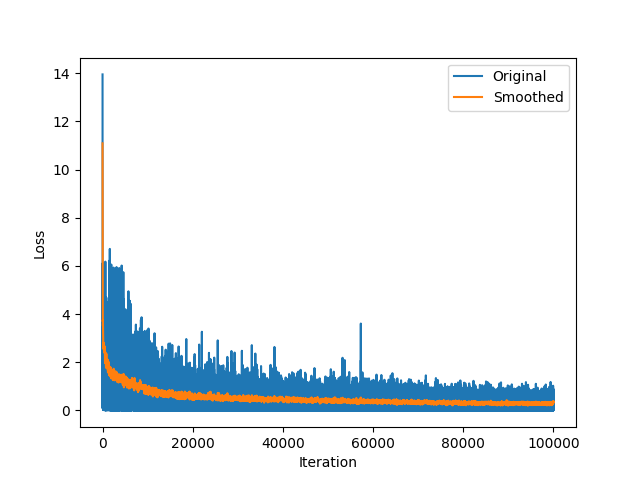
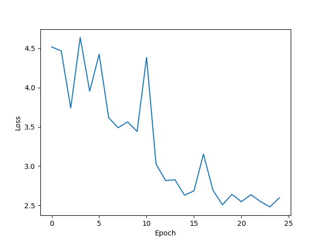
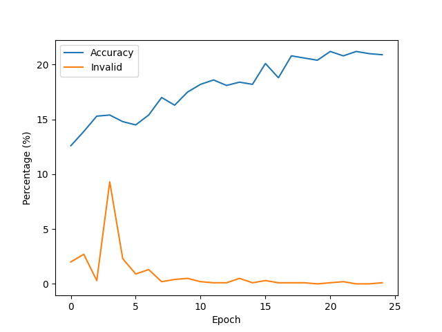

# model-003.pt Report

| Summary | |
|---------|-|
| Epochs | 25 |
| Accuracy | 20.9 % |
| Invalid | 0.1 % |

### Correct Results
| Ground Truth | Model Output |
|--------------|--------------|
| `{expr=}7{=expr}{result=}7{=result}` | `{expr=}7{=expr}{result=}7{=result}` |
| `{expr=}-30 + 4 / 28{=expr}{steps=}-30 + 4 / 28\n-30 + 0{=steps}{result=}-30{=result}` | `{expr=}-30 + 4 / 28{=expr}{steps=}-30 + 4 / 28\n-30 + 0{=steps}{result=}-30{=result}` |
| `{expr=}12{=expr}{result=}12{=result}` | `{expr=}12{=expr}{result=}12{=result}` |
| `{expr=}0{=expr}{result=}0{=result}` | `{expr=}0{=expr}{result=}0{=result}` |
| `{expr=}36 - 10 / 31 + 31{=expr}{steps=}36 - 0 + 31\n36 + 31{=steps}{result=}67{=result}` | `{expr=}36 - 10 / 31 + 31{=expr}{steps=}36 - 0 + 31\n36 + 31{=steps}{result=}67{=result}` |
| `{expr=}4 / 5 + 32{=expr}{steps=}0 + 32{=steps}{result=}32{=result}` | `{expr=}4 / 5 + 32{=expr}{steps=}0 + 32{=steps}{result=}32{=result}` |
| `{expr=}-(38 + 14){=expr}{steps=}-(52){=steps}{result=}-52{=result}` | `{expr=}-(38 + 14){=expr}{steps=}-(52){=steps}{result=}-52{=result}` |
| `{expr=}15{=expr}{result=}15{=result}` | `{expr=}15{=expr}{result=}15{=result}` |
| `{expr=}27{=expr}{result=}27{=result}` | `{expr=}27{=expr}{result=}27{=result}` |
| `{expr=}25{=expr}{result=}25{=result}` | `{expr=}25{=expr}{result=}25{=result}` |
| `{expr=}50 * 0 * (49 - 33){=expr}{steps=}0 * (49 - 33)\n0 * (16)\n0 * 16{=steps}{result=}0{=result}` | `{expr=}50 * 0 * (49 - 33){=expr}{steps=}0 * (49 - 35)\n0 * (0)\n0 * 0{=steps}{result=}0{=result}` |
| `{expr=}47{=expr}{result=}47{=result}` | `{expr=}47{=expr}{result=}47{=result}` |
| `{expr=}-(49 / 25){=expr}{steps=}-(1){=steps}{result=}-1{=result}` | `{expr=}-(49 / 25){=expr}{steps=}-(1){=steps}{result=}-1{=result}` |
| `{expr=}11 / 21{=expr}{result=}0{=result}` | `{expr=}11 / 21{=expr}{result=}0{=result}` |
| `{expr=}24{=expr}{result=}24{=result}` | `{expr=}24{=expr}{result=}24{=result}` |
| `{expr=}-48{=expr}{result=}-48{=result}` | `{expr=}-48{=expr}{result=}-48{=result}` |
| `{expr=}-7{=expr}{result=}-7{=result}` | `{expr=}-7{=expr}{result=}-7{=result}` |
| `{expr=}37{=expr}{result=}37{=result}` | `{expr=}37{=expr}{result=}37{=result}` |
| `{expr=}-((-14)){=expr}{steps=}-((-14))\n-(-14)\n--14{=steps}{result=}14{=result}` | `{expr=}-((-14)){=expr}{steps=}-((-14))\n-(-14)\n--14{=steps}{result=}14{=result}` |
| `{expr=}7{=expr}{result=}7{=result}` | `{expr=}7{=expr}{result=}7{=result}` |
| `{expr=}-((39)){=expr}{steps=}-(39){=steps}{result=}-39{=result}` | `{expr=}-((39)){=expr}{steps=}-(39){=steps}{result=}-39{=result}` |
| `{expr=}-((-1)){=expr}{steps=}-((-1))\n-(-1)\n--1{=steps}{result=}1{=result}` | `{expr=}-((-1)){=expr}{steps=}-((-1))\n-(-1)\n--1{=steps}{result=}1{=result}` |
| `{expr=}-18 + 30 / 50{=expr}{steps=}-18 + 30 / 50\n-18 + 0{=steps}{result=}-18{=result}` | `{expr=}-18 + 30 / 50{=expr}{steps=}-18 + 30 / 50\n-18 + 0{=steps}{result=}-18{=result}` |
| `{expr=}2{=expr}{result=}2{=result}` | `{expr=}2{=expr}{result=}2{=result}` |
| `{expr=}-7{=expr}{result=}-7{=result}` | `{expr=}-7{=expr}{result=}-7{=result}` |
| `{expr=}32{=expr}{result=}32{=result}` | `{expr=}32{=expr}{result=}32{=result}` |
| `{expr=}-8 * -0{=expr}{steps=}-8 * -0\n-8 * 0{=steps}{result=}0{=result}` | `{expr=}-8 * -0{=expr}{steps=}-8 * -0{=steps}{result=}0{=result}` |
| `{expr=}12{=expr}{result=}12{=result}` | `{expr=}12{=expr}{result=}12{=result}` |
| `{expr=}37 * 0 + -0{=expr}{steps=}0 + -0\n0 + 0{=steps}{result=}0{=result}` | `{expr=}37 * 0 + -0{=expr}{steps=}0 + -0{=steps}{result=}0{=result}` |
| `{expr=}48{=expr}{result=}48{=result}` | `{expr=}48{=expr}{result=}48{=result}` |
| `{expr=}4 + 27 / 3 / 12{=expr}{steps=}4 + 9 / 12\n4 + 0{=steps}{result=}4{=result}` | `{expr=}4 + 27 / 3 / 12{=expr}{steps=}4 + 1 / 12\n4 + 0{=steps}{result=}4{=result}` |
| `{expr=}(-27) - 0{=expr}{steps=}(-27) - 0\n-27 - 0{=steps}{result=}-27{=result}` | `{expr=}(-27) - 0{=expr}{steps=}(-27) - 0\n-27 - 0{=steps}{result=}-27{=result}` |
| `{expr=}18{=expr}{result=}18{=result}` | `{expr=}18{=expr}{result=}18{=result}` |
| `{expr=}12{=expr}{result=}12{=result}` | `{expr=}12{=expr}{result=}12{=result}` |
| `{expr=}(26 / 50) + 34{=expr}{steps=}(0) + 34\n0 + 34{=steps}{result=}34{=result}` | `{expr=}(26 / 50) + 34{=expr}{steps=}(0) + 34\n0 + 34{=steps}{result=}34{=result}` |
| `{expr=}32 + 9 / 49{=expr}{steps=}32 + 0{=steps}{result=}32{=result}` | `{expr=}32 + 9 / 49{=expr}{steps=}32 + 0{=steps}{result=}32{=result}` |
| `{expr=}-0 / 46 - 30{=expr}{steps=}0 / 46 - 30\n0 - 30{=steps}{result=}-30{=result}` | `{expr=}-0 / 46 - 30{=expr}{steps=}0 / 46 - 30\n0 - 30{=steps}{result=}-30{=result}` |
| `{expr=}29{=expr}{result=}29{=result}` | `{expr=}29{=expr}{result=}29{=result}` |
| `{expr=}44{=expr}{result=}44{=result}` | `{expr=}44{=expr}{result=}44{=result}` |
| `{expr=}14{=expr}{result=}14{=result}` | `{expr=}14{=expr}{result=}14{=result}` |
| `{expr=}8{=expr}{result=}8{=result}` | `{expr=}8{=expr}{result=}8{=result}` |
| `{expr=}24{=expr}{result=}24{=result}` | `{expr=}24{=expr}{result=}24{=result}` |
| `{expr=}21{=expr}{result=}21{=result}` | `{expr=}21{=expr}{result=}21{=result}` |
| `{expr=}-((33 - 22)){=expr}{steps=}-((11))\n-(11){=steps}{result=}-11{=result}` | `{expr=}-((33 - 22)){=expr}{steps=}-((11))\n-(11){=steps}{result=}-11{=result}` |
| `{expr=}50{=expr}{result=}50{=result}` | `{expr=}50{=expr}{result=}50{=result}` |
| `{expr=}34{=expr}{result=}34{=result}` | `{expr=}34{=expr}{result=}34{=result}` |
| `{expr=}4{=expr}{result=}4{=result}` | `{expr=}4{=expr}{result=}4{=result}` |
| `{expr=}23{=expr}{result=}23{=result}` | `{expr=}23{=expr}{result=}23{=result}` |
| `{expr=}49 + 40 + 16 / 39{=expr}{steps=}89 + 16 / 39\n89 + 0{=steps}{result=}89{=result}` | `{expr=}49 + 40 + 16 / 39{=expr}{steps=}89 + 16 / 39\n89 + 0{=steps}{result=}89{=result}` |
| `{expr=}43{=expr}{result=}43{=result}` | `{expr=}43{=expr}{result=}43{=result}` |
| `{expr=}13{=expr}{result=}13{=result}` | `{expr=}13{=expr}{result=}13{=result}` |
| `{expr=}43{=expr}{result=}43{=result}` | `{expr=}43{=expr}{result=}43{=result}` |
| `{expr=}35{=expr}{result=}35{=result}` | `{expr=}35{=expr}{result=}35{=result}` |
| `{expr=}-(22 + 10){=expr}{steps=}-(32){=steps}{result=}-32{=result}` | `{expr=}-(22 + 10){=expr}{steps=}-(32){=steps}{result=}-32{=result}` |
| `{expr=}29{=expr}{result=}29{=result}` | `{expr=}29{=expr}{result=}29{=result}` |
| `{expr=}4{=expr}{result=}4{=result}` | `{expr=}4{=expr}{result=}4{=result}` |
| `{expr=}33{=expr}{result=}33{=result}` | `{expr=}33{=expr}{result=}33{=result}` |
| `{expr=}29 - 0 / 17 * 27{=expr}{steps=}29 - 0 * 27\n29 - 0{=steps}{result=}29{=result}` | `{expr=}29 - 0 / 17 * 27{=expr}{steps=}29 - 0 * 27\n29 - 0{=steps}{result=}29{=result}` |
| `{expr=}20{=expr}{result=}20{=result}` | `{expr=}20{=expr}{result=}20{=result}` |
| `{expr=}-4{=expr}{result=}-4{=result}` | `{expr=}-4{=expr}{result=}-4{=result}` |
| `{expr=}-39{=expr}{result=}-39{=result}` | `{expr=}-39{=expr}{result=}-39{=result}` |
| `{expr=}32{=expr}{result=}32{=result}` | `{expr=}32{=expr}{result=}32{=result}` |
| `{expr=}-(33 - 36){=expr}{steps=}-(-3)\n--3{=steps}{result=}3{=result}` | `{expr=}-(33 - 36){=expr}{steps=}-(-3)\n--3{=steps}{result=}3{=result}` |
| `{expr=}27{=expr}{result=}27{=result}` | `{expr=}27{=expr}{result=}27{=result}` |
| `{expr=}(34) + -0{=expr}{steps=}34 + -0\n34 + 0{=steps}{result=}34{=result}` | `{expr=}(34) + -0{=expr}{steps=}34 + -0\n34 + 0{=steps}{result=}34{=result}` |
| `{expr=}-22{=expr}{result=}-22{=result}` | `{expr=}-22{=expr}{result=}-22{=result}` |
| `{expr=}-14{=expr}{result=}-14{=result}` | `{expr=}-14{=expr}{result=}-14{=result}` |
| `{expr=}(-20) - 44{=expr}{steps=}(-20) - 44\n-20 - 44{=steps}{result=}-64{=result}` | `{expr=}(-20) - 44{=expr}{steps=}(-20) - 44\n-20 - 44{=steps}{result=}-64{=result}` |
| `{expr=}-(12 - 0){=expr}{steps=}-(12){=steps}{result=}-12{=result}` | `{expr=}-(12 - 0){=expr}{steps=}-(12){=steps}{result=}-12{=result}` |
| `{expr=}12{=expr}{result=}12{=result}` | `{expr=}12{=expr}{result=}12{=result}` |
| `{expr=}40{=expr}{result=}40{=result}` | `{expr=}40{=expr}{result=}40{=result}` |
| `{expr=}37{=expr}{result=}37{=result}` | `{expr=}37{=expr}{result=}37{=result}` |
| `{expr=}-13{=expr}{result=}-13{=result}` | `{expr=}-13{=expr}{result=}-13{=result}` |
| `{expr=}31{=expr}{result=}31{=result}` | `{expr=}31{=expr}{result=}31{=result}` |
| `{expr=}-(18 / 30){=expr}{steps=}-(0)\n-0{=steps}{result=}0{=result}` | `{expr=}-(18 / 30){=expr}{steps=}-(0)\n-0{=steps}{result=}0{=result}` |
| `{expr=}37{=expr}{result=}37{=result}` | `{expr=}37{=expr}{result=}37{=result}` |
| `{expr=}46{=expr}{result=}46{=result}` | `{expr=}46{=expr}{result=}46{=result}` |
| `{expr=}7{=expr}{result=}7{=result}` | `{expr=}7{=expr}{result=}7{=result}` |
| `{expr=}6{=expr}{result=}6{=result}` | `{expr=}6{=expr}{result=}6{=result}` |
| `{expr=}43{=expr}{result=}43{=result}` | `{expr=}43{=expr}{result=}43{=result}` |
| `{expr=}15{=expr}{result=}15{=result}` | `{expr=}15{=expr}{result=}15{=result}` |
| `{expr=}-0{=expr}{result=}0{=result}` | `{expr=}-0{=expr}{result=}0{=result}` |
| `{expr=}-((38)){=expr}{steps=}-(38){=steps}{result=}-38{=result}` | `{expr=}-((38)){=expr}{steps=}-(38){=steps}{result=}-38{=result}` |
| `{expr=}7{=expr}{result=}7{=result}` | `{expr=}7{=expr}{result=}7{=result}` |
| `{expr=}-26{=expr}{result=}-26{=result}` | `{expr=}-26{=expr}{result=}-26{=result}` |
| `{expr=}38{=expr}{result=}38{=result}` | `{expr=}38{=expr}{result=}38{=result}` |
| `{expr=}-(16 + 4){=expr}{steps=}-(20){=steps}{result=}-20{=result}` | `{expr=}-(16 + 4){=expr}{steps=}-(20){=steps}{result=}-20{=result}` |
| `{expr=}-0{=expr}{result=}0{=result}` | `{expr=}-0{=expr}{result=}0{=result}` |
| `{expr=}19{=expr}{result=}19{=result}` | `{expr=}19{=expr}{result=}19{=result}` |
| `{expr=}23{=expr}{result=}23{=result}` | `{expr=}23{=expr}{result=}23{=result}` |
| `{expr=}-37{=expr}{result=}-37{=result}` | `{expr=}-37{=expr}{result=}-37{=result}` |
| `{expr=}-27 + 20 / 22{=expr}{steps=}-27 + 20 / 22\n-27 + 0{=steps}{result=}-27{=result}` | `{expr=}-27 + 20 / 22{=expr}{steps=}-27 + 20 / 22\n-27 + 0{=steps}{result=}-27{=result}` |
| `{expr=}14 + 42 - 30 - 4{=expr}{steps=}56 - 30 - 4\n26 - 4{=steps}{result=}22{=result}` | `{expr=}14 + 42 - 30 - 4{=expr}{steps=}65 - 30 - 4\n25 - 4{=steps}{result=}22{=result}` |
| `{expr=}37 - 7 - -38{=expr}{steps=}30 - -38{=steps}{result=}68{=result}` | `{expr=}37 - 7 - -38{=expr}{steps=}30 - -38{=steps}{result=}68{=result}` |
| `{expr=}11 / 45 - 40 / 45{=expr}{steps=}0 - 40 / 45\n0 - 0{=steps}{result=}0{=result}` | `{expr=}11 / 45 - 40 / 45{=expr}{steps=}0 - 40 / 45\n0 - 0{=steps}{result=}0{=result}` |
| `{expr=}-((-31)){=expr}{steps=}-((-31))\n-(-31)\n--31{=steps}{result=}31{=result}` | `{expr=}-((-31)){=expr}{steps=}-((-31))\n-(-31)\n--31{=steps}{result=}31{=result}` |
| `{expr=}-30{=expr}{result=}-30{=result}` | `{expr=}-30{=expr}{result=}-30{=result}` |
| `{expr=}27 / 38 + 41{=expr}{steps=}0 + 41{=steps}{result=}41{=result}` | `{expr=}27 / 38 + 41{=expr}{steps=}0 + 41{=steps}{result=}41{=result}` |
| `{expr=}21 + 3 / 29{=expr}{steps=}21 + 0{=steps}{result=}21{=result}` | `{expr=}21 + 3 / 29{=expr}{steps=}21 + 0{=steps}{result=}21{=result}` |
| `{expr=}19 * 0 / (18 - 23){=expr}{steps=}0 / (18 - 23)\n0 / (-5)\n0 / -5{=steps}{result=}0{=result}` | `{expr=}19 * 0 / (18 - 23){=expr}{steps=}0 / (18 - 24)\n0 / (0)\n0 / 0{=steps}{result=}0{=result}` |
| `{expr=}-7{=expr}{result=}-7{=result}` | `{expr=}-7{=expr}{result=}-7{=result}` |
| `{expr=}1{=expr}{result=}1{=result}` | `{expr=}1{=expr}{result=}1{=result}` |
| `{expr=}13{=expr}{result=}13{=result}` | `{expr=}13{=expr}{result=}13{=result}` |
| `{expr=}-19{=expr}{result=}-19{=result}` | `{expr=}-19{=expr}{result=}-19{=result}` |
| `{expr=}44 + 9 / 38 / 18{=expr}{steps=}44 + 0 / 18\n44 + 0{=steps}{result=}44{=result}` | `{expr=}44 + 9 / 38 / 18{=expr}{steps=}44 + 0 / 18\n44 + 0{=steps}{result=}44{=result}` |
| `{expr=}8{=expr}{result=}8{=result}` | `{expr=}8{=expr}{result=}8{=result}` |
| `{expr=}45{=expr}{result=}45{=result}` | `{expr=}45{=expr}{result=}45{=result}` |
| `{expr=}-((36)){=expr}{steps=}-(36){=steps}{result=}-36{=result}` | `{expr=}-((36)){=expr}{steps=}-(36){=steps}{result=}-36{=result}` |
| `{expr=}34{=expr}{result=}34{=result}` | `{expr=}34{=expr}{result=}34{=result}` |
| `{expr=}11 / 41 * 12 - 18{=expr}{steps=}0 * 12 - 18\n0 - 18{=steps}{result=}-18{=result}` | `{expr=}11 / 41 * 12 - 18{=expr}{steps=}0 * 12 - 18\n0 - 18{=steps}{result=}-18{=result}` |
| `{expr=}-(18 / 30){=expr}{steps=}-(0)\n-0{=steps}{result=}0{=result}` | `{expr=}-(18 / 30){=expr}{steps=}-(0)\n-0{=steps}{result=}0{=result}` |
| `{expr=}-((-43)){=expr}{steps=}-((-43))\n-(-43)\n--43{=steps}{result=}43{=result}` | `{expr=}-((-43)){=expr}{steps=}-((-43))\n-(-43)\n--43{=steps}{result=}43{=result}` |
| `{expr=}26{=expr}{result=}26{=result}` | `{expr=}26{=expr}{result=}26{=result}` |
| `{expr=}-(14 - 26){=expr}{steps=}-(-12)\n--12{=steps}{result=}12{=result}` | `{expr=}-(14 - 26){=expr}{steps=}-(-12)\n--12{=steps}{result=}12{=result}` |
| `{expr=}-(10 * 42){=expr}{steps=}-(420){=steps}{result=}-420{=result}` | `{expr=}-(10 * 42){=expr}{steps=}-(420){=steps}{result=}-420{=result}` |
| `{expr=}-0{=expr}{result=}0{=result}` | `{expr=}-0{=expr}{result=}0{=result}` |
| `{expr=}10{=expr}{result=}10{=result}` | `{expr=}10{=expr}{result=}10{=result}` |
| `{expr=}23{=expr}{result=}23{=result}` | `{expr=}23{=expr}{result=}23{=result}` |
| `{expr=}-((17)){=expr}{steps=}-(17){=steps}{result=}-17{=result}` | `{expr=}-((17)){=expr}{steps=}-(17){=steps}{result=}-17{=result}` |
| `{expr=}15{=expr}{result=}15{=result}` | `{expr=}15{=expr}{result=}15{=result}` |
| `{expr=}44{=expr}{result=}44{=result}` | `{expr=}44{=expr}{result=}44{=result}` |
| `{expr=}47{=expr}{result=}47{=result}` | `{expr=}47{=expr}{result=}47{=result}` |
| `{expr=}9{=expr}{result=}9{=result}` | `{expr=}9{=expr}{result=}9{=result}` |
| `{expr=}-25{=expr}{result=}-25{=result}` | `{expr=}-25{=expr}{result=}-25{=result}` |
| `{expr=}39{=expr}{result=}39{=result}` | `{expr=}39{=expr}{result=}39{=result}` |
| `{expr=}-(30 / 47){=expr}{steps=}-(0)\n-0{=steps}{result=}0{=result}` | `{expr=}-(30 / 47){=expr}{steps=}-(0)\n-0{=steps}{result=}0{=result}` |
| `{expr=}46{=expr}{result=}46{=result}` | `{expr=}46{=expr}{result=}46{=result}` |
| `{expr=}-((-6)){=expr}{steps=}-((-6))\n-(-6)\n--6{=steps}{result=}6{=result}` | `{expr=}-((-6)){=expr}{steps=}-((-6))\n-(-6)\n--6{=steps}{result=}6{=result}` |
| `{expr=}-38{=expr}{result=}-38{=result}` | `{expr=}-38{=expr}{result=}-38{=result}` |
| `{expr=}16{=expr}{result=}16{=result}` | `{expr=}16{=expr}{result=}16{=result}` |
| `{expr=}3{=expr}{result=}3{=result}` | `{expr=}3{=expr}{result=}3{=result}` |
| `{expr=}23{=expr}{result=}23{=result}` | `{expr=}23{=expr}{result=}23{=result}` |
| `{expr=}2{=expr}{result=}2{=result}` | `{expr=}2{=expr}{result=}2{=result}` |
| `{expr=}13{=expr}{result=}13{=result}` | `{expr=}13{=expr}{result=}13{=result}` |
| `{expr=}20{=expr}{result=}20{=result}` | `{expr=}20{=expr}{result=}20{=result}` |
| `{expr=}21{=expr}{result=}21{=result}` | `{expr=}21{=expr}{result=}21{=result}` |
| `{expr=}9{=expr}{result=}9{=result}` | `{expr=}9{=expr}{result=}9{=result}` |
| `{expr=}-(0 + 1){=expr}{steps=}-(1){=steps}{result=}-1{=result}` | `{expr=}-(0 + 1){=expr}{steps=}-(1){=steps}{result=}-1{=result}` |
| `{expr=}-36 - 23 * 0{=expr}{steps=}-36 - 23 * 0\n-36 - 0{=steps}{result=}-36{=result}` | `{expr=}-36 - 23 * 0{=expr}{steps=}-36 - 23 * 0\n-36 - 0{=steps}{result=}-36{=result}` |
| `{expr=}2{=expr}{result=}2{=result}` | `{expr=}2{=expr}{result=}2{=result}` |
| `{expr=}-((-26)){=expr}{steps=}-((-26))\n-(-26)\n--26{=steps}{result=}26{=result}` | `{expr=}-((-26)){=expr}{steps=}-((-26))\n-(-26)\n--26{=steps}{result=}26{=result}` |
| `{expr=}-(23 / 36){=expr}{steps=}-(0)\n-0{=steps}{result=}0{=result}` | `{expr=}-(23 / 36){=expr}{steps=}-(0)\n-0{=steps}{result=}0{=result}` |
| `{expr=}-35{=expr}{result=}-35{=result}` | `{expr=}-35{=expr}{result=}-35{=result}` |
| `{expr=}43{=expr}{result=}43{=result}` | `{expr=}43{=expr}{result=}43{=result}` |
| `{expr=}21 / 50 - -25{=expr}{steps=}0 - -25{=steps}{result=}25{=result}` | `{expr=}21 / 50 - -25{=expr}{steps=}0 - -25{=steps}{result=}25{=result}` |
| `{expr=}24{=expr}{result=}24{=result}` | `{expr=}24{=expr}{result=}24{=result}` |
| `{expr=}38{=expr}{result=}38{=result}` | `{expr=}38{=expr}{result=}38{=result}` |
| `{expr=}1 / 28 * -43{=expr}{steps=}0 * -43{=steps}{result=}0{=result}` | `{expr=}1 / 28 * -43{=expr}{steps=}0 * -43{=steps}{result=}0{=result}` |
| `{expr=}35{=expr}{result=}35{=result}` | `{expr=}35{=expr}{result=}35{=result}` |
| `{expr=}2{=expr}{result=}2{=result}` | `{expr=}2{=expr}{result=}2{=result}` |
| `{expr=}45 + 8 / 33{=expr}{steps=}45 + 0{=steps}{result=}45{=result}` | `{expr=}45 + 8 / 33{=expr}{steps=}45 + 0{=steps}{result=}45{=result}` |
| `{expr=}46{=expr}{result=}46{=result}` | `{expr=}46{=expr}{result=}46{=result}` |
| `{expr=}22{=expr}{result=}22{=result}` | `{expr=}22{=expr}{result=}22{=result}` |
| `{expr=}48 + 13 * 0{=expr}{steps=}48 + 0{=steps}{result=}48{=result}` | `{expr=}48 + 13 * 0{=expr}{steps=}48 + 0{=steps}{result=}48{=result}` |
| `{expr=}25{=expr}{result=}25{=result}` | `{expr=}25{=expr}{result=}25{=result}` |
| `{expr=}-42{=expr}{result=}-42{=result}` | `{expr=}-42{=expr}{result=}-42{=result}` |
| `{expr=}12{=expr}{result=}12{=result}` | `{expr=}12{=expr}{result=}12{=result}` |
| `{expr=}0{=expr}{result=}0{=result}` | `{expr=}0{=expr}{result=}0{=result}` |
| `{expr=}28{=expr}{result=}28{=result}` | `{expr=}28{=expr}{result=}28{=result}` |
| `{expr=}3{=expr}{result=}3{=result}` | `{expr=}3{=expr}{result=}3{=result}` |
| `{expr=}45{=expr}{result=}45{=result}` | `{expr=}45{=expr}{result=}45{=result}` |
| `{expr=}1{=expr}{result=}1{=result}` | `{expr=}1{=expr}{result=}1{=result}` |
| `{expr=}-((4)){=expr}{steps=}-(4){=steps}{result=}-4{=result}` | `{expr=}-((4)){=expr}{steps=}-(4){=steps}{result=}-4{=result}` |
| `{expr=}9 / 15 + (-50){=expr}{steps=}0 + (-50)\n0 + -50{=steps}{result=}-50{=result}` | `{expr=}9 / 15 + (-50){=expr}{steps=}1 + (-50)\n1 + -50{=steps}{result=}-50{=result}` |
| `{expr=}14 / 18 - -49{=expr}{steps=}0 - -49{=steps}{result=}49{=result}` | `{expr=}14 / 18 - -49{=expr}{steps=}1 - -49{=steps}{result=}49{=result}` |
| `{expr=}37 / 30 * 16 / 40{=expr}{steps=}1 * 16 / 40\n16 / 40{=steps}{result=}0{=result}` | `{expr=}37 / 30 * 16 / 40{=expr}{steps=}1 * 16 / 40\n1 * 40{=steps}{result=}0{=result}` |
| `{expr=}-19{=expr}{result=}-19{=result}` | `{expr=}-19{=expr}{result=}-19{=result}` |
| `{expr=}-((-36)){=expr}{steps=}-((-36))\n-(-36)\n--36{=steps}{result=}36{=result}` | `{expr=}-((-36)){=expr}{steps=}-((-36))\n-(-36)\n--36{=steps}{result=}36{=result}` |
| `{expr=}5 / 47 + 34{=expr}{steps=}0 + 34{=steps}{result=}34{=result}` | `{expr=}5 / 47 + 34{=expr}{steps=}0 + 34{=steps}{result=}34{=result}` |
| `{expr=}44{=expr}{result=}44{=result}` | `{expr=}44{=expr}{result=}44{=result}` |
| `{expr=}23{=expr}{result=}23{=result}` | `{expr=}23{=expr}{result=}23{=result}` |
| `{expr=}-3{=expr}{result=}-3{=result}` | `{expr=}-3{=expr}{result=}-3{=result}` |
| `{expr=}26{=expr}{result=}26{=result}` | `{expr=}26{=expr}{result=}26{=result}` |
| `{expr=}-((-34)){=expr}{steps=}-((-34))\n-(-34)\n--34{=steps}{result=}34{=result}` | `{expr=}-((-34)){=expr}{steps=}-((-34))\n-(-34)\n--34{=steps}{result=}34{=result}` |
| `{expr=}26{=expr}{result=}26{=result}` | `{expr=}26{=expr}{result=}26{=result}` |
| `{expr=}27{=expr}{result=}27{=result}` | `{expr=}27{=expr}{result=}27{=result}` |
| `{expr=}-30{=expr}{result=}-30{=result}` | `{expr=}-30{=expr}{result=}-30{=result}` |
| `{expr=}-44{=expr}{result=}-44{=result}` | `{expr=}-44{=expr}{result=}-44{=result}` |
| `{expr=}-(33 - 0){=expr}{steps=}-(33){=steps}{result=}-33{=result}` | `{expr=}-(33 - 0){=expr}{steps=}-(33){=steps}{result=}-33{=result}` |
| `{expr=}-18{=expr}{result=}-18{=result}` | `{expr=}-18{=expr}{result=}-18{=result}` |
| `{expr=}27{=expr}{result=}27{=result}` | `{expr=}27{=expr}{result=}27{=result}` |
| `{expr=}29 - 19 + 45{=expr}{steps=}10 + 45{=steps}{result=}55{=result}` | `{expr=}29 - 19 + 45{=expr}{steps=}20 + 45{=steps}{result=}55{=result}` |
| `{expr=}41 - 21 / 37 / 33{=expr}{steps=}41 - 0 / 33\n41 - 0{=steps}{result=}41{=result}` | `{expr=}41 - 21 / 37 / 33{=expr}{steps=}41 - 0 / 33\n41 - 0{=steps}{result=}41{=result}` |
| `{expr=}47{=expr}{result=}47{=result}` | `{expr=}47{=expr}{result=}47{=result}` |
| `{expr=}8{=expr}{result=}8{=result}` | `{expr=}8{=expr}{result=}8{=result}` |
| `{expr=}40{=expr}{result=}40{=result}` | `{expr=}40{=expr}{result=}40{=result}` |
| `{expr=}36{=expr}{result=}36{=result}` | `{expr=}36{=expr}{result=}36{=result}` |
| `{expr=}27{=expr}{result=}27{=result}` | `{expr=}27{=expr}{result=}27{=result}` |
| `{expr=}-(21 / 36){=expr}{steps=}-(0)\n-0{=steps}{result=}0{=result}` | `{expr=}-(21 / 36){=expr}{steps=}-(0)\n-0{=steps}{result=}0{=result}` |
| `{expr=}14{=expr}{result=}14{=result}` | `{expr=}14{=expr}{result=}14{=result}` |
| `{expr=}-(30 + 12){=expr}{steps=}-(42){=steps}{result=}-42{=result}` | `{expr=}-(30 + 12){=expr}{steps=}-(42){=steps}{result=}-42{=result}` |
| `{expr=}-((47)){=expr}{steps=}-(47){=steps}{result=}-47{=result}` | `{expr=}-((47)){=expr}{steps=}-(47){=steps}{result=}-47{=result}` |
| `{expr=}27{=expr}{result=}27{=result}` | `{expr=}27{=expr}{result=}27{=result}` |
| `{expr=}47 + -27{=expr}{steps=}47 + -27{=steps}{result=}20{=result}` | `{expr=}47 + -27{=expr}{steps=}47 + -27{=steps}{result=}20{=result}` |
| `{expr=}50{=expr}{result=}50{=result}` | `{expr=}50{=expr}{result=}50{=result}` |
| `{expr=}5{=expr}{result=}5{=result}` | `{expr=}5{=expr}{result=}5{=result}` |
| `{expr=}37{=expr}{result=}37{=result}` | `{expr=}37{=expr}{result=}37{=result}` |
| `{expr=}12{=expr}{result=}12{=result}` | `{expr=}12{=expr}{result=}12{=result}` |
| `{expr=}25{=expr}{result=}25{=result}` | `{expr=}25{=expr}{result=}25{=result}` |
| `{expr=}49{=expr}{result=}49{=result}` | `{expr=}49{=expr}{result=}49{=result}` |
| `{expr=}(-36) / -33{=expr}{steps=}(-36) / -33\n-36 / -33{=steps}{result=}1{=result}` | `{expr=}(-36) / -33{=expr}{steps=}(-36) / -33\n-36 / -33\n-1 - -33{=steps}{result=}1{=result}` |
| `{expr=}-(28 - 38){=expr}{steps=}-(-10)\n--10{=steps}{result=}10{=result}` | `{expr=}-(28 - 38){=expr}{steps=}-(-10)\n--10{=steps}{result=}10{=result}` |
| `{expr=}10 / 25{=expr}{result=}0{=result}` | `{expr=}10 / 25{=expr}{result=}0{=result}` |
| `{expr=}27{=expr}{result=}27{=result}` | `{expr=}27{=expr}{result=}27{=result}` |
| `{expr=}26{=expr}{result=}26{=result}` | `{expr=}26{=expr}{result=}26{=result}` |
| `{expr=}2 / 21 / 48 - 38{=expr}{steps=}0 / 48 - 38\n0 - 38{=steps}{result=}-38{=result}` | `{expr=}2 / 21 / 48 - 38{=expr}{steps=}0 / 48 - 38\n0 - 38{=steps}{result=}-38{=result}` |
| `{expr=}-(46 - 44){=expr}{steps=}-(2){=steps}{result=}-2{=result}` | `{expr=}-(46 - 44){=expr}{steps=}-(2){=steps}{result=}-2{=result}` |
| `{expr=}-44{=expr}{result=}-44{=result}` | `{expr=}-44{=expr}{result=}-44{=result}` |
| `{expr=}24{=expr}{result=}24{=result}` | `{expr=}24{=expr}{result=}24{=result}` |

### Incorrect Results
| Ground Truth | Model Output |
|--------------|--------------|
| `{expr=}0 + 46 - 9 - 12{=expr}{steps=}46 - 9 - 12\n37 - 12{=steps}{result=}25{=result}` | `{expr=}0 + 46 - 9 - 12{=expr}{steps=}46 - 9 - 12\n24 - 12{=steps}{result=}24{=result}` |
| `{expr=}-(11 * 25){=expr}{steps=}-(275){=steps}{result=}-275{=result}` | `{expr=}-(11 * 25){=expr}{steps=}-(356){=steps}{result=}-356{=result}` |
| `{expr=}39 - 43 - 16 + 39{=expr}{steps=}-4 - 16 + 39\n-20 + 39{=steps}{result=}19{=result}` | `{expr=}39 - 43 - 16 + 39{=expr}{steps=}-1 - 16 + 39\n-16 + 39{=steps}{result=}20{=result}` |
| `{expr=}-13 - 26 + 41{=expr}{steps=}-13 - 26 + 41\n-39 + 41{=steps}{result=}2{=result}` | `{expr=}-13 - 26 + 41{=expr}{steps=}-13 - 26 + 41\n-34 + 41{=steps}{result=}-30{=result}` |
| `{expr=}10 + 40 * 26 * 1{=expr}{steps=}10 + 1040 * 1\n10 + 1040{=steps}{result=}1050{=result}` | `{expr=}10 + 40 * 26 * 1{=expr}{steps=}10 + 560 * 1\n10 + 560{=steps}{result=}566{=result}` |
| `{expr=}16 - 27 + 12 + 42{=expr}{steps=}-11 + 12 + 42\n1 + 42{=steps}{result=}43{=result}` | `{expr=}16 - 27 + 12 + 42{=expr}{steps=}-10 + 12 + 42\n19 + 42{=steps}{result=}60{=result}` |
| `{expr=}12 - 24 * 17{=expr}{steps=}12 - 408{=steps}{result=}-396{=result}` | `{expr=}12 - 24 * 17{=expr}{steps=}12 - 204{=steps}{result=}-254{=result}` |
| `{expr=}38 * 37 - (46 + 49){=expr}{steps=}1406 - (46 + 49)\n1406 - (95)\n1406 - 95{=steps}{result=}1311{=result}` | `{expr=}38 * 37 - (46 + 49){=expr}{steps=}1120 - (46 + 49)\n1120 - (46)\n11160 - 46{=steps}{result=}111707{=result}` |
| `{expr=}(31 - 48) + 41 * 24{=expr}{steps=}(-17) + 41 * 24\n-17 + 41 * 24\n-17 + 984{=steps}{result=}967{=result}` | `{expr=}(31 - 48) + 41 * 24{=expr}{steps=}(-28) + 41 * 24\n-28 + 41 * 24\n-28 + 120{=steps}{result=}111{=result}` |
| `{expr=}-21 + -45{=expr}{steps=}-21 + -45{=steps}{result=}-66{=result}` | `{expr=}-21 + -45{=expr}{steps=}-21 + -45{=steps}{result=}-39{=result}` |
| `{expr=}(35 + 37) + 18{=expr}{steps=}(72) + 18\n72 + 18{=steps}{result=}90{=result}` | `{expr=}(35 + 37) + 18{=expr}{steps=}(75) + 18\n75 + 18{=steps}{result=}10{=result}` |
| `{expr=}(-10) - -33{=expr}{steps=}(-10) - -33\n-10 - -33{=steps}{result=}23{=result}` | `{expr=}(-10) - -33{=expr}{steps=}(-10) - -33\n-10 - -33{=steps}{result=}20{=result}` |
| `{expr=}36 * 11 - 37 * 4{=expr}{steps=}396 - 37 * 4\n396 - 148{=steps}{result=}248{=result}` | `{expr=}36 * 11 - 37 * 4{=expr}{steps=}354 - 37 * 4\n354 - 13{=steps}{result=}320{=result}` |
| `{expr=}5 + 50 * 26 / 23{=expr}{steps=}5 + 1300 / 23\n5 + 56{=steps}{result=}61{=result}` | `{expr=}5 + 50 * 26 / 23{=expr}{steps=}5 + 1240 / 23\n5 + 23{=steps}{result=}31{=result}` |
| `{expr=}(-33) - -28{=expr}{steps=}(-33) - -28\n-33 - -28{=steps}{result=}-5{=result}` | `{expr=}(-33) - -28{=expr}{steps=}(-33) - -28\n-33 - -28{=steps}{result=}-11{=result}` |
| `{expr=}43 - 23 * 32 - 22{=expr}{steps=}43 - 736 - 22\n-693 - 22{=steps}{result=}-715{=result}` | `{expr=}43 - 23 * 32 - 22{=expr}{steps=}43 - 134 - 22\n-134 - 22{=steps}{result=}-139{=result}` |
| `{expr=}-9 + 31 - 49{=expr}{steps=}-9 + 31 - 49\n22 - 49{=steps}{result=}-27{=result}` | `{expr=}-9 + 31 - 49{=expr}{steps=}-9 + 31 - 49\n-14 - 49{=steps}{result=}-40{=result}` |
| `{expr=}-(22 - 21){=expr}{steps=}-(1){=steps}{result=}-1{=result}` | `{expr=}-(22 - 21){=expr}{steps=}-(-1)\n--1{=steps}{result=}1{=result}` |
| `{expr=}40 * 0 - 3 + 18{=expr}{steps=}0 - 3 + 18\n-3 + 18{=steps}{result=}15{=result}` | `{expr=}40 * 0 - 3 + 18{=expr}{steps=}0 - 3 + 18\n0 + 18{=steps}{result=}-18{=result}` |
| `{expr=}15 + 1 + 7{=expr}{steps=}16 + 7{=steps}{result=}23{=result}` | `{expr=}15 + 1 + 7{=expr}{steps=}15 + 7{=steps}{result=}11{=result}` |
| `{expr=}23 - 4 - 38 - 50{=expr}{steps=}19 - 38 - 50\n-19 - 50{=steps}{result=}-69{=result}` | `{expr=}23 - 4 - 38 - 50{=expr}{steps=}14 - 38 - 50\n-1 - 50{=steps}{result=}-30{=result}` |
| `{expr=}(40 + 35) / -39{=expr}{steps=}(75) / -39\n75 / -39{=steps}{result=}-2{=result}` | `{expr=}(40 + 35) / -39{=expr}{steps=}(75) / -39\n75 / -39{=steps}{result=}-10{=result}` |
| `{expr=}30 + 48 + -16{=expr}{steps=}78 + -16{=steps}{result=}62{=result}` | `{expr=}30 + 48 + -16{=expr}{steps=}78 + -16{=steps}{result=}28{=result}` |
| `{expr=}25 * 34 - -49{=expr}{steps=}850 - -49{=steps}{result=}899{=result}` | `{expr=}25 * 34 - -49{=expr}{steps=}1224 - -49{=steps}{result=}1210{=result}` |
| `{expr=}(7 - 43) + 38 * 28{=expr}{steps=}(-36) + 38 * 28\n-36 + 38 * 28\n-36 + 1064{=steps}{result=}1028{=result}` | `{expr=}(7 - 43) + 38 * 28{=expr}{steps=}(-34) + 38 * 28\n-34 + 38 * 28\n-34 + 1180{=steps}{result=}1110{=result}` |
| `{expr=}35 + 45 + 9{=expr}{steps=}80 + 9{=steps}{result=}89{=result}` | `{expr=}35 + 45 + 9{=expr}{steps=}85 + 9{=steps}{result=}80{=result}` |
| `{expr=}50 + 43 - 14 * 1{=expr}{steps=}93 - 14 * 1\n93 - 14{=steps}{result=}79{=result}` | `{expr=}50 + 43 - 14 * 1{=expr}{steps=}82 - 14 * 1\n82 - 24{=steps}{result=}80{=result}` |
| `{expr=}45 - 16 + 41 + 43{=expr}{steps=}29 + 41 + 43\n70 + 43{=steps}{result=}113{=result}` | `{expr=}45 - 16 + 41 + 43{=expr}{steps=}32 + 41 + 43\n64 + 43{=steps}{result=}110{=result}` |
| `{expr=}35 * 40 + (18 - 3){=expr}{steps=}1400 + (18 - 3)\n1400 + (15)\n1400 + 15{=steps}{result=}1415{=result}` | `{expr=}35 * 40 + (18 - 3){=expr}{steps=}1120 + (18 - 3)\n1120 + (13)\n1120 + 13{=steps}{result=}1336{=result}` |
| `{expr=}1 - 26 - 26 - 23{=expr}{steps=}-25 - 26 - 23\n-51 - 23{=steps}{result=}-74{=result}` | `{expr=}1 - 26 - 26 - 23{=expr}{steps=}-26 - 26 - 23\n-20 - 23{=steps}{result=}-23{=result}` |
| `{expr=}10 * 18 - 12 - 21{=expr}{steps=}180 - 12 - 21\n168 - 21{=steps}{result=}147{=result}` | `{expr=}10 * 18 - 12 - 21{=expr}{steps=}180 - 12 - 21\n190 - 21{=steps}{result=}199{=result}` |
| `{expr=}(13 * 19) + 23 * 27{=expr}{steps=}(247) + 23 * 27\n247 + 23 * 27\n247 + 621{=steps}{result=}868{=result}` | `{expr=}(13 * 19) + 23 * 27{=expr}{steps=}(355) + 23 * 27\n355 + 23 * 27\n355 + 1184{=steps}{result=}4110{=result}` |
| `{expr=}-(41 - 9){=expr}{steps=}-(32){=steps}{result=}-32{=result}` | `{expr=}-(41 - 9){=expr}{steps=}-(41){=steps}{result=}-41{=result}` |
| `{expr=}-(43 + 19){=expr}{steps=}-(62){=steps}{result=}-62{=result}` | `{expr=}-(43 + 19){=expr}{steps=}-(51){=steps}{result=}-51{=result}` |
| `{expr=}-17 + 39 * 25{=expr}{steps=}-17 + 39 * 25\n-17 + 975{=steps}{result=}958{=result}` | `{expr=}-17 + 39 * 25{=expr}{steps=}-17 + 39 * 25\n-17 + 1206{=steps}{result=}1316{=result}` |
| `{expr=}-((48 + 11)){=expr}{steps=}-((59))\n-(59){=steps}{result=}-59{=result}` | `{expr=}-((48 + 11)){=expr}{steps=}-((58))\n-(58){=steps}{result=}-58{=result}` |
| `{expr=}-((39 * 8)){=expr}{steps=}-((312))\n-(312){=steps}{result=}-312{=result}` | `{expr=}-((39 * 8)){=expr}{steps=}-((1205))\n-(1255){=steps}{result=}-1255{=result}` |
| `{expr=}49 + 44 - 33 * 50{=expr}{steps=}93 - 33 * 50\n93 - 1650{=steps}{result=}-1557{=result}` | `{expr=}49 + 44 - 33 * 50{=expr}{steps=}81 - 33 * 50\n81 - 1000{=steps}{result=}-109{=result}` |
| `{expr=}5 + 46 * -45{=expr}{steps=}5 + 46 * -45\n5 + -2070{=steps}{result=}-2065{=result}` | `{expr=}5 + 46 * -45{=expr}{steps=}5 + 46 * -45\n5 + -1204{=steps}{result=}-1205{=result}` |
| `{expr=}(-23) + 33 - 15{=expr}{steps=}(-23) + 33 - 15\n-23 + 33 - 15\n10 - 15{=steps}{result=}-5{=result}` | `{expr=}(-23) + 33 - 15{=expr}{steps=}(-23) + 33 - 15\n-23 + 33 - 15\n-10 - 15{=steps}{result=}-15{=result}` |
| `{expr=}41 - 4 + 9{=expr}{steps=}37 + 9{=steps}{result=}46{=result}` | `{expr=}41 - 4 + 9{=expr}{steps=}33 + 9{=steps}{result=}43{=result}` |
| `{expr=}28 * 3 + 42 - 46{=expr}{steps=}84 + 42 - 46\n126 - 46{=steps}{result=}80{=result}` | `{expr=}28 * 3 + 42 - 46{=expr}{steps=}338 + 42 - 46\n318 - 46{=steps}{result=}310{=result}` |
| `{expr=}(23 - 31) - 13{=expr}{steps=}(-8) - 13\n-8 - 13{=steps}{result=}-21{=result}` | `{expr=}(23 - 31) - 13{=expr}{steps=}(-2) - 13\n-2 - 13{=steps}{result=}-1{=result}` |
| `{expr=}-12 - 7 + 36{=expr}{steps=}-12 - 7 + 36\n-19 + 36{=steps}{result=}17{=result}` | `{expr=}-12 - 7 + 36{=expr}{steps=}-12 - 7 + 36\n-14 + 36{=steps}{result=}-39{=result}` |
| `{expr=}-39 - 8 + 33{=expr}{steps=}-39 - 8 + 33\n-47 + 33{=steps}{result=}-14{=result}` | `{expr=}-39 - 8 + 33{=expr}{steps=}-39 - 8 + 33\n-7 + 33{=steps}{result=}20{=result}` |
| `{expr=}-21 / 45 * 48{=expr}{steps=}-21 / 45 * 48\n-1 * 48{=steps}{result=}-48{=result}` | `{expr=}-21 / 45 * 48{=expr}{steps=}-21 / 45 * 48\n-1 * 486{=steps}{result=}-140{=result}` |
| `{expr=}-(10 - 7){=expr}{steps=}-(3){=steps}{result=}-3{=result}` | `{expr=}-(10 - 7){=expr}{steps=}-(-2)\n--2{=steps}{result=}2{=result}` |
| `{expr=}-((11 + 48)){=expr}{steps=}-((59))\n-(59){=steps}{result=}-59{=result}` | `{expr=}-((11 + 48)){=expr}{steps=}-((58))\n-(58){=steps}{result=}-58{=result}` |
| `{expr=}34 - 31 * (29 + 2){=expr}{steps=}34 - 31 * (31)\n34 - 31 * 31\n34 - 961{=steps}{result=}-927{=result}` | `{expr=}34 - 31 * (29 + 2){=expr}{steps=}34 - 31 * (16)\n34 - 31 * 16\n34 - 2060{=steps}{result=}-236{=result}` |
| `{expr=}(-45) * 20 + 45{=expr}{steps=}(-45) * 20 + 45\n-45 * 20 + 45\n-900 + 45{=steps}{result=}-855{=result}` | `{expr=}(-45) * 20 + 45{=expr}{steps=}(-45) * 20 + 45\n-45 * 20 + 45\n-1100 + 45{=steps}{result=}-1169{=result}` |
| `{expr=}-36 + (17 + 12){=expr}{steps=}-36 + (17 + 12)\n-36 + (29)\n-36 + 29{=steps}{result=}-7{=result}` | `{expr=}-36 + (17 + 12){=expr}{steps=}-36 + (17 + 12)\n-36 + (36)\n-36 + 36{=steps}{result=}-36{=result}` |
| `{expr=}35 + 41 + 29 + 16{=expr}{steps=}76 + 29 + 16\n105 + 16{=steps}{result=}121{=result}` | `{expr=}35 + 41 + 29 + 16{=expr}{steps=}75 + 29 + 16\n118 + 16{=steps}{result=}111{=result}` |
| `{expr=}15 - (14 - 11){=expr}{steps=}15 - (3)\n15 - 3{=steps}{result=}12{=result}` | `{expr=}15 - (14 - 11){=expr}{steps=}15 - (1)\n15 - 1{=steps}{result=}10{=result}` |
| `{expr=}-28 - 31 + 12{=expr}{steps=}-28 - 31 + 12\n-59 + 12{=steps}{result=}-47{=result}` | `{expr=}-28 - 31 + 12{=expr}{steps=}-28 - 31 + 12\n-44 + 12{=steps}{result=}-40{=result}` |
| `{expr=}43 * (-6){=expr}{steps=}43 * (-6)\n43 * -6{=steps}{result=}-258{=result}` | `{expr=}43 * (-6){=expr}{steps=}43 * (-6)\n43 * -6{=steps}{result=}-110{=result}` |
| `{expr=}-(12 - 12){=expr}{steps=}-(0)\n-0{=steps}{result=}0{=result}` | `{expr=}-(12 - 12){=expr}{steps=}-(12){=steps}{result=}-12{=result}` |
| `{expr=}(26 - 8) + (41 - 44){=expr}{steps=}(18) + (41 - 44)\n18 + (41 - 44)\n18 + (-3)\n18 + -3{=steps}{result=}15{=result}` | `{expr=}(26 - 8) + (41 - 44){=expr}{steps=}(-2) + (41 - 4)\n-2 + (41 - 4)\n-2 + (33)\n- 3 + 33{=steps}{result=}2{=result}` |
| `{expr=}44 + 29 + 35{=expr}{steps=}73 + 35{=steps}{result=}108{=result}` | `{expr=}44 + 29 + 35{=expr}{steps=}70 + 35{=steps}{result=}110{=result}` |
| `{expr=}46 - 1 * 9{=expr}{steps=}46 - 9{=steps}{result=}37{=result}` | `{expr=}46 - 1 * 9{=expr}{steps=}46 - 9{=steps}{result=}34{=result}` |
| `{expr=}38 + 50 - 37 - 41{=expr}{steps=}88 - 37 - 41\n51 - 41{=steps}{result=}10{=result}` | `{expr=}38 + 50 - 37 - 41{=expr}{steps=}88 - 37 - 41\n68 - 41{=steps}{result=}20{=result}` |
| `{expr=}42 + (35 / 44){=expr}{steps=}42 + (0)\n42 + 0{=steps}{result=}42{=result}` | `{expr=}42 + (35 / 44){=expr}{steps=}42 + (1)\n42 + 1{=steps}{result=}40{=result}` |
| `{expr=}-(38 - 48){=expr}{steps=}-(-10)\n--10{=steps}{result=}10{=result}` | `{expr=}-(38 - 48){=expr}{steps=}-(-1)\n--1{=steps}{result=}1{=result}` |
| `{expr=}(26 + 16) * 15{=expr}{steps=}(42) * 15\n42 * 15{=steps}{result=}630{=result}` | `{expr=}(26 + 16) * 15{=expr}{steps=}(46) * 15\n46 * 15{=steps}{result=}118{=result}` |
| `{expr=}25 * 42 / 34 * 18{=expr}{steps=}1050 / 34 * 18\n30 * 18{=steps}{result=}540{=result}` | `{expr=}25 * 42 / 34 * 18{=expr}{steps=}1204 / 34 * 18\n1 + 34{=steps}{result=}34{=result}` |
| `{expr=}(1 / 1) + (33){=expr}{steps=}(1) + (33)\n1 + (33)\n1 + 33{=steps}{result=}34{=result}` | `{expr=}(1 / 1) + (33){=expr}{steps=}1 / (33)\n1 + 33 + 33{=steps}{result=}3{=result}` |
| `{expr=}4 * 18 - 40{=expr}{steps=}72 - 40{=steps}{result=}32{=result}` | `{expr=}4 * 18 - 40{=expr}{steps=}44 - 40{=steps}{result=}-4{=result}` |
| `{expr=}7 - 23 + 29 * 46{=expr}{steps=}-16 + 29 * 46\n-16 + 1334{=steps}{result=}1318{=result}` | `{expr=}7 - 23 + 29 * 46{=expr}{steps=}-2 + 29 * 46\n-2 + 1640{=steps}{result=}1646{=result}` |
| `{expr=}45 - 18 + (39 + 38){=expr}{steps=}27 + (39 + 38)\n27 + (77)\n27 + 77{=steps}{result=}104{=result}` | `{expr=}45 - 18 + (39 + 38){=expr}{steps=}3 + (39 + 38)\n34 + (42)\n34 + 42{=steps}{result=}71{=result}` |
| `{expr=}(-22) + -28{=expr}{steps=}(-22) + -28\n-22 + -28{=steps}{result=}-50{=result}` | `{expr=}(-22) + -28{=expr}{steps=}(-22) + -28\n-22 + -28{=steps}{result=}-29{=result}` |
| `{expr=}1 / 3 + (8 / 7){=expr}{steps=}0 + (8 / 7)\n0 + (1)\n0 + 1{=steps}{result=}1{=result}` | `{expr=}1 / 3 + (8 / 7){=expr}{steps=}0 + (8 / 7)\n0 + 8 / 7)\n0 + 7{=steps}{result=}7{=result}` |
| `{expr=}2 - 2 * -28{=expr}{steps=}2 - 2 * -28\n2 - -56{=steps}{result=}58{=result}` | `{expr=}2 - 2 * -28{=expr}{steps=}2 - 2 * -28\n2 - -108{=steps}{result=}-108{=result}` |
| `{expr=}(-21) / (45 * 35){=expr}{steps=}(-21) / (45 * 35)\n-21 / (45 * 35)\n-21 / (1575)\n-21 / 1575{=steps}{result=}-1{=result}` | `{expr=}(-21) / (45 * 35){=expr}{steps=}(-21) / (45 * 35)\n-21 / (45 * 35)\n-21 / (1110)\n-21 / 1326{=steps}{result=}{null}{=result}` |
| `{expr=}-13 + 44 * 3{=expr}{steps=}-13 + 44 * 3\n-13 + 132{=steps}{result=}119{=result}` | `{expr=}-13 + 44 * 3{=expr}{steps=}-13 + 44 * 3\n-13 + 134{=steps}{result=}1344{=result}` |
| `{expr=}5 - 22 - 42 - 47{=expr}{steps=}-17 - 42 - 47\n-59 - 47{=steps}{result=}-106{=result}` | `{expr=}5 - 22 - 42 - 47{=expr}{steps=}-22 - 42 - 47\n-72 - 47{=steps}{result=}-100{=result}` |
| `{expr=}(32) - -50{=expr}{steps=}32 - -50{=steps}{result=}82{=result}` | `{expr=}(32) - -50{=expr}{steps=}32 - -50 - -50\n62 - -50{=steps}{result=}119{=result}` |
| `{expr=}-(48 + 41){=expr}{steps=}-(89){=steps}{result=}-89{=result}` | `{expr=}-(48 + 41){=expr}{steps=}-(81){=steps}{result=}-81{=result}` |
| `{expr=}44 / 13 - 34 * 2{=expr}{steps=}3 - 34 * 2\n3 - 68{=steps}{result=}-65{=result}` | `{expr=}44 / 13 - 34 * 2{=expr}{steps=}3 - 34 * 2\n3 - 134{=steps}{result=}-134{=result}` |
| `{expr=}42 + 26 - 15{=expr}{steps=}68 - 15{=steps}{result=}53{=result}` | `{expr=}42 + 26 - 15{=expr}{steps=}65 - 15{=steps}{result=}11{=result}` |
| `{expr=}(44 + 32) + 22 * 23{=expr}{steps=}(76) + 22 * 23\n76 + 22 * 23\n76 + 506{=steps}{result=}582{=result}` | `{expr=}(44 + 32) + 22 * 23{=expr}{steps=}(75) + 22 * 23\n75 + 22 * 23\n75 + 124{=steps}{result=}1111{=result}` |
| `{expr=}23 + 36 - 37 * 9{=expr}{steps=}59 - 37 * 9\n59 - 333{=steps}{result=}-274{=result}` | `{expr=}23 + 36 - 37 * 9{=expr}{steps=}57 - 37 * 9\n57 - 104{=steps}{result=}-117{=result}` |
| `{expr=}14 + 5 + 41{=expr}{steps=}19 + 41{=steps}{result=}60{=result}` | `{expr=}14 + 5 + 41{=expr}{steps=}33 + 41{=steps}{result=}73{=result}` |
| `{expr=}-((2 - 27)){=expr}{steps=}-((-25))\n-(-25)\n--25{=steps}{result=}25{=result}` | `{expr=}-((2 - 27)){=expr}{steps=}-((-20))\n-(-20)\n--20{=steps}{result=}20{=result}` |
| `{expr=}4 - 11 - -7{=expr}{steps=}-7 - -7{=steps}{result=}0{=result}` | `{expr=}4 - 11 - -7{=expr}{steps=}-2 - -7{=steps}{result=}2{=result}` |
| `{expr=}50 + 47 - 5{=expr}{steps=}97 - 5{=steps}{result=}92{=result}` | `{expr=}50 + 47 - 5{=expr}{steps=}87 - 5{=steps}{result=}80{=result}` |
| `{expr=}-37 + (11){=expr}{steps=}-37 + (11)\n-37 + 11{=steps}{result=}-26{=result}` | `{expr=}-37 + (11){=expr}{steps=}-37 + (11)\n-37 + 11{=steps}{result=}-2{=result}` |
| `{expr=}14 * 31 + 40{=expr}{steps=}434 + 40{=steps}{result=}474{=result}` | `{expr=}14 * 31 + 40{=expr}{steps=}420 + 40{=steps}{result=}426{=result}` |
| `{expr=}34 - 44 + (7 * 11){=expr}{steps=}-10 + (7 * 11)\n-10 + (77)\n-10 + 77{=steps}{result=}67{=result}` | `{expr=}34 - 44 + (7 * 11){=expr}{steps=}-11 + (7 * 11)\n-11 + (134)\n-11 + 134{=steps}{result=}134{=result}` |
| `{expr=}-(6 + 10){=expr}{steps=}-(16){=steps}{result=}-16{=result}` | `{expr=}-(6 + 10){=expr}{steps=}-(26){=steps}{result=}-26{=result}` |
| `{expr=}(-12) - 19{=expr}{steps=}(-12) - 19\n-12 - 19{=steps}{result=}-31{=result}` | `{expr=}(-12) - 19{=expr}{steps=}(-12) - 19\n-12 - 19{=steps}{result=}-12{=result}` |
| `{expr=}23 - 2 + -18{=expr}{steps=}21 + -18{=steps}{result=}3{=result}` | `{expr=}23 - 2 + -18{=expr}{steps=}2 + -18{=steps}{result=}-18{=result}` |
| `{expr=}-28 - 5{=expr}{steps=}-28 - 5{=steps}{result=}-33{=result}` | `{expr=}-28 - 5{=expr}{steps=}-28 - 5{=steps}{result=}-29{=result}` |
| `{expr=}(25 - 48) + (49 - 16){=expr}{steps=}(-23) + (49 - 16)\n-23 + (49 - 16)\n-23 + (33)\n-23 + 33{=steps}{result=}10{=result}` | `{expr=}(25 - 48) + (49 - 16){=expr}{steps=}(-13) + (49 - 1\n-13 + (49 - 1\n-13 + (26{=steps}{result=}-26{=result}` |
| `{expr=}22 - 33 - 9 - 34{=expr}{steps=}-11 - 9 - 34\n-20 - 34{=steps}{result=}-54{=result}` | `{expr=}22 - 33 - 9 - 34{=expr}{steps=}-12 - 9 - 34\n-19 - 34{=steps}{result=}-40{=result}` |
| `{expr=}10 - 40 - 19 - 35{=expr}{steps=}-30 - 19 - 35\n-49 - 35{=steps}{result=}-84{=result}` | `{expr=}10 - 40 - 19 - 35{=expr}{steps=}-30 - 19 - 35\n-70 - 35{=steps}{result=}-19{=result}` |
| `{expr=}23 - 46 * 9 * 19{=expr}{steps=}23 - 414 * 19\n23 - 7866{=steps}{result=}-7843{=result}` | `{expr=}23 - 46 * 9 * 19{=expr}{steps=}23 - 180 * 19\n23 - 2640{=steps}{result=}-2649{=result}` |
| `{expr=}33 - 35 + -13{=expr}{steps=}-2 + -13{=steps}{result=}-15{=result}` | `{expr=}33 - 35 + -13{=expr}{steps=}-1 + -13{=steps}{result=}-1{=result}` |
| `{expr=}45 + 2 + -37{=expr}{steps=}47 + -37{=steps}{result=}10{=result}` | `{expr=}45 + 2 + -37{=expr}{steps=}42 + -37{=steps}{result=}29{=result}` |
| `{expr=}44 - 20 - 46 - 39{=expr}{steps=}24 - 46 - 39\n-22 - 39{=steps}{result=}-61{=result}` | `{expr=}44 - 20 - 46 - 39{=expr}{steps=}34 - 46 - 39\n-1 - 39{=steps}{result=}-39{=result}` |
| `{expr=}31 - 26 + 10 + 8{=expr}{steps=}5 + 10 + 8\n15 + 8{=steps}{result=}23{=result}` | `{expr=}31 - 26 + 10 + 8{=expr}{steps=}-1 + 10 + 8\n1 + 8{=steps}{result=}10{=result}` |
| `{expr=}(6 - 48) + -42{=expr}{steps=}(-42) + -42\n-42 + -42{=steps}{result=}-84{=result}` | `{expr=}(6 - 48) + -42{=expr}{steps=}(-43) + -42\n-43 + -42{=steps}{result=}-14{=result}` |
| `{expr=}-(22 + 49){=expr}{steps=}-(71){=steps}{result=}-71{=result}` | `{expr=}-(22 + 49){=expr}{steps=}-(72){=steps}{result=}-72{=result}` |
| `{expr=}(50 - 1) - 20 - 7{=expr}{steps=}(49) - 20 - 7\n49 - 20 - 7\n29 - 7{=steps}{result=}22{=result}` | `{expr=}(50 - 1) - 20 - 7{=expr}{steps=}(10) - 20 - 7\n10 - 20 - 7\n10 - 7{=steps}{result=}-5{=result}` |
| `{expr=}20 / 18 * 44 - 1{=expr}{steps=}1 * 44 - 1\n44 - 1{=steps}{result=}43{=result}` | `{expr=}20 / 18 * 44 - 1{=expr}{steps=}1 * 44 - 1\n24 - 1{=steps}{result=}24{=result}` |
| `{expr=}32 * 41 + (14 + 38){=expr}{steps=}1312 + (14 + 38)\n1312 + (52)\n1312 + 52{=steps}{result=}1364{=result}` | `{expr=}32 * 41 + (14 + 38){=expr}{steps=}1120 + (14 + 38)\n1120 + (14)\n1120 + 14{=steps}{result=}11116{=result}` |
| `{expr=}(21 / 1) + 9 + 50{=expr}{steps=}(21) + 9 + 50\n21 + 9 + 50\n30 + 50{=steps}{result=}80{=result}` | `{expr=}(21 / 1) + 9 + 50{=expr}{steps=}(2) + 9 + 50\n2 + 9 + 50\n5 + 50{=steps}{result=}83{=result}` |
| `{expr=}-(21 + 21){=expr}{steps=}-(42){=steps}{result=}-42{=result}` | `{expr=}-(21 + 21){=expr}{steps=}-(41){=steps}{result=}-41{=result}` |
| `{expr=}16 + 10 / 37 - 33{=expr}{steps=}16 + 0 - 33\n16 - 33{=steps}{result=}-17{=result}` | `{expr=}16 + 10 / 37 - 33{=expr}{steps=}16 + 0 - 33\n16 - 33{=steps}{result=}-1{=result}` |
| `{expr=}3 - 4 + 46 + 18{=expr}{steps=}-1 + 46 + 18\n45 + 18{=steps}{result=}63{=result}` | `{expr=}3 - 4 + 46 + 18{=expr}{steps=}-4 + 46 + 18\n-14 + 18{=steps}{result=}11{=result}` |
| `{expr=}-3 - 12 + 7{=expr}{steps=}-3 - 12 + 7\n-15 + 7{=steps}{result=}-8{=result}` | `{expr=}-3 - 12 + 7{=expr}{steps=}-3 - 12 + 7\n-32 + 7{=steps}{result=}-39{=result}` |
| `{expr=}43 + 29 - 24 + 0{=expr}{steps=}72 - 24 + 0\n48 + 0{=steps}{result=}48{=result}` | `{expr=}43 + 29 - 24 + 0{=expr}{steps=}60 - 24 + 0\n35 + 0{=steps}{result=}35{=result}` |
| `{expr=}(3 - 47) - 16 + 45{=expr}{steps=}(-44) - 16 + 45\n-44 - 16 + 45\n-60 + 45{=steps}{result=}-15{=result}` | `{expr=}(3 - 47) - 16 + 45{=expr}{steps=}(-4) - 16 + 45\n-4 - 16 + 45\n-4 + 45{=steps}{result=}-10{=result}` |
| `{expr=}(30 + 37) + 8 - 31{=expr}{steps=}(67) + 8 - 31\n67 + 8 - 31\n75 - 31{=steps}{result=}44{=result}` | `{expr=}(30 + 37) + 8 - 31{=expr}{steps=}(75) + 8 - 31\n75 + 8 - 31\n75 - 31{=steps}{result=}40{=result}` |
| `{expr=}22 / 37 - 24 + 26{=expr}{steps=}0 - 24 + 26\n-24 + 26{=steps}{result=}2{=result}` | `{expr=}22 / 37 - 24 + 26{=expr}{steps=}0 - 24 + 26\n-24 + 26{=steps}{result=}-11{=result}` |
| `{expr=}47 + 50 * 17 / 37{=expr}{steps=}47 + 850 / 37\n47 + 22{=steps}{result=}69{=result}` | `{expr=}47 + 50 * 17 / 37{=expr}{steps=}47 + 100 / 37\n47 + 1{=steps}{result=}57{=result}` |
| `{expr=}-37 + 17 - 22{=expr}{steps=}-37 + 17 - 22\n-20 - 22{=steps}{result=}-42{=result}` | `{expr=}-37 + 17 - 22{=expr}{steps=}-37 + 17 - 22\n-2 - 22{=steps}{result=}-2{=result}` |
| `{expr=}2 - 28 - (37 + 11){=expr}{steps=}-26 - (37 + 11)\n-26 - (48)\n-26 - 48{=steps}{result=}-74{=result}` | `{expr=}2 - 28 - (37 + 11){=expr}{steps=}-23 - (37 + 11)\n-23 - (52)\n-23 - 52{=steps}{result=}-42{=result}` |
| `{expr=}-33 + 46{=expr}{steps=}-33 + 46{=steps}{result=}13{=result}` | `{expr=}-33 + 46{=expr}{steps=}-33 + 46{=steps}{result=}-16{=result}` |
| `{expr=}-(46 * 47){=expr}{steps=}-(2162){=steps}{result=}-2162{=result}` | `{expr=}-(46 * 47){=expr}{steps=}-(1200){=steps}{result=}-1200{=result}` |
| `{expr=}40 * 9 - 10{=expr}{steps=}360 - 10{=steps}{result=}350{=result}` | `{expr=}40 * 9 - 10{=expr}{steps=}100 - 10{=steps}{result=}100{=result}` |
| `{expr=}9 + 8 - (4 - 4){=expr}{steps=}17 - (4 - 4)\n17 - (0)\n17 - 0{=steps}{result=}17{=result}` | `{expr=}9 + 8 - (4 - 4){=expr}{steps=}12 - (4 - 4)\n12 - (-4)\n12 - -4{=steps}{result=}19{=result}` |
| `{expr=}16 * 30 + -44{=expr}{steps=}480 + -44{=steps}{result=}436{=result}` | `{expr=}16 * 30 + -44{=expr}{steps=}460 + -44{=steps}{result=}411{=result}` |
| `{expr=}17 + 20 + 38 - 30{=expr}{steps=}37 + 38 - 30\n75 - 30{=steps}{result=}45{=result}` | `{expr=}17 + 20 + 38 - 30{=expr}{steps=}37 + 38 - 30\n7 - 30{=steps}{result=}-1{=result}` |
| `{expr=}24 + 24 - 11 - 32{=expr}{steps=}48 - 11 - 32\n37 - 32{=steps}{result=}5{=result}` | `{expr=}24 + 24 - 11 - 32{=expr}{steps=}54 - 11 - 32\n37 - 32{=steps}{result=}3{=result}` |
| `{expr=}6 - 11 * 36 - 35{=expr}{steps=}6 - 396 - 35\n-390 - 35{=steps}{result=}-425{=result}` | `{expr=}6 - 11 * 36 - 35{=expr}{steps=}6 - 364 - 35\n-318 - 35{=steps}{result=}-319{=result}` |
| `{expr=}-(24 + 9){=expr}{steps=}-(33){=steps}{result=}-33{=result}` | `{expr=}-(24 + 9){=expr}{steps=}-(26){=steps}{result=}-26{=result}` |
| `{expr=}37 - 24 * 21{=expr}{steps=}37 - 504{=steps}{result=}-467{=result}` | `{expr=}37 - 24 * 21{=expr}{steps=}37 - 1240{=steps}{result=}-1154{=result}` |
| `{expr=}-(25 + 48){=expr}{steps=}-(73){=steps}{result=}-73{=result}` | `{expr=}-(25 + 48){=expr}{steps=}-(71){=steps}{result=}-71{=result}` |
| `{expr=}(29 - 40) + (-2){=expr}{steps=}(-11) + (-2)\n-11 + (-2)\n-11 + -2{=steps}{result=}-13{=result}` | `{expr=}(29 - 40) + (-2){=expr}{steps=}(-2) + (-2)\n-2 + (-2)\n-2 + -2{=steps}{result=}-2{=result}` |
| `{expr=}39 - 19 - 23 - 24{=expr}{steps=}20 - 23 - 24\n-3 - 24{=steps}{result=}-27{=result}` | `{expr=}39 - 19 - 23 - 24{=expr}{steps=}20 - 23 - 24\n-23 - 24{=steps}{result=}-40{=result}` |
| `{expr=}19 - 29 - 50{=expr}{steps=}-10 - 50{=steps}{result=}-60{=result}` | `{expr=}19 - 29 - 50{=expr}{steps=}-19 - 50{=steps}{result=}-29{=result}` |
| `{expr=}-22 * 23 + 0{=expr}{steps=}-22 * 23 + 0\n-506 + 0{=steps}{result=}-506{=result}` | `{expr=}-22 * 23 + 0{=expr}{steps=}-22 * 23 + 0\n-120 + 0{=steps}{result=}-120{=result}` |
| `{expr=}27 * 23 + 34{=expr}{steps=}621 + 34{=steps}{result=}655{=result}` | `{expr=}27 * 23 + 34{=expr}{steps=}624 + 34{=steps}{result=}618{=result}` |
| `{expr=}27 * 4 + 0 - 12{=expr}{steps=}108 + 0 - 12\n108 - 12{=steps}{result=}96{=result}` | `{expr=}27 * 4 + 0 - 12{=expr}{steps=}36 + 0 - 12\n366 - 12{=steps}{result=}367{=result}` |
| `{expr=}-9 + 47 + 8{=expr}{steps=}-9 + 47 + 8\n38 + 8{=steps}{result=}46{=result}` | `{expr=}-9 + 47 + 8{=expr}{steps=}-9 + 47 + 8\n24 + 8{=steps}{result=}34{=result}` |
| `{expr=}(-44) + 42{=expr}{steps=}(-44) + 42\n-44 + 42{=steps}{result=}-2{=result}` | `{expr=}(-44) + 42{=expr}{steps=}(-44) + 42\n-44 + 42{=steps}{result=}-1{=result}` |
| `{expr=}9 + 19{=expr}{result=}28{=result}` | `{expr=}9 + 19{=expr}{result=}19{=result}` |
| `{expr=}14 - 30 + (38){=expr}{steps=}-16 + (38)\n-16 + 38{=steps}{result=}22{=result}` | `{expr=}14 - 30 + (38){=expr}{steps=}-2 + (38)\n-2 + 38{=steps}{result=}24{=result}` |
| `{expr=}28 * 1 * 49 - 33{=expr}{steps=}28 * 49 - 33\n1372 - 33{=steps}{result=}1339{=result}` | `{expr=}28 * 1 * 49 - 33{=expr}{steps=}288 * 49 - 33\n11200 - 33{=steps}{result=}1129{=result}` |
| `{expr=}-7 + 26 - 40{=expr}{steps=}-7 + 26 - 40\n19 - 40{=steps}{result=}-21{=result}` | `{expr=}-7 + 26 - 40{=expr}{steps=}-7 + 26 - 40\n2 - 40{=steps}{result=}-40{=result}` |
| `{expr=}(-3) - -22{=expr}{steps=}(-3) - -22\n-3 - -22{=steps}{result=}19{=result}` | `{expr=}(-3) - -22{=expr}{steps=}(-3) - -22\n-3 - -22{=steps}{result=}-6{=result}` |
| `{expr=}9 * 11 - 20 / 29{=expr}{steps=}99 - 20 / 29\n99 - 0{=steps}{result=}99{=result}` | `{expr=}9 * 11 - 20 / 29{=expr}{steps=}19 - 20 / 29\n19 - 0{=steps}{result=}19{=result}` |
| `{expr=}(8) * 32 - 18{=expr}{steps=}8 * 32 - 18\n256 - 18{=steps}{result=}238{=result}` | `{expr=}(8) * 32 - 18{=expr}{steps=}58 * 39 - 18\n124 - 14{=steps}{result=}124{=result}` |
| `{expr=}25 + 30 - 4 + 1{=expr}{steps=}55 - 4 + 1\n51 + 1{=steps}{result=}52{=result}` | `{expr=}25 + 30 - 4 + 1{=expr}{steps=}55 - 4 + 1\n35 + 1{=steps}{result=}44{=result}` |
| `{expr=}7 / 7 - 1{=expr}{steps=}1 - 1{=steps}{result=}0{=result}` | `{expr=}7 / 7 - 1{=expr}{steps=}0 - 1{=steps}{result=}-1{=result}` |
| `{expr=}(23 + 9) + 6{=expr}{steps=}(32) + 6\n32 + 6{=steps}{result=}38{=result}` | `{expr=}(23 + 9) + 6{=expr}{steps=}(20) + 6\n20 + 6{=steps}{result=}20{=result}` |
| `{expr=}-39 * 29 - 26{=expr}{steps=}-39 * 29 - 26\n-1131 - 26{=steps}{result=}-1157{=result}` | `{expr=}-39 * 29 - 26{=expr}{steps=}-39 * 29 - 26\n-1100 - 26{=steps}{result=}-1996{=result}` |
| `{expr=}17 - 45 - 6{=expr}{steps=}-28 - 6{=steps}{result=}-34{=result}` | `{expr=}17 - 45 - 6{=expr}{steps=}-30 - 6{=steps}{result=}-36{=result}` |
| `{expr=}(24) - 25 - 50{=expr}{steps=}24 - 25 - 50\n-1 - 50{=steps}{result=}-51{=result}` | `{expr=}(24) - 25 - 50{=expr}{steps=}24 - 25 - 50\n13 - 50{=steps}{result=}-10{=result}` |
| `{expr=}-12 + 22 * 23{=expr}{steps=}-12 + 22 * 23\n-12 + 506{=steps}{result=}494{=result}` | `{expr=}-12 + 22 * 23{=expr}{steps=}-12 + 22 * 23\n-12 + 124{=steps}{result=}134{=result}` |
| `{expr=}6 - 12 / 35 - 38{=expr}{steps=}6 - 0 - 38\n6 - 38{=steps}{result=}-32{=result}` | `{expr=}6 - 12 / 35 - 38{=expr}{steps=}6 - 0 - 38\n6 - 38{=steps}{result=}-48{=result}` |
| `{expr=}30 + (29 - 13){=expr}{steps=}30 + (16)\n30 + 16{=steps}{result=}46{=result}` | `{expr=}30 + (29 - 13){=expr}{steps=}30 + (11)\n30 + 11{=steps}{result=}5{=result}` |
| `{expr=}-(23 + 21){=expr}{steps=}-(44){=steps}{result=}-44{=result}` | `{expr=}-(23 + 21){=expr}{steps=}-(31){=steps}{result=}-31{=result}` |
| `{expr=}1 + 44 + 14 + 12{=expr}{steps=}45 + 14 + 12\n59 + 12{=steps}{result=}71{=result}` | `{expr=}1 + 44 + 14 + 12{=expr}{steps=}44 + 14 + 12\n34 + 12{=steps}{result=}44{=result}` |
| `{expr=}38 * 31 + 10 + 0{=expr}{steps=}1178 + 10 + 0\n1188 + 0{=steps}{result=}1188{=result}` | `{expr=}38 * 31 + 10 + 0{=expr}{steps=}1280 + 10 + 0\n1280 + 0{=steps}{result=}2289{=result}` |
| `{expr=}(-37) - 36 - 33{=expr}{steps=}(-37) - 36 - 33\n-37 - 36 - 33\n-73 - 33{=steps}{result=}-106{=result}` | `{expr=}(-37) - 36 - 33{=expr}{steps=}(-37) - 36 - 33\n-37 - 36 - 33\n-7 - 33{=steps}{result=}-10{=result}` |
| `{expr=}(0 + 6) - 23 - 11{=expr}{steps=}(6) - 23 - 11\n6 - 23 - 11\n-17 - 11{=steps}{result=}-28{=result}` | `{expr=}(0 + 6) - 23 - 11{=expr}{steps=}(0) - 23 - 11\n0 - 23 - 11\n-23 - 11{=steps}{result=}-22{=result}` |
| `{expr=}(-5) + 23 - 25{=expr}{steps=}(-5) + 23 - 25\n-5 + 23 - 25\n18 - 25{=steps}{result=}-7{=result}` | `{expr=}(-5) + 23 - 25{=expr}{steps=}(-5) + 23 - 25\n-5 + 23 - 25\n-10 - 25{=steps}{result=}-19{=result}` |
| `{expr=}38 - 47 * 39{=expr}{steps=}38 - 1833{=steps}{result=}-1795{=result}` | `{expr=}38 - 47 * 39{=expr}{steps=}38 - 1720{=steps}{result=}-181{=result}` |
| `{expr=}19 - 38 - (11){=expr}{steps=}-19 - (11)\n-19 - 11{=steps}{result=}-30{=result}` | `{expr=}19 - 38 - (11){=expr}{steps=}-18 - (11)\n-18 - 11{=steps}{result=}-18{=result}` |
| `{expr=}-44 - 46 - 43{=expr}{steps=}-44 - 46 - 43\n-90 - 43{=steps}{result=}-133{=result}` | `{expr=}-44 - 46 - 43{=expr}{steps=}-44 - 46 - 43\n-10 - 43{=steps}{result=}-10{=result}` |
| `{expr=}16 * 1 - (-23){=expr}{steps=}16 - (-23)\n16 - -23{=steps}{result=}39{=result}` | `{expr=}16 * 1 - (-23){=expr}{steps=}16 - (-23)\n16 - -23{=steps}{result=}117{=result}` |
| `{expr=}18 + 40 + 20 - 6{=expr}{steps=}58 + 20 - 6\n78 - 6{=steps}{result=}72{=result}` | `{expr=}18 + 40 + 20 - 6{=expr}{steps=}68 + 20 - 6\n78 - 6{=steps}{result=}77{=result}` |
| `{expr=}(23 + 34) / 18{=expr}{steps=}(57) / 18\n57 / 18{=steps}{result=}3{=result}` | `{expr=}(23 + 34) / 18{=expr}{steps=}(53) / 18\n53 / 18{=steps}{result=}1{=result}` |
| `{expr=}(47 + 9) - 44 - 26{=expr}{steps=}(56) - 44 - 26\n56 - 44 - 26\n12 - 26{=steps}{result=}-14{=result}` | `{expr=}(47 + 9) - 44 - 26{=expr}{steps=}(40) - 44 - 26\n40 - 44 - 26\n21 - 26{=steps}{result=}-10{=result}` |
| `{expr=}23 - 23 - (1 + 40){=expr}{steps=}0 - (1 + 40)\n0 - (41)\n0 - 41{=steps}{result=}-41{=result}` | `{expr=}23 - 23 - (1 + 40){=expr}{steps=}-12 - (1 + 40)\n-12 - (40)\n-12 - 40{=steps}{result=}-32{=result}` |
| `{expr=}(43 * 3) * 5{=expr}{steps=}(129) * 5\n129 * 5{=steps}{result=}645{=result}` | `{expr=}(43 * 3) * 5{=expr}{steps=}(40) * 5\n40 * 5{=steps}{result=}110{=result}` |
| `{expr=}1 + 14 + 9{=expr}{steps=}15 + 9{=steps}{result=}24{=result}` | `{expr=}1 + 14 + 9{=expr}{steps=}14 + 9{=steps}{result=}14{=result}` |
| `{expr=}-(7 * 49){=expr}{steps=}-(343){=steps}{result=}-343{=result}` | `{expr=}-(7 * 49){=expr}{steps=}-(400){=steps}{result=}-400{=result}` |
| `{expr=}(-14) + 16 - 39{=expr}{steps=}(-14) + 16 - 39\n-14 + 16 - 39\n2 - 39{=steps}{result=}-37{=result}` | `{expr=}(-14) + 16 - 39{=expr}{steps=}(-14) + 16 - 39\n-14 + 16 - 39\n-14 - 39{=steps}{result=}-10{=result}` |
| `{expr=}22 / -19{=expr}{steps=}22 / -19{=steps}{result=}-2{=result}` | `{expr=}22 / -19{=expr}{steps=}22 / -19{=steps}{result=}0{=result}` |
| `{expr=}11 * (42 - 26){=expr}{steps=}11 * (16)\n11 * 16{=steps}{result=}176{=result}` | `{expr=}11 * (42 - 26){=expr}{steps=}11 * (16)\n11 * 16{=steps}{result=}10{=result}` |
| `{expr=}-(28 + 13){=expr}{steps=}-(41){=steps}{result=}-41{=result}` | `{expr=}-(28 + 13){=expr}{steps=}-(42){=steps}{result=}-42{=result}` |
| `{expr=}25 + 1 - 24 / 13{=expr}{steps=}26 - 24 / 13\n26 - 1{=steps}{result=}25{=result}` | `{expr=}25 + 1 - 24 / 13{=expr}{steps=}34 - 24 / 13\n34 - 0{=steps}{result=}34{=result}` |
| `{expr=}8 * 27 * 41 - 26{=expr}{steps=}216 * 41 - 26\n8856 - 26{=steps}{result=}8830{=result}` | `{expr=}8 * 27 * 41 - 26{=expr}{steps=}128 * 41 - 26\n11200 - 26{=steps}{result=}11694{=result}` |
| `{expr=}48 * 5 - 33 + 30{=expr}{steps=}240 - 33 + 30\n207 + 30{=steps}{result=}237{=result}` | `{expr=}48 * 5 - 33 + 30{=expr}{steps=}124 - 33 + 30\n124 + 30{=steps}{result=}131{=result}` |
| `{expr=}3 + 32 + 35 / 25{=expr}{steps=}35 + 35 / 25\n35 + 1{=steps}{result=}36{=result}` | `{expr=}3 + 32 + 35 / 25{=expr}{steps=}43 + 35 / 25\n43 + 0{=steps}{result=}43{=result}` |
| `{expr=}(44 - 30) + 50 - 34{=expr}{steps=}(14) + 50 - 34\n14 + 50 - 34\n64 - 34{=steps}{result=}30{=result}` | `{expr=}(44 - 30) + 50 - 34{=expr}{steps=}(2) + 50 - 34\n2 + 50 - 34\n1 -1 34{=steps}{result=}-13{=result}` |
| `{expr=}32 + 48 - 48 - 30{=expr}{steps=}80 - 48 - 30\n32 - 30{=steps}{result=}2{=result}` | `{expr=}32 + 48 - 48 - 30{=expr}{steps=}82 - 48 - 30\n17 - 30{=steps}{result=}-10{=result}` |
| `{expr=}-(42 * 7){=expr}{steps=}-(294){=steps}{result=}-294{=result}` | `{expr=}-(42 * 7){=expr}{steps=}-(142){=steps}{result=}-142{=result}` |
| `{expr=}6 + 12 + 42 - 5{=expr}{steps=}18 + 42 - 5\n60 - 5{=steps}{result=}55{=result}` | `{expr=}6 + 12 + 42 - 5{=expr}{steps=}24 + 42 - 5\n50 - 5{=steps}{result=}59{=result}` |
| `{expr=}28 - 39 - 11{=expr}{steps=}-11 - 11{=steps}{result=}-22{=result}` | `{expr=}28 - 39 - 11{=expr}{steps=}-10 - 11{=steps}{result=}-11{=result}` |
| `{expr=}14 - 32 + (10 / 35){=expr}{steps=}-18 + (10 / 35)\n-18 + (0)\n-18 + 0{=steps}{result=}-18{=result}` | `{expr=}14 - 32 + (10 / 35){=expr}{steps=}-2 + (10 / 35)\n-2 + (0)\n-2 + 0{=steps}{result=}-2{=result}` |
| `{expr=}(11 + 11) - 19 - 36{=expr}{steps=}(22) - 19 - 36\n22 - 19 - 36\n3 - 36{=steps}{result=}-33{=result}` | `{expr=}(11 + 11) - 19 - 36{=expr}{steps=}(23) - 19 - 36\n23 - 19 - 36\n2 - 36{=steps}{result=}-4{=result}` |
| `{expr=}16 + 22 - 38{=expr}{steps=}38 - 38{=steps}{result=}0{=result}` | `{expr=}16 + 22 - 38{=expr}{steps=}46 - 38{=steps}{result=}-1{=result}` |
| `{expr=}8 * 40 + (7 + 1){=expr}{steps=}320 + (7 + 1)\n320 + (8)\n320 + 8{=steps}{result=}328{=result}` | `{expr=}8 * 40 + (7 + 1){=expr}{steps=}180 + (7 + 1)\n180 + (16)\n180 + 16{=steps}{result=}187{=result}` |
| `{expr=}50 + -49{=expr}{steps=}50 + -49{=steps}{result=}1{=result}` | `{expr=}50 + -49{=expr}{steps=}50 + -49{=steps}{result=}-10{=result}` |
| `{expr=}32 + 33 * 28 - 20{=expr}{steps=}32 + 924 - 20\n956 - 20{=steps}{result=}936{=result}` | `{expr=}32 + 33 * 28 - 20{=expr}{steps=}32 + 1240 - 20\n1250 - 20{=steps}{result=}1279{=result}` |
| `{expr=}20 / 22 + 49 - 48{=expr}{steps=}0 + 49 - 48\n49 - 48{=steps}{result=}1{=result}` | `{expr=}20 / 22 + 49 - 48{=expr}{steps=}1 + 49 - 48\n49 - 48{=steps}{result=}20{=result}` |
| `{expr=}31 - 26 + 39{=expr}{steps=}5 + 39{=steps}{result=}44{=result}` | `{expr=}31 - 26 + 39{=expr}{steps=}-10 + 39{=steps}{result=}29{=result}` |
| `{expr=}24 + 13 * 28{=expr}{steps=}24 + 364{=steps}{result=}388{=result}` | `{expr=}24 + 13 * 28{=expr}{steps=}24 + 422{=steps}{result=}412{=result}` |
| `{expr=}-(9 + 21){=expr}{steps=}-(30){=steps}{result=}-30{=result}` | `{expr=}-(9 + 21){=expr}{steps=}-(22){=steps}{result=}-22{=result}` |
| `{expr=}24 * 2 * 27 * 15{=expr}{steps=}48 * 27 * 15\n1296 * 15{=steps}{result=}19440{=result}` | `{expr=}24 * 2 * 27 * 15{=expr}{steps=}24 * 27 * 15\n1100 * 12{=steps}{result=}11000{=result}` |
| `{expr=}29 + 40 + -27{=expr}{steps=}69 + -27{=steps}{result=}42{=result}` | `{expr=}29 + 40 + -27{=expr}{steps=}69 + -27{=steps}{result=}19{=result}` |
| `{expr=}1 / 50 * 49 * 48{=expr}{steps=}0 * 49 * 48\n0 * 48{=steps}{result=}0{=result}` | `{expr=}1 / 50 * 49 * 48{=expr}{steps=}0 * 49 * 48\n0 * 48{=steps}{result=}080{=result}` |
| `{expr=}48 - 45 + 40 - 26{=expr}{steps=}3 + 40 - 26\n43 - 26{=steps}{result=}17{=result}` | `{expr=}48 - 45 + 40 - 26{=expr}{steps=}-1 + 40 - 26\n-4 - 26{=steps}{result=}-36{=result}` |
| `{expr=}-44 - (25 + 23){=expr}{steps=}-44 - (25 + 23)\n-44 - (48)\n-44 - 48{=steps}{result=}-92{=result}` | `{expr=}-44 - (25 + 23){=expr}{steps=}-44 - (25 + 23)\n-44 - (51)\n-44 - 51{=steps}{result=}-10{=result}` |
| `{expr=}42 + 6 - (37 + 40){=expr}{steps=}48 - (37 + 40)\n48 - (77)\n48 - 77{=steps}{result=}-29{=result}` | `{expr=}42 + 6 - (37 + 40){=expr}{steps=}42 - (37 + 40)\n42 - (71)\n42 - 71{=steps}{result=}20{=result}` |
| `{expr=}24 + 43 - -26{=expr}{steps=}67 - -26{=steps}{result=}93{=result}` | `{expr=}24 + 43 - -26{=expr}{steps=}60 - -26{=steps}{result=}96{=result}` |
| `{expr=}(45) - 9 + 44{=expr}{steps=}45 - 9 + 44\n36 + 44{=steps}{result=}80{=result}` | `{expr=}(45) - 9 + 44{=expr}{steps=}45 - 9 + 44\n35 + 44{=steps}{result=}70{=result}` |
| `{expr=}20 - 33 - (7 + 13){=expr}{steps=}-13 - (7 + 13)\n-13 - (20)\n-13 - 20{=steps}{result=}-33{=result}` | `{expr=}20 - 33 - (7 + 13){=expr}{steps=}-13 - (7 + 13)\n-13 - (54)\n-13 - 54{=steps}{result=}-10{=result}` |
| `{expr=}(44 - 27) * 13{=expr}{steps=}(17) * 13\n17 * 13{=steps}{result=}221{=result}` | `{expr=}(44 - 27) * 13{=expr}{steps=}(3) * 13\n3 * 13{=steps}{result=}14{=result}` |
| `{expr=}-(24 + 21){=expr}{steps=}-(45){=steps}{result=}-45{=result}` | `{expr=}-(24 + 21){=expr}{steps=}-(42){=steps}{result=}-42{=result}` |
| `{expr=}46 / 32 - 44{=expr}{steps=}1 - 44{=steps}{result=}-43{=result}` | `{expr=}46 / 32 - 44{=expr}{steps=}1 - 44{=steps}{result=}-44{=result}` |
| `{expr=}7 - 6 + -3{=expr}{steps=}1 + -3{=steps}{result=}-2{=result}` | `{expr=}7 - 6 + -3{=expr}{steps=}-6 + -3{=steps}{result=}-10{=result}` |
| `{expr=}16 - 30 * -24{=expr}{steps=}16 - 30 * -24\n16 - -720{=steps}{result=}736{=result}` | `{expr=}16 - 30 * -24{=expr}{steps=}16 - 30 * -24\n16 - -160{=steps}{result=}160{=result}` |
| `{expr=}-(35 * 10){=expr}{steps=}-(350){=steps}{result=}-350{=result}` | `{expr=}-(35 * 10){=expr}{steps=}-(1204){=steps}{result=}-1204{=result}` |
| `{expr=}-50 + (13){=expr}{steps=}-50 + (13)\n-50 + 13{=steps}{result=}-37{=result}` | `{expr=}-50 + (13){=expr}{steps=}-50 + (13)\n-50 + 13{=steps}{result=}-16{=result}` |
| `{expr=}17 + (43 - 33){=expr}{steps=}17 + (10)\n17 + 10{=steps}{result=}27{=result}` | `{expr=}17 + (43 - 33){=expr}{steps=}17 + (-11)\n17 + -11{=steps}{result=}10{=result}` |
| `{expr=}-(40 - 6){=expr}{steps=}-(34){=steps}{result=}-34{=result}` | `{expr=}-(40 - 6){=expr}{steps=}-(40){=steps}{result=}-40{=result}` |
| `{expr=}-34 - (46 / 16){=expr}{steps=}-34 - (46 / 16)\n-34 - (2)\n-34 - 2{=steps}{result=}-36{=result}` | `{expr=}-34 - (46 / 16){=expr}{steps=}-34 - (46 / 16)\n-34 - (1)\n-34 - 1{=steps}{result=}-30{=result}` |
| `{expr=}-(16 - 47){=expr}{steps=}-(-31)\n--31{=steps}{result=}31{=result}` | `{expr=}-(16 - 47){=expr}{steps=}-(-2)\n--2{=steps}{result=}2{=result}` |
| `{expr=}20 + 49 + -29{=expr}{steps=}69 + -29{=steps}{result=}40{=result}` | `{expr=}20 + 49 + -29{=expr}{steps=}69 + -29{=steps}{result=}19{=result}` |
| `{expr=}22 * 29 - 48 + 46{=expr}{steps=}638 - 48 + 46\n590 + 46{=steps}{result=}636{=result}` | `{expr=}22 * 29 - 48 + 46{=expr}{steps=}728 - 48 + 46\n718 + 46{=steps}{result=}717{=result}` |
| `{expr=}(17 + 3) * 29{=expr}{steps=}(20) * 29\n20 * 29{=steps}{result=}580{=result}` | `{expr=}(17 + 3) * 29{=expr}{steps=}(20) * 29\n20 * 29{=steps}{result=}110{=result}` |
| `{expr=}40 / 42 + 11 - 45{=expr}{steps=}0 + 11 - 45\n11 - 45{=steps}{result=}-34{=result}` | `{expr=}40 / 42 + 11 - 45{=expr}{steps=}1 + 11 - 45\n1 - 45{=steps}{result=}-40{=result}` |
| `{expr=}-((21 / 22)){=expr}{steps=}-((0))\n-(0)\n-0{=steps}{result=}0{=result}` | `{expr=}-((21 / 22)){=expr}{steps=}-((1))\n-(1){=steps}{result=}-1{=result}` |
| `{expr=}44 - 13 + (-19){=expr}{steps=}31 + (-19)\n31 + -19{=steps}{result=}12{=result}` | `{expr=}44 - 13 + (-19){=expr}{steps=}34 + (-19)\n34 + -19{=steps}{result=}24{=result}` |
| `{expr=}-35 * 50{=expr}{steps=}-35 * 50{=steps}{result=}-1750{=result}` | `{expr=}-35 * 50{=expr}{steps=}-35 * 70{=steps}{result=}-1000{=result}` |
| `{expr=}34 / 15 * 9 + 29{=expr}{steps=}2 * 9 + 29\n18 + 29{=steps}{result=}47{=result}` | `{expr=}34 / 15 * 9 + 29{=expr}{steps=}1 * 9 + 29\n1 + 29{=steps}{result=}29{=result}` |
| `{expr=}(1 + 12) * -17{=expr}{steps=}(13) * -17\n13 * -17{=steps}{result=}-221{=result}` | `{expr=}(1 + 12) * -17{=expr}{steps=}(22) * -17\n22 * -17{=steps}{result=}-44{=result}` |
| `{expr=}-32 + -46{=expr}{steps=}-32 + -46{=steps}{result=}-78{=result}` | `{expr=}-32 + -46{=expr}{steps=}-32 + -46{=steps}{result=}-66{=result}` |
| `{expr=}(-35) * 23 - 21{=expr}{steps=}(-35) * 23 - 21\n-35 * 23 - 21\n-805 - 21{=steps}{result=}-826{=result}` | `{expr=}(-35) * 23 - 21{=expr}{steps=}(-35) * 23 - 21\n-35 * 23 - 21\n-1100 - 21{=steps}{result=}-1100{=result}` |
| `{expr=}16 * 37 - 8 * 30{=expr}{steps=}592 - 8 * 30\n592 - 240{=steps}{result=}352{=result}` | `{expr=}16 * 37 - 8 * 30{=expr}{steps=}318 - 8 * 30\n318 - 10{=steps}{result=}310{=result}` |
| `{expr=}49 - 31 + 39 + 5{=expr}{steps=}18 + 39 + 5\n57 + 5{=steps}{result=}62{=result}` | `{expr=}49 - 31 + 39 + 5{=expr}{steps=}11 + 39 + 5\n39 + 5{=steps}{result=}40{=result}` |
| `{expr=}23 + 42 + 26{=expr}{steps=}65 + 26{=steps}{result=}91{=result}` | `{expr=}23 + 42 + 26{=expr}{steps=}65 + 26{=steps}{result=}110{=result}` |
| `{expr=}-9 - 15 / 37{=expr}{steps=}-9 - 15 / 37\n-9 - 0{=steps}{result=}-9{=result}` | `{expr=}-9 - 15 / 37{=expr}{steps=}-9 - 15 / 37\n-8 - 0{=steps}{result=}-8{=result}` |
| `{expr=}25 - 45 / 12{=expr}{steps=}25 - 3{=steps}{result=}22{=result}` | `{expr=}25 - 45 / 12{=expr}{steps=}25 - 2{=steps}{result=}20{=result}` |
| `{expr=}21 - 3 + -31{=expr}{steps=}18 + -31{=steps}{result=}-13{=result}` | `{expr=}21 - 3 + -31{=expr}{steps=}22 + -31{=steps}{result=}-3{=result}` |
| `{expr=}-(30 + 4){=expr}{steps=}-(34){=steps}{result=}-34{=result}` | `{expr=}-(30 + 4){=expr}{steps=}-(40){=steps}{result=}-40{=result}` |
| `{expr=}17 - 41 * 48{=expr}{steps=}17 - 1968{=steps}{result=}-1951{=result}` | `{expr=}17 - 41 * 48{=expr}{steps=}17 - 1720{=steps}{result=}-1819{=result}` |
| `{expr=}32 - 19 - 13 - 31{=expr}{steps=}13 - 13 - 31\n0 - 31{=steps}{result=}-31{=result}` | `{expr=}32 - 19 - 13 - 31{=expr}{steps=}2 - 13 - 31\n-23 - 31{=steps}{result=}-30{=result}` |
| `{expr=}-(12 + 18){=expr}{steps=}-(30){=steps}{result=}-30{=result}` | `{expr=}-(12 + 18){=expr}{steps=}-(32){=steps}{result=}-32{=result}` |
| `{expr=}7 + (-23){=expr}{steps=}7 + (-23)\n7 + -23{=steps}{result=}-16{=result}` | `{expr=}7 + (-23){=expr}{steps=}7 + (-23)\n7 + -23{=steps}{result=}-10{=result}` |
| `{expr=}36 - 47 + 40{=expr}{steps=}-11 + 40{=steps}{result=}29{=result}` | `{expr=}36 - 47 + 40{=expr}{steps=}-10 + 40{=steps}{result=}-10{=result}` |
| `{expr=}4 + 24 + -2{=expr}{steps=}28 + -2{=steps}{result=}26{=result}` | `{expr=}4 + 24 + -2{=expr}{steps=}33 + -2{=steps}{result=}23{=result}` |
| `{expr=}-(44 - 35){=expr}{steps=}-(9){=steps}{result=}-9{=result}` | `{expr=}-(44 - 35){=expr}{steps=}-(1){=steps}{result=}-1{=result}` |
| `{expr=}37 * (-27){=expr}{steps=}37 * (-27)\n37 * -27{=steps}{result=}-999{=result}` | `{expr=}37 * (-27){=expr}{steps=}37 * (-27)\n37 * -27{=steps}{result=}-100{=result}` |
| `{expr=}6 / 19 - 31 - 24{=expr}{steps=}0 - 31 - 24\n-31 - 24{=steps}{result=}-55{=result}` | `{expr=}6 / 19 - 31 - 24{=expr}{steps=}0 - 31 - 24\n-31 - 24{=steps}{result=}-44{=result}` |
| `{expr=}46 / 2 + 12 + 2{=expr}{steps=}23 + 12 + 2\n35 + 2{=steps}{result=}37{=result}` | `{expr=}46 / 2 + 12 + 2{=expr}{steps=}34 + 12 + 2\n54 + 2{=steps}{result=}50{=result}` |
| `{expr=}-7 + (13 - 12){=expr}{steps=}-7 + (13 - 12)\n-7 + (1)\n-7 + 1{=steps}{result=}-6{=result}` | `{expr=}-7 + (13 - 12){=expr}{steps=}-7 + (13 - 12)\n-7 + (13)\n-7 + 13{=steps}{result=}18{=result}` |
| `{expr=}(-9) - 47 * 18{=expr}{steps=}(-9) - 47 * 18\n-9 - 47 * 18\n-9 - 846{=steps}{result=}-855{=result}` | `{expr=}(-9) - 47 * 18{=expr}{steps=}(-9) - 47 * 18\n-9 - 47 * 18\n-9 - 130{=steps}{result=}-130{=result}` |
| `{expr=}-47 - -32{=expr}{steps=}-47 - -32{=steps}{result=}-15{=result}` | `{expr=}-47 - -32{=expr}{steps=}-47 - -32{=steps}{result=}-16{=result}` |
| `{expr=}21 - 42 - 20 * 43{=expr}{steps=}-21 - 20 * 43\n-21 - 860{=steps}{result=}-881{=result}` | `{expr=}21 - 42 - 20 * 43{=expr}{steps=}-22 - 20 * 43\n-22 - 1000{=steps}{result=}-109{=result}` |
| `{expr=}50 - 48 * 37 - 26{=expr}{steps=}50 - 1776 - 26\n-1726 - 26{=steps}{result=}-1752{=result}` | `{expr=}50 - 48 * 37 - 26{=expr}{steps=}50 - 170 - 26\n-174 - 26{=steps}{result=}-175{=result}` |
| `{expr=}3 * 30 - 46 / 11{=expr}{steps=}90 - 46 / 11\n90 - 4{=steps}{result=}86{=result}` | `{expr=}3 * 30 - 46 / 11{=expr}{steps=}170 - 46 / 11\n170 - 1{=steps}{result=}170{=result}` |
| `{expr=}45 * 16 + 46 + 22{=expr}{steps=}720 + 46 + 22\n766 + 22{=steps}{result=}788{=result}` | `{expr=}45 * 16 + 46 + 22{=expr}{steps=}524 + 46 + 22\n511 + 22{=steps}{result=}510{=result}` |
| `{expr=}18 + 17 + 22{=expr}{steps=}35 + 22{=steps}{result=}57{=result}` | `{expr=}18 + 17 + 22{=expr}{steps=}38 + 22{=steps}{result=}40{=result}` |
| `{expr=}7 + 46 / -10{=expr}{steps=}7 + 46 / -10\n7 + -5{=steps}{result=}2{=result}` | `{expr=}7 + 46 / -10{=expr}{steps=}7 + 46 / -10\n7 + -1{=steps}{result=}4{=result}` |
| `{expr=}7 - 18 - 35 * 39{=expr}{steps=}-11 - 35 * 39\n-11 - 1365{=steps}{result=}-1376{=result}` | `{expr=}7 - 18 - 35 * 39{=expr}{steps=}-14 - 35 * 39\n-14 - 1204{=steps}{result=}-119{=result}` |
| `{expr=}42 - 15 + 19{=expr}{steps=}27 + 19{=steps}{result=}46{=result}` | `{expr=}42 - 15 + 19{=expr}{steps=}3 + 19{=steps}{result=}20{=result}` |
| `{expr=}22 - 29 - (13 - 49){=expr}{steps=}-7 - (13 - 49)\n-7 - (-36)\n-7 - -36{=steps}{result=}29{=result}` | `{expr=}22 - 29 - (13 - 49){=expr}{steps=}-10 - (13 - 49)\n-10 - (-5)\n-10 - -5{=steps}{result=}-5{=result}` |
| `{expr=}3 + 46 - -4{=expr}{steps=}49 - -4{=steps}{result=}53{=result}` | `{expr=}3 + 46 - -4{=expr}{steps=}42 - -4{=steps}{result=}44{=result}` |
| `{expr=}32 + 47 - -2{=expr}{steps=}79 - -2{=steps}{result=}81{=result}` | `{expr=}32 + 47 - -2{=expr}{steps=}85 - -2{=steps}{result=}82{=result}` |
| `{expr=}22 + 7 + 11 * 26{=expr}{steps=}29 + 11 * 26\n29 + 286{=steps}{result=}315{=result}` | `{expr=}22 + 7 + 11 * 26{=expr}{steps=}32 + 11 * 26\n32 + 260{=steps}{result=}266{=result}` |
| `{expr=}14 + 4 / 23 + 28{=expr}{steps=}14 + 0 + 28\n14 + 28{=steps}{result=}42{=result}` | `{expr=}14 + 4 / 23 + 28{=expr}{steps=}14 + 0 + 28\n14 + 28{=steps}{result=}24{=result}` |
| `{expr=}50 + 11 + 34 + 44{=expr}{steps=}61 + 34 + 44\n95 + 44{=steps}{result=}139{=result}` | `{expr=}50 + 11 + 34 + 44{=expr}{steps=}53 + 34 + 44\n84 + 44{=steps}{result=}110{=result}` |
| `{expr=}50 / 9{=expr}{result=}5{=result}` | `{expr=}50 / 9{=expr}{result=}9{=result}` |
| `{expr=}-(10 / 5){=expr}{steps=}-(2){=steps}{result=}-2{=result}` | `{expr=}-(10 / 5){=expr}{steps=}-(0)\n-0{=steps}{result=}0{=result}` |
| `{expr=}-(18 + 18){=expr}{steps=}-(36){=steps}{result=}-36{=result}` | `{expr=}-(18 + 18){=expr}{steps=}-(32){=steps}{result=}-32{=result}` |
| `{expr=}23 + 32 - 14{=expr}{steps=}55 - 14{=steps}{result=}41{=result}` | `{expr=}23 + 32 - 14{=expr}{steps=}55 - 14{=steps}{result=}20{=result}` |
| `{expr=}22 + 34 + (13 - 38){=expr}{steps=}56 + (13 - 38)\n56 + (-25)\n56 + -25{=steps}{result=}31{=result}` | `{expr=}22 + 34 + (13 - 38){=expr}{steps=}64 + (13 - 38)\n64 + (13)\n64 + 13{=steps}{result=}19{=result}` |
| `{expr=}(-50) - 44 - 44{=expr}{steps=}(-50) - 44 - 44\n-50 - 44 - 44\n-94 - 44{=steps}{result=}-138{=result}` | `{expr=}(-50) - 44 - 44{=expr}{steps=}(-50) - 44 - 44\n-50 - 44 - 44\n-80 - 44{=steps}{result=}-104{=result}` |
| `{expr=}-(9 - 31){=expr}{steps=}-(-22)\n--22{=steps}{result=}22{=result}` | `{expr=}-(9 - 31){=expr}{steps=}-(-2)\n--2{=steps}{result=}2{=result}` |
| `{expr=}15 - 20 + 12 + 17{=expr}{steps=}-5 + 12 + 17\n7 + 17{=steps}{result=}24{=result}` | `{expr=}15 - 20 + 12 + 17{=expr}{steps=}-2 + 12 + 17\n2 + 17{=steps}{result=}28{=result}` |
| `{expr=}-47 - 30 * 32{=expr}{steps=}-47 - 30 * 32\n-47 - 960{=steps}{result=}-1007{=result}` | `{expr=}-47 - 30 * 32{=expr}{steps=}-47 - 30 * 32\n-47 - 1060{=steps}{result=}-1066{=result}` |
| `{expr=}8 - 8 + 11 + 36{=expr}{steps=}0 + 11 + 36\n11 + 36{=steps}{result=}47{=result}` | `{expr=}8 - 8 + 11 + 36{=expr}{steps=}-2 + 11 + 36\n2 + 36{=steps}{result=}34{=result}` |
| `{expr=}-(7 - 3){=expr}{steps=}-(4){=steps}{result=}-4{=result}` | `{expr=}-(7 - 3){=expr}{steps=}-(-2)\n--2{=steps}{result=}2{=result}` |
| `{expr=}47 + 7 + 41{=expr}{steps=}54 + 41{=steps}{result=}95{=result}` | `{expr=}47 + 7 + 41{=expr}{steps=}52 + 41{=steps}{result=}96{=result}` |
| `{expr=}14 + 38 - 28 + 15{=expr}{steps=}52 - 28 + 15\n24 + 15{=steps}{result=}39{=result}` | `{expr=}14 + 38 - 28 + 15{=expr}{steps=}53 - 28 + 15\n24 + 15{=steps}{result=}5{=result}` |
| `{expr=}-(5 + 47){=expr}{steps=}-(52){=steps}{result=}-52{=result}` | `{expr=}-(5 + 47){=expr}{steps=}-(51){=steps}{result=}-51{=result}` |
| `{expr=}-(5 * 46){=expr}{steps=}-(230){=steps}{result=}-230{=result}` | `{expr=}-(5 * 46){=expr}{steps=}-(226){=steps}{result=}-226{=result}` |
| `{expr=}25 + 48 * -30{=expr}{steps=}25 + 48 * -30\n25 + -1440{=steps}{result=}-1415{=result}` | `{expr=}25 + 48 * -30{=expr}{steps=}25 + 48 * -30\n25 + -1300{=steps}{result=}-1300{=result}` |
| `{expr=}46 + 8 - 23{=expr}{steps=}54 - 23{=steps}{result=}31{=result}` | `{expr=}46 + 8 - 23{=expr}{steps=}42 - 23{=steps}{result=}30{=result}` |
| `{expr=}37 * 6 * 3 - 15{=expr}{steps=}222 * 3 - 15\n666 - 15{=steps}{result=}651{=result}` | `{expr=}37 * 6 * 3 - 15{=expr}{steps=}324 * 3 - 15\n1120 - 15{=steps}{result=}1119{=result}` |
| `{expr=}-(49 - 17){=expr}{steps=}-(32){=steps}{result=}-32{=result}` | `{expr=}-(49 - 17){=expr}{steps=}-(10){=steps}{result=}-10{=result}` |
| `{expr=}-(49 - 16){=expr}{steps=}-(33){=steps}{result=}-33{=result}` | `{expr=}-(49 - 16){=expr}{steps=}-(10){=steps}{result=}-10{=result}` |
| `{expr=}2 * 10 - 13 - 14{=expr}{steps=}20 - 13 - 14\n7 - 14{=steps}{result=}-7{=result}` | `{expr=}2 * 10 - 13 - 14{=expr}{steps=}20 - 13 - 14\n23 - 14{=steps}{result=}10{=result}` |
| `{expr=}13 * 13 + 28{=expr}{steps=}169 + 28{=steps}{result=}197{=result}` | `{expr=}13 * 13 + 28{=expr}{steps=}134 + 28{=steps}{result=}210{=result}` |
| `{expr=}-11 - (33 - 32){=expr}{steps=}-11 - (33 - 32)\n-11 - (1)\n-11 - 1{=steps}{result=}-12{=result}` | `{expr=}-11 - (33 - 32){=expr}{steps=}-11 - (33 - 32)\n-11 - (32)\n-11 - 32{=steps}{result=}-42{=result}` |
| `{expr=}-(31 * 28){=expr}{steps=}-(868){=steps}{result=}-868{=result}` | `{expr=}-(31 * 28){=expr}{steps=}-(750){=steps}{result=}-750{=result}` |
| `{expr=}37 + 27 + 15 - 20{=expr}{steps=}64 + 15 - 20\n79 - 20{=steps}{result=}59{=result}` | `{expr=}37 + 27 + 15 - 20{=expr}{steps=}60 + 15 - 20\n114 - 20{=steps}{result=}110{=result}` |
| `{expr=}(-31) + -38{=expr}{steps=}(-31) + -38\n-31 + -38{=steps}{result=}-69{=result}` | `{expr=}(-31) + -38{=expr}{steps=}(-31) + -38\n-31 + -38{=steps}{result=}-7{=result}` |
| `{expr=}25 + 46 + 35 - 40{=expr}{steps=}71 + 35 - 40\n106 - 40{=steps}{result=}66{=result}` | `{expr=}25 + 46 + 35 - 40{=expr}{steps=}78 + 35 - 40\n110 - 40{=steps}{result=}-110{=result}` |
| `{expr=}38 + (44 + 38){=expr}{steps=}38 + (82)\n38 + 82{=steps}{result=}120{=result}` | `{expr=}38 + (44 + 38){=expr}{steps=}38 + (111)\n38 + 11{=steps}{result=}50{=result}` |
| `{expr=}(20 * 44) * 4 + 3{=expr}{steps=}(880) * 4 + 3\n880 * 4 + 3\n3520 + 3{=steps}{result=}3523{=result}` | `{expr=}(20 * 44) * 4 + 3{=expr}{steps=}(1224) * 4 + 3\n1224 * 4 + 3\n3220 + 3{=steps}{result=}3211{=result}` |
| `{expr=}25 + 39 + 19{=expr}{steps=}64 + 19{=steps}{result=}83{=result}` | `{expr=}25 + 39 + 19{=expr}{steps=}65 + 19{=steps}{result=}110{=result}` |
| `{expr=}39 - 8 - 48 - 41{=expr}{steps=}31 - 48 - 41\n-17 - 41{=steps}{result=}-58{=result}` | `{expr=}39 - 8 - 48 - 41{=expr}{steps=}24 - 48 - 41\n-13 - 41{=steps}{result=}-42{=result}` |
| `{expr=}(-14) - -1{=expr}{steps=}(-14) - -1\n-14 - -1{=steps}{result=}-13{=result}` | `{expr=}(-14) - -1{=expr}{steps=}(-14) - -1\n-14 - -1{=steps}{result=}-14{=result}` |
| `{expr=}-9 * 15 * 28{=expr}{steps=}-9 * 15 * 28\n-135 * 28{=steps}{result=}-3780{=result}` | `{expr=}-9 * 15 * 28{=expr}{steps=}-9 * 15 * 28\n-124 * 28{=steps}{result=}-1340{=result}` |
| `{expr=}18 + 13 + 25 - 43{=expr}{steps=}31 + 25 - 43\n56 - 43{=steps}{result=}13{=result}` | `{expr=}18 + 13 + 25 - 43{=expr}{steps=}33 + 25 - 43\n54 - 43{=steps}{result=}20{=result}` |
| `{expr=}19 * 15 * 18 + 25{=expr}{steps=}285 * 18 + 25\n5130 + 25{=steps}{result=}5155{=result}` | `{expr=}19 * 15 * 18 + 25{=expr}{steps=}150 * 18 + 25\n3240 + 25{=steps}{result=}3376{=result}` |
| `{expr=}0 + 43 - (49 - 50){=expr}{steps=}43 - (49 - 50)\n43 - (-1)\n43 - -1{=steps}{result=}44{=result}` | `{expr=}0 + 43 - (49 - 50){=expr}{steps=}43 - (49 - 50)\n43 - (1)\n43 - 1{=steps}{result=}21{=result}` |
| `{expr=}(41 + 19) + -46{=expr}{steps=}(60) + -46\n60 + -46{=steps}{result=}14{=result}` | `{expr=}(41 + 19) + -46{=expr}{steps=}(52) + -46\n52 + -46{=steps}{result=}20{=result}` |
| `{expr=}24 - 0 + 12 * 8{=expr}{steps=}24 + 12 * 8\n24 + 96{=steps}{result=}120{=result}` | `{expr=}24 - 0 + 12 * 8{=expr}{steps=}24 + 12 * 8\n24 + 120{=steps}{result=}239{=result}` |
| `{expr=}-(19 + 11){=expr}{steps=}-(30){=steps}{result=}-30{=result}` | `{expr=}-(19 + 11){=expr}{steps=}-(32){=steps}{result=}-32{=result}` |
| `{expr=}26 - 44 + 40 - 20{=expr}{steps=}-18 + 40 - 20\n22 - 20{=steps}{result=}2{=result}` | `{expr=}26 - 44 + 40 - 20{=expr}{steps=}-11 + 40 - 20\n-40 - 20{=steps}{result=}-10{=result}` |
| `{expr=}(19) - 36 * 21{=expr}{steps=}19 - 36 * 21\n19 - 756{=steps}{result=}-737{=result}` | `{expr=}(19) - 36 * 21{=expr}{steps=}19 - 36 * 21\n19 - 134{=steps}{result=}-134{=result}` |
| `{expr=}31 - 12 + (-47){=expr}{steps=}19 + (-47)\n19 + -47{=steps}{result=}-28{=result}` | `{expr=}31 - 12 + (-47){=expr}{steps=}2 + (-47)\n2 + -47{=steps}{result=}-48{=result}` |
| `{expr=}43 + 44 + 45 + 44{=expr}{steps=}87 + 45 + 44\n132 + 44{=steps}{result=}176{=result}` | `{expr=}43 + 44 + 45 + 44{=expr}{steps=}88 + 45 + 44\n111 + 44{=steps}{result=}111{=result}` |
| `{expr=}-(25 + 28){=expr}{steps=}-(53){=steps}{result=}-53{=result}` | `{expr=}-(25 + 28){=expr}{steps=}-(51){=steps}{result=}-51{=result}` |
| `{expr=}14 + 32 + (49 - 31){=expr}{steps=}46 + (49 - 31)\n46 + (18)\n46 + 18{=steps}{result=}64{=result}` | `{expr=}14 + 32 + (49 - 31){=expr}{steps=}47 + (49 - 31)\n47 + (-13)\n47 + -13{=steps}{result=}110{=result}` |
| `{expr=}-(49 - 16){=expr}{steps=}-(33){=steps}{result=}-33{=result}` | `{expr=}-(49 - 16){=expr}{steps=}-(10){=steps}{result=}-10{=result}` |
| `{expr=}-(45 + 3){=expr}{steps=}-(48){=steps}{result=}-48{=result}` | `{expr=}-(45 + 3){=expr}{steps=}-(40){=steps}{result=}-40{=result}` |
| `{expr=}12 - 30 + 28 + 14{=expr}{steps=}-18 + 28 + 14\n10 + 14{=steps}{result=}24{=result}` | `{expr=}12 - 30 + 28 + 14{=expr}{steps=}-1 + 28 + 14\n28 + 14{=steps}{result=}5{=result}` |
| `{expr=}-(20 + 2){=expr}{steps=}-(22){=steps}{result=}-22{=result}` | `{expr=}-(20 + 2){=expr}{steps=}-(20){=steps}{result=}-20{=result}` |
| `{expr=}5 + 16 * -12{=expr}{steps=}5 + 16 * -12\n5 + -192{=steps}{result=}-187{=result}` | `{expr=}5 + 16 * -12{=expr}{steps=}5 + 16 * -12\n5 + -424{=steps}{result=}434{=result}` |
| `{expr=}(8 + 23) * -7{=expr}{steps=}(31) * -7\n31 * -7{=steps}{result=}-217{=result}` | `{expr=}(8 + 23) * -7{=expr}{steps=}(53) * -7\n53 * -7{=steps}{result=}-116{=result}` |
| `{expr=}25 - 6{=expr}{result=}19{=result}` | `{expr=}25 - 6{=expr}{result=}29{=result}` |
| `{expr=}29 - 49 - 30 - 21{=expr}{steps=}-20 - 30 - 21\n-50 - 21{=steps}{result=}-71{=result}` | `{expr=}29 - 49 - 30 - 21{=expr}{steps=}-10 - 30 - 21\n-20 - 21{=steps}{result=}-41{=result}` |
| `{expr=}-39 / 14 - 17{=expr}{steps=}-39 / 14 - 17\n-3 - 17{=steps}{result=}-20{=result}` | `{expr=}-39 / 14 - 17{=expr}{steps=}-39 / 14 - 17\n-1 - 17{=steps}{result=}-17{=result}` |
| `{expr=}-(45 * 7){=expr}{steps=}-(315){=steps}{result=}-315{=result}` | `{expr=}-(45 * 7){=expr}{steps=}-(454){=steps}{result=}-454{=result}` |
| `{expr=}36 + 31 + 39{=expr}{steps=}67 + 39{=steps}{result=}106{=result}` | `{expr=}36 + 31 + 39{=expr}{steps=}65 + 39{=steps}{result=}90{=result}` |
| `{expr=}-48 * 34{=expr}{steps=}-48 * 34{=steps}{result=}-1632{=result}` | `{expr=}-48 * 34{=expr}{steps=}-48 * 34{=steps}{result=}-1080{=result}` |
| `{expr=}5 + 42 + 11{=expr}{steps=}47 + 11{=steps}{result=}58{=result}` | `{expr=}5 + 42 + 11{=expr}{steps=}52 + 11{=steps}{result=}53{=result}` |
| `{expr=}33 - 19 / 29 - 8{=expr}{steps=}33 - 0 - 8\n33 - 8{=steps}{result=}25{=result}` | `{expr=}33 - 19 / 29 - 8{=expr}{steps=}33 - 0 - 8\n33 - 8{=steps}{result=}21{=result}` |
| `{expr=}41 + 39 + 16 - 24{=expr}{steps=}80 + 16 - 24\n96 - 24{=steps}{result=}72{=result}` | `{expr=}41 + 39 + 16 - 24{=expr}{steps=}72 + 16 - 24\n118 - 24{=steps}{result=}11{=result}` |
| `{expr=}49 / 25 + 23 - 5{=expr}{steps=}1 + 23 - 5\n24 - 5{=steps}{result=}19{=result}` | `{expr=}49 / 25 + 23 - 5{=expr}{steps=}1 + 23 - 5\n23 - 5{=steps}{result=}24{=result}` |
| `{expr=}48 - 35 * (-1){=expr}{steps=}48 - 35 * (-1)\n48 - 35 * -1\n48 - -35{=steps}{result=}83{=result}` | `{expr=}48 - 35 * (-1){=expr}{steps=}48 - 35 * (-1)\n48 - 35 * -1\n48 - -2{=steps}{result=}238{=result}` |
| `{expr=}-28 + (31 + 24){=expr}{steps=}-28 + (31 + 24)\n-28 + (55)\n-28 + 55{=steps}{result=}27{=result}` | `{expr=}-28 + (31 + 24){=expr}{steps=}-28 + (31 + 24)\n-28 + (51)\n-28 + 51{=steps}{result=}29{=result}` |
| `{expr=}-(16 + 48){=expr}{steps=}-(64){=steps}{result=}-64{=result}` | `{expr=}-(16 + 48){=expr}{steps=}-(61){=steps}{result=}-61{=result}` |
| `{expr=}-(27 + 25){=expr}{steps=}-(52){=steps}{result=}-52{=result}` | `{expr=}-(27 + 25){=expr}{steps=}-(50){=steps}{result=}-50{=result}` |
| `{expr=}-4 + 10 + 7{=expr}{steps=}-4 + 10 + 7\n6 + 7{=steps}{result=}13{=result}` | `{expr=}-4 + 10 + 7{=expr}{steps=}-4 + 10 + 7\n-2 + 7{=steps}{result=}2{=result}` |
| `{expr=}29 + 47 - 10{=expr}{steps=}76 - 10{=steps}{result=}66{=result}` | `{expr=}29 + 47 - 10{=expr}{steps=}75 - 10{=steps}{result=}85{=result}` |
| `{expr=}3 * 38 - -31{=expr}{steps=}114 - -31{=steps}{result=}145{=result}` | `{expr=}3 * 38 - -31{=expr}{steps=}128 - -31{=steps}{result=}110{=result}` |
| `{expr=}22 * 26 + 21 + 37{=expr}{steps=}572 + 21 + 37\n593 + 37{=steps}{result=}630{=result}` | `{expr=}22 * 26 + 21 + 37{=expr}{steps=}520 + 21 + 37\n512 + 37{=steps}{result=}519{=result}` |
| `{expr=}40 - 26 - 50 - 43{=expr}{steps=}14 - 50 - 43\n-36 - 43{=steps}{result=}-79{=result}` | `{expr=}40 - 26 - 50 - 43{=expr}{steps=}14 - 50 - 43\n-1 - 43{=steps}{result=}-43{=result}` |
| `{expr=}11 - 37 + 33 - 31{=expr}{steps=}-26 + 33 - 31\n7 - 31{=steps}{result=}-24{=result}` | `{expr=}11 - 37 + 33 - 31{=expr}{steps=}-28 + 33 - 31\n-23 - 31{=steps}{result=}-10{=result}` |
| `{expr=}(47 * 28) - -29{=expr}{steps=}(1316) - -29\n1316 - -29{=steps}{result=}1345{=result}` | `{expr=}(47 * 28) - -29{=expr}{steps=}(1225) - -29\n12255 - -29{=steps}{result=}1118{=result}` |
| `{expr=}15 * 50 + 16 * 50{=expr}{steps=}750 + 16 * 50\n750 + 800{=steps}{result=}1550{=result}` | `{expr=}15 * 50 + 16 * 50{=expr}{steps=}1200 + 16 * 50\n1200 + 500{=steps}{result=}1609{=result}` |
| `{expr=}14 - 34 * 34 + 32{=expr}{steps=}14 - 1156 + 32\n-1142 + 32{=steps}{result=}-1110{=result}` | `{expr=}14 - 34 * 34 + 32{=expr}{steps=}14 - 1740 + 32\n-1730 + 32\n-1750{=steps}{result=}-179{=result}` |
| `{expr=}42 / 14 - 28 - 3{=expr}{steps=}3 - 28 - 3\n-25 - 3{=steps}{result=}-28{=result}` | `{expr=}42 / 14 - 28 - 3{=expr}{steps=}2 - 28 - 3\n-28 - 3{=steps}{result=}-29{=result}` |
| `{expr=}-(42 + 38){=expr}{steps=}-(80){=steps}{result=}-80{=result}` | `{expr=}-(42 + 38){=expr}{steps=}-(71){=steps}{result=}-71{=result}` |
| `{expr=}26 * 46 * 19 + 10{=expr}{steps=}1196 * 19 + 10\n22724 + 10{=steps}{result=}22734{=result}` | `{expr=}26 * 46 * 19 + 10{=expr}{steps=}1110 * 19 + 10\n32200 + 10{=steps}{result=}3260{=result}` |
| `{expr=}(30 * 25) + (32 - 2){=expr}{steps=}(750) + (32 - 2)\n750 + (32 - 2)\n750 + (30)\n750 + 30{=steps}{result=}780{=result}` | `{expr=}(30 * 25) + (32 - 2){=expr}{steps=}(755) + (32 - 2)\n755 + (32 - 2)\n755 + (-1)\n755 - -11{=steps}{result=}70{=result}` |
| `{expr=}-26 - 32 + 42{=expr}{steps=}-26 - 32 + 42\n-58 + 42{=steps}{result=}-16{=result}` | `{expr=}-26 - 32 + 42{=expr}{steps=}-26 - 32 + 42\n-50 + 42{=steps}{result=}-19{=result}` |
| `{expr=}31 + 31 + 6 - 28{=expr}{steps=}62 + 6 - 28\n68 - 28{=steps}{result=}40{=result}` | `{expr=}31 + 31 + 6 - 28{=expr}{steps=}62 + 6 - 28\n72 - 28{=steps}{result=}39{=result}` |
| `{expr=}(50 + 38) - 17 - 18{=expr}{steps=}(88) - 17 - 18\n88 - 17 - 18\n71 - 18{=steps}{result=}53{=result}` | `{expr=}(50 + 38) - 17 - 18{=expr}{steps=}(82) - 17 - 18\n82 - 17 - 18\n17 - 18{=steps}{result=}19{=result}` |
| `{expr=}-38 + (10 - 1){=expr}{steps=}-38 + (10 - 1)\n-38 + (9)\n-38 + 9{=steps}{result=}-29{=result}` | `{expr=}-38 + (10 - 1){=expr}{steps=}-38 + (10 - 1)\n-38 + (-2)\n-38 + -2{=steps}{result=}-10{=result}` |
| `{expr=}-6 * 42{=expr}{steps=}-6 * 42{=steps}{result=}-252{=result}` | `{expr=}-6 * 42{=expr}{steps=}-6 * 42{=steps}{result=}-110{=result}` |
| `{expr=}11 / 0 * (-46){=expr}{steps=}DIV_BY_ZERO{=steps}{result=}{null}{=result}` | `{expr=}11 / 0 * (-46){=expr}{steps=}0 * (-46)\n0 * -46{=steps}{result=}-40{=result}` |
| `{expr=}20 - 8 - 44 - 43{=expr}{steps=}12 - 44 - 43\n-32 - 43{=steps}{result=}-75{=result}` | `{expr=}20 - 8 - 44 - 43{=expr}{steps=}10 - 44 - 43\n-44 - 43{=steps}{result=}-10{=result}` |
| `{expr=}(-50) * 44 - 42{=expr}{steps=}(-50) * 44 - 42\n-50 * 44 - 42\n-2200 - 42{=steps}{result=}-2242{=result}` | `{expr=}(-50) * 44 - 42{=expr}{steps=}(-50) * 44 - 42\n-50 * 44 - 42\n-1100 - 42{=steps}{result=}-1116{=result}` |
| `{expr=}30 * 24 + 27 * 11{=expr}{steps=}720 + 27 * 11\n720 + 297{=steps}{result=}1017{=result}` | `{expr=}30 * 24 + 27 * 11{=expr}{steps=}700 + 27 * 11\n709 + 280{=steps}{result=}717{=result}` |
| `{expr=}-(8 * 43){=expr}{steps=}-(344){=steps}{result=}-344{=result}` | `{expr=}-(8 * 43){=expr}{steps=}-(424){=steps}{result=}-424{=result}` |
| `{expr=}(42 - 2) - 38 - 5{=expr}{steps=}(40) - 38 - 5\n40 - 38 - 5\n2 - 5{=steps}{result=}-3{=result}` | `{expr=}(42 - 2) - 38 - 5{=expr}{steps=}(22) - 38 - 5\n22 - 38 - 5\n1 - 5{=steps}{result=}-1{=result}` |
| `{expr=}(24 + 50) + 46 + 23{=expr}{steps=}(74) + 46 + 23\n74 + 46 + 23\n120 + 23{=steps}{result=}143{=result}` | `{expr=}(24 + 50) + 46 + 23{=expr}{steps=}(64) + 46 + 23\n64 + 46 + 23\n114 + 23{=steps}{result=}111{=result}` |
| `{expr=}(29 / 33) + (33 * 48){=expr}{steps=}(0) + (33 * 48)\n0 + (33 * 48)\n0 + (1584)\n0 + 1584{=steps}{result=}1584{=result}` | `{expr=}(29 / 33) + (33 * 48){=expr}{steps=}(0) + (33 * 48)\n0 + (33 * 48)\n0 + (11138)\n0 + 13888{=steps}{result=}128{=result}` |
| `{expr=}(18) * 45 + 45{=expr}{steps=}18 * 45 + 45\n810 + 45{=steps}{result=}855{=result}` | `{expr=}(18) * 45 + 45{=expr}{steps=}18 * 45 + 45\n300 + 45{=steps}{result=}317{=result}` |
| `{expr=}8 * -32{=expr}{steps=}8 * -32{=steps}{result=}-256{=result}` | `{expr=}8 * -32{=expr}{steps=}-31 * -32{=steps}{result=}-330{=result}` |
| `{expr=}12 - 26 * 7 * 50{=expr}{steps=}12 - 182 * 50\n12 - 9100{=steps}{result=}-9088{=result}` | `{expr=}12 - 26 * 7 * 50{=expr}{steps=}12 - 160 * 50\n12 - 18400{=steps}{result=}-1849{=result}` |
| `{expr=}40 / 37 + 32 * 44{=expr}{steps=}1 + 32 * 44\n1 + 1408{=steps}{result=}1409{=result}` | `{expr=}40 / 37 + 32 * 44{=expr}{steps=}1 + 32 * 44\n1 + 1326{=steps}{result=}1366{=result}` |
| `{expr=}(38 + 4) * 37 + 47{=expr}{steps=}(42) * 37 + 47\n42 * 37 + 47\n1554 + 47{=steps}{result=}1601{=result}` | `{expr=}(38 + 4) * 37 + 47{=expr}{steps=}(42) * 37 + 47\n42 * 37 + 47\n1110 + 47{=steps}{result=}1179{=result}` |
| `{expr=}-15 - 27 - 14{=expr}{steps=}-15 - 27 - 14\n-42 - 14{=steps}{result=}-56{=result}` | `{expr=}-15 - 27 - 14{=expr}{steps=}-15 - 27 - 14\n-5 - 14{=steps}{result=}-40{=result}` |
| `{expr=}47 * 33 - -22{=expr}{steps=}1551 - -22{=steps}{result=}1573{=result}` | `{expr=}47 * 33 - -22{=expr}{steps=}1200 - -22{=steps}{result=}1210{=result}` |
| `{expr=}7 + 49 - 8 - 7{=expr}{steps=}56 - 8 - 7\n48 - 7{=steps}{result=}41{=result}` | `{expr=}7 + 49 - 8 - 7{=expr}{steps=}52 - 8 - 7\n37 - 7{=steps}{result=}20{=result}` |
| `{expr=}-(4 - 40){=expr}{steps=}-(-36)\n--36{=steps}{result=}36{=result}` | `{expr=}-(4 - 40){=expr}{steps=}-(-40)\n--40{=steps}{result=}40{=result}` |
| `{expr=}14 * 9 * 30 + 8{=expr}{steps=}126 * 30 + 8\n3780 + 8{=steps}{result=}3788{=result}` | `{expr=}14 * 9 * 30 + 8{=expr}{steps=}144 * 30 + 8\n3100 + 8{=steps}{result=}3100{=result}` |
| `{expr=}-(11 - 26){=expr}{steps=}-(-15)\n--15{=steps}{result=}15{=result}` | `{expr=}-(11 - 26){=expr}{steps=}-(-12)\n--12{=steps}{result=}12{=result}` |
| `{expr=}(18 + 1) - 7 - 22{=expr}{steps=}(19) - 7 - 22\n19 - 7 - 22\n12 - 22{=steps}{result=}-10{=result}` | `{expr=}(18 + 1) - 7 - 22{=expr}{steps=}(20) - 7 - 22\n20 - 7 - 22\n2 - 22{=steps}{result=}1{=result}` |
| `{expr=}44 - 36 - (0 + 41){=expr}{steps=}8 - (0 + 41)\n8 - (41)\n8 - 41{=steps}{result=}-33{=result}` | `{expr=}44 - 36 - (0 + 41){=expr}{steps=}11 - (0 + 41)\n11 - (13)\n11 - 13{=steps}{result=}13{=result}` |
| `{expr=}32 - 0 - 31 + 12{=expr}{steps=}32 - 31 + 12\n1 + 12{=steps}{result=}13{=result}` | `{expr=}32 - 0 - 31 + 12{=expr}{steps=}32 - 31 + 12\n34 + 12{=steps}{result=}50{=result}` |
| `{expr=}34 - 50 + 15{=expr}{steps=}-16 + 15{=steps}{result=}-1{=result}` | `{expr=}34 - 50 + 15{=expr}{steps=}-1 + 15{=steps}{result=}19{=result}` |
| `{expr=}33 - 33 + 16{=expr}{steps=}0 + 16{=steps}{result=}16{=result}` | `{expr=}33 - 33 + 16{=expr}{steps=}-1 + 16{=steps}{result=}19{=result}` |
| `{expr=}34 + 35 / 33 - 3{=expr}{steps=}34 + 1 - 3\n35 - 3{=steps}{result=}32{=result}` | `{expr=}34 + 35 / 33 - 3{=expr}{steps=}34 + 0 - 3\n34 - 3{=steps}{result=}34{=result}` |
| `{expr=}1 + 45 - 2 * 9{=expr}{steps=}46 - 2 * 9\n46 - 18{=steps}{result=}28{=result}` | `{expr=}1 + 45 - 2 * 9{=expr}{steps=}35 - 2 * 9\n35 - 1{=steps}{result=}14{=result}` |
| `{expr=}44 + 11 + -46{=expr}{steps=}55 + -46{=steps}{result=}9{=result}` | `{expr=}44 + 11 + -46{=expr}{steps=}54 + -46{=steps}{result=}29{=result}` |
| `{expr=}-(21 - 2){=expr}{steps=}-(19){=steps}{result=}-19{=result}` | `{expr=}-(21 - 2){=expr}{steps=}-(2){=steps}{result=}-2{=result}` |
| `{expr=}44 + (42 + 28){=expr}{steps=}44 + (70)\n44 + 70{=steps}{result=}114{=result}` | `{expr=}44 + (42 + 28){=expr}{steps=}44 + (12)\n44 + 12{=steps}{result=}50{=result}` |
| `{expr=}-(36 - 10){=expr}{steps=}-(26){=steps}{result=}-26{=result}` | `{expr=}-(36 - 10){=expr}{steps=}-(1){=steps}{result=}-1{=result}` |
| `{expr=}-46 + 15 - 28{=expr}{steps=}-46 + 15 - 28\n-31 - 28{=steps}{result=}-59{=result}` | `{expr=}-46 + 15 - 28{=expr}{steps=}-46 + 15 - 28\n-1 - 28{=steps}{result=}-29{=result}` |
| `{expr=}19 * 34 * 16{=expr}{steps=}646 * 16{=steps}{result=}10336{=result}` | `{expr=}19 * 34 * 16{=expr}{steps=}320 * 16{=steps}{result=}3140{=result}` |
| `{expr=}19 * -22{=expr}{steps=}19 * -22{=steps}{result=}-418{=result}` | `{expr=}19 * -22{=expr}{steps=}19 * -22{=steps}{result=}-200{=result}` |
| `{expr=}(-33) - 48{=expr}{steps=}(-33) - 48\n-33 - 48{=steps}{result=}-81{=result}` | `{expr=}(-33) - 48{=expr}{steps=}(-33) - 48\n-33 - 48{=steps}{result=}-74{=result}` |
| `{expr=}-26 + (34 - 4){=expr}{steps=}-26 + (34 - 4)\n-26 + (30)\n-26 + 30{=steps}{result=}4{=result}` | `{expr=}-26 + (34 - 4){=expr}{steps=}-26 + (34 - 4)\n-26 + (-1)\n-26 + -1{=steps}{result=}-2{=result}` |
| `{expr=}3 - 48 / (50 - 9){=expr}{steps=}3 - 48 / (41)\n3 - 48 / 41\n3 - 1{=steps}{result=}2{=result}` | `{expr=}3 - 48 / (50 - 9){=expr}{steps=}3 - 48 / (-1\n3 - 4 / -1\n3 - 0{=steps}{result=}-3{=result}` |
| `{expr=}(32 - 27) - 37 - 32{=expr}{steps=}(5) - 37 - 32\n5 - 37 - 32\n-32 - 32{=steps}{result=}-64{=result}` | `{expr=}(32 - 27) - 37 - 32{=expr}{steps=}(1) - 37 - 32\n1 - 37 - 32\n-3 - 32{=steps}{result=}-4{=result}` |
| `{expr=}18 + 6 - -27{=expr}{steps=}24 - -27{=steps}{result=}51{=result}` | `{expr=}18 + 6 - -27{=expr}{steps=}23 - -27{=steps}{result=}29{=result}` |
| `{expr=}47 - 7 + (16 - 45){=expr}{steps=}40 + (16 - 45)\n40 + (-29)\n40 + -29{=steps}{result=}11{=result}` | `{expr=}47 - 7 + (16 - 45){=expr}{steps=}34 + (16 - 45)\n34 + (16)\n34 + 16{=steps}{result=}31{=result}` |
| `{expr=}(36 - 22) / 14 * 21{=expr}{steps=}(14) / 14 * 21\n14 / 14 * 21\n1 * 21{=steps}{result=}21{=result}` | `{expr=}(36 - 22) / 14 * 21{=expr}{steps=}(2) / 14 * 21\n2 / 14 * 21\n2 / 23{=steps}{result=}0{=result}` |
| `{expr=}38 + 46 + -38{=expr}{steps=}84 + -38{=steps}{result=}46{=result}` | `{expr=}38 + 46 + -38{=expr}{steps=}80 + -38{=steps}{result=}19{=result}` |
| `{expr=}24 - 30 - 9 - 10{=expr}{steps=}-6 - 9 - 10\n-15 - 10{=steps}{result=}-25{=result}` | `{expr=}24 - 30 - 9 - 10{=expr}{steps=}-1 - 9 - 10\n-19 - 10{=steps}{result=}-19{=result}` |
| `{expr=}-(6 - 36){=expr}{steps=}-(-30)\n--30{=steps}{result=}30{=result}` | `{expr=}-(6 - 36){=expr}{steps=}-(-20)\n--20{=steps}{result=}20{=result}` |
| `{expr=}(10 + 13) / 30 + 41{=expr}{steps=}(23) / 30 + 41\n23 / 30 + 41\n0 + 41{=steps}{result=}41{=result}` | `{expr=}(10 + 13) / 30 + 41{=expr}{steps=}(23) / 30 + 41\n23 / 30 + 41\n1 + 41{=steps}{result=}51{=result}` |
| `{expr=}-(5 + 19){=expr}{steps=}-(24){=steps}{result=}-24{=result}` | `{expr=}-(5 + 19){=expr}{steps=}-(26){=steps}{result=}-26{=result}` |
| `{expr=}(-28) - 23 - 20{=expr}{steps=}(-28) - 23 - 20\n-28 - 23 - 20\n-51 - 20{=steps}{result=}-71{=result}` | `{expr=}(-28) - 23 - 20{=expr}{steps=}(-28) - 23 - 20\n-28 - 23 - 20\n-7 - 20{=steps}{result=}-10{=result}` |
| `{expr=}1 - 23 / (21 * 33){=expr}{steps=}1 - 23 / (693)\n1 - 23 / 693\n1 - 0{=steps}{result=}1{=result}` | `{expr=}1 - 23 / (21 * 33){=expr}{steps=}1 - 23 / (12)\n1 - 23 / 22\n1 - 23{=steps}{result=}-23{=result}` |
| `{expr=}12 + 1 + -0{=expr}{steps=}13 + -0\n13 + 0{=steps}{result=}13{=result}` | `{expr=}12 + 1 + -0{=expr}{steps=}12 + -0\n12 + 0{=steps}{result=}12{=result}` |
| `{expr=}-(40 - 37){=expr}{steps=}-(3){=steps}{result=}-3{=result}` | `{expr=}-(40 - 37){=expr}{steps=}-(1){=steps}{result=}-1{=result}` |
| `{expr=}(50 + 46) - 45 - 3{=expr}{steps=}(96) - 45 - 3\n96 - 45 - 3\n51 - 3{=steps}{result=}48{=result}` | `{expr=}(50 + 46) - 45 - 3{=expr}{steps=}(85) - 45 - 35\n85 - 45 - 35\n75 - 35{=steps}{result=}406{=result}` |
| `{expr=}8 * 36 - (19 + 39){=expr}{steps=}288 - (19 + 39)\n288 - (58)\n288 - 58{=steps}{result=}230{=result}` | `{expr=}8 * 36 - (19 + 39){=expr}{steps=}122 - (19 + 39)\n122 - (52)\n1222 - 52{=steps}{result=}196{=result}` |
| `{expr=}-((45 * 30)){=expr}{steps=}-((1350))\n-(1350){=steps}{result=}-1350{=result}` | `{expr=}-((45 * 30)){=expr}{steps=}-((1200))\n-(120){=steps}{result=}-120{=result}` |
| `{expr=}41 - 26 * -28{=expr}{steps=}41 - 26 * -28\n41 - -728{=steps}{result=}769{=result}` | `{expr=}41 - 26 * -28{=expr}{steps=}41 - 26 * -28\n41 - -1666{=steps}{result=}1646{=result}` |
| `{expr=}23 + 25 + 34{=expr}{steps=}48 + 34{=steps}{result=}82{=result}` | `{expr=}23 + 25 + 34{=expr}{steps=}48 + 34{=steps}{result=}70{=result}` |
| `{expr=}-47 + (26 * 37){=expr}{steps=}-47 + (26 * 37)\n-47 + (962)\n-47 + 962{=steps}{result=}915{=result}` | `{expr=}-47 + (26 * 37){=expr}{steps=}-47 + (26 * 37)\n-47 + (120)\n-47 + 120{=steps}{result=}118{=result}` |
| `{expr=}(-12) - 43 + 46{=expr}{steps=}(-12) - 43 + 46\n-12 - 43 + 46\n-55 + 46{=steps}{result=}-9{=result}` | `{expr=}(-12) - 43 + 46{=expr}{steps=}(-12) - 43 + 46\n-12 - 43 + 46\n-74 + 46{=steps}{result=}-105{=result}` |
| `{expr=}-49 - 29 / 6{=expr}{steps=}-49 - 29 / 6\n-49 - 4{=steps}{result=}-53{=result}` | `{expr=}-49 - 29 / 6{=expr}{steps=}-49 - 29 / 6\n-49 - 6{=steps}{result=}-40{=result}` |
| `{expr=}-41 / 0 * 39{=expr}{steps=}-41 / 0 * 39\nDIV_BY_ZERO{=steps}{result=}{null}{=result}` | `{expr=}-41 / 0 * 39{=expr}{steps=}-41 / 0 * 39\n-41 * 39{=steps}{result=}-14{=result}` |
| `{expr=}7 - 14 + 38{=expr}{steps=}-7 + 38{=steps}{result=}31{=result}` | `{expr=}7 - 14 + 38{=expr}{steps=}-2 + 38{=steps}{result=}39{=result}` |
| `{expr=}47 - 14 * 7{=expr}{steps=}47 - 98{=steps}{result=}-51{=result}` | `{expr=}47 - 14 * 7{=expr}{steps=}47 - 140{=steps}{result=}-130{=result}` |
| `{expr=}8 + 2 + 9 + 33{=expr}{steps=}10 + 9 + 33\n19 + 33{=steps}{result=}52{=result}` | `{expr=}8 + 2 + 9 + 33{=expr}{steps=}32 + 9 + 33\n44 + 33{=steps}{result=}74{=result}` |
| `{expr=}-(28 + 37){=expr}{steps=}-(65){=steps}{result=}-65{=result}` | `{expr=}-(28 + 37){=expr}{steps=}-(68){=steps}{result=}-68{=result}` |
| `{expr=}32 - 2 + 39 - 0{=expr}{steps=}30 + 39 - 0\n69 - 0{=steps}{result=}69{=result}` | `{expr=}32 - 2 + 39 - 0{=expr}{steps=}23 + 39 - 0\n40 - 0{=steps}{result=}40{=result}` |
| `{expr=}-(26 * 3){=expr}{steps=}-(78){=steps}{result=}-78{=result}` | `{expr=}-(26 * 3){=expr}{steps=}-(160){=steps}{result=}-160{=result}` |
| `{expr=}10 - 48 + (47){=expr}{steps=}-38 + (47)\n-38 + 47{=steps}{result=}9{=result}` | `{expr=}10 - 48 + (47){=expr}{steps=}-38 + (47)\n-38 + 47{=steps}{result=}-19{=result}` |
| `{expr=}33 - 47 + 43 * 26{=expr}{steps=}-14 + 43 * 26\n-14 + 1118{=steps}{result=}1104{=result}` | `{expr=}33 - 47 + 43 * 26{=expr}{steps=}-11 + 43 * 26\n-11 + 1220{=steps}{result=}1136{=result}` |
| `{expr=}-((1 - 4)){=expr}{steps=}-((-3))\n-(-3)\n--3{=steps}{result=}3{=result}` | `{expr=}-((1 - 4)){=expr}{steps=}-((-4))\n-(-4)\n--4{=steps}{result=}4{=result}` |
| `{expr=}-49 + 8 - 26{=expr}{steps=}-49 + 8 - 26\n-41 - 26{=steps}{result=}-67{=result}` | `{expr=}-49 + 8 - 26{=expr}{steps=}-49 + 8 - 26\n-4 - 26{=steps}{result=}-30{=result}` |
| `{expr=}22 / 19 - 20 * 35{=expr}{steps=}1 - 20 * 35\n1 - 700{=steps}{result=}-699{=result}` | `{expr=}22 / 19 - 20 * 35{=expr}{steps=}1 - 20 * 35\n1 - 100{=steps}{result=}-100{=result}` |
| `{expr=}47 + 23 - -10{=expr}{steps=}70 - -10{=steps}{result=}80{=result}` | `{expr=}47 + 23 - -10{=expr}{steps=}70 - -10{=steps}{result=}90{=result}` |
| `{expr=}49 + 33 + 38 - 21{=expr}{steps=}82 + 38 - 21\n120 - 21{=steps}{result=}99{=result}` | `{expr=}49 + 33 + 38 - 21{=expr}{steps=}82 + 38 - 21\n114 - 21{=steps}{result=}110{=result}` |
| `{expr=}43 - 35 * -47{=expr}{steps=}43 - 35 * -47\n43 - -1645{=steps}{result=}1688{=result}` | `{expr=}43 - 35 * -47{=expr}{steps=}43 - 35 * -47\n43 - -130{=steps}{result=}1300{=result}` |
| `{expr=}-(34 - 30){=expr}{steps=}-(4){=steps}{result=}-4{=result}` | `{expr=}-(34 - 30){=expr}{steps=}-(-3)\n--34{=steps}{result=}34{=result}` |
| `{expr=}(13 - 43) - 34 + 22{=expr}{steps=}(-30) - 34 + 22\n-30 - 34 + 22\n-64 + 22{=steps}{result=}-42{=result}` | `{expr=}(13 - 43) - 34 + 22{=expr}{steps=}(-24) - 34 + 22\n-24 - 34 + 22\n-1 22{=steps}{result=}-11{=result}` |
| `{expr=}-17 + 6 - 17{=expr}{steps=}-17 + 6 - 17\n-11 - 17{=steps}{result=}-28{=result}` | `{expr=}-17 + 6 - 17{=expr}{steps=}-17 + 6 - 17\n-14 - 17{=steps}{result=}-29{=result}` |
| `{expr=}(11 + 9) - (-31){=expr}{steps=}(20) - (-31)\n20 - (-31)\n20 - -31{=steps}{result=}51{=result}` | `{expr=}(11 + 9) - (-31){=expr}{steps=}(22) - (-31)\n22 - (-31)\n22 - -31{=steps}{result=}12{=result}` |
| `{expr=}24 * 27 / 37 * 49{=expr}{steps=}648 / 37 * 49\n17 * 49{=steps}{result=}833{=result}` | `{expr=}24 * 27 / 37 * 49{=expr}{steps=}1104 / 37 * 49\n1 + 1444{=steps}{result=}1444{=result}` |
| `{expr=}-23 - 34 + 26{=expr}{steps=}-23 - 34 + 26\n-57 + 26{=steps}{result=}-31{=result}` | `{expr=}-23 - 34 + 26{=expr}{steps=}-23 - 34 + 26\n-50 + 26{=steps}{result=}-19{=result}` |
| `{expr=}46 - 43 + 37 + 30{=expr}{steps=}3 + 37 + 30\n40 + 30{=steps}{result=}70{=result}` | `{expr=}46 - 43 + 37 + 30{=expr}{steps=}-1 + 37 + 30\n2 + 30{=steps}{result=}40{=result}` |
| `{expr=}25 * 37 + 49 + 11{=expr}{steps=}925 + 49 + 11\n974 + 11{=steps}{result=}985{=result}` | `{expr=}25 * 37 + 49 + 11{=expr}{steps=}1120 + 49 + 11\n1130 + 11{=steps}{result=}1236{=result}` |
| `{expr=}-20 + 34 * 25{=expr}{steps=}-20 + 34 * 25\n-20 + 850{=steps}{result=}830{=result}` | `{expr=}-20 + 34 * 25{=expr}{steps=}-20 + 34 * 25\n-20 + 1206{=steps}{result=}1216{=result}` |
| `{expr=}39 * 42 / 32{=expr}{steps=}1638 / 32{=steps}{result=}51{=result}` | `{expr=}39 * 42 / 32{=expr}{steps=}1220 / 32{=steps}{result=}11{=result}` |
| `{expr=}-12 * 43 - 39{=expr}{steps=}-12 * 43 - 39\n-516 - 39{=steps}{result=}-555{=result}` | `{expr=}-12 * 43 - 39{=expr}{steps=}-12 * 43 - 39\n-1204 - 39{=steps}{result=}-1290{=result}` |
| `{expr=}48 / 45 - 5 / 32{=expr}{steps=}1 - 5 / 32\n1 - 0{=steps}{result=}1{=result}` | `{expr=}48 / 45 - 5 / 32{=expr}{steps=}1 - 5 / 32\n1 - 0{=steps}{result=}-1{=result}` |
| `{expr=}12 + 44 + 26 + 21{=expr}{steps=}56 + 26 + 21\n82 + 21{=steps}{result=}103{=result}` | `{expr=}12 + 44 + 26 + 21{=expr}{steps=}65 + 26 + 21\n110 + 21{=steps}{result=}110{=result}` |
| `{expr=}43 + 12 - 48{=expr}{steps=}55 - 48{=steps}{result=}7{=result}` | `{expr=}43 + 12 - 48{=expr}{steps=}56 - 48{=steps}{result=}-1{=result}` |
| `{expr=}-(1 + 26){=expr}{steps=}-(27){=steps}{result=}-27{=result}` | `{expr=}-(1 + 26){=expr}{steps=}-(26){=steps}{result=}-26{=result}` |
| `{expr=}-35 - 29 - 44{=expr}{steps=}-35 - 29 - 44\n-64 - 44{=steps}{result=}-108{=result}` | `{expr=}-35 - 29 - 44{=expr}{steps=}-35 - 29 - 44\n-7 - 44{=steps}{result=}-10{=result}` |
| `{expr=}5 - 40 / -30{=expr}{steps=}5 - 40 / -30\n5 - -2{=steps}{result=}7{=result}` | `{expr=}5 - 40 / -30{=expr}{steps=}5 - 40 / -30\n5 - -1{=steps}{result=}10{=result}` |
| `{expr=}(26 + 25) - 0 / 32{=expr}{steps=}(51) - 0 / 32\n51 - 0 / 32\n51 - 0{=steps}{result=}51{=result}` | `{expr=}(26 + 25) - 0 / 32{=expr}{steps=}(55) - 0 / 32\n55 - 0 / 32\n55 - 0{=steps}{result=}55{=result}` |
| `{expr=}-((15 + 2)){=expr}{steps=}-((17))\n-(17){=steps}{result=}-17{=result}` | `{expr=}-((15 + 2)){=expr}{steps=}-((20))\n-(20){=steps}{result=}-20{=result}` |
| `{expr=}-(40 * 5){=expr}{steps=}-(200){=steps}{result=}-200{=result}` | `{expr=}-(40 * 5){=expr}{steps=}-(100){=steps}{result=}-100{=result}` |
| `{expr=}28 - 2 * 10 + 21{=expr}{steps=}28 - 20 + 21\n8 + 21{=steps}{result=}29{=result}` | `{expr=}28 - 2 * 10 + 21{=expr}{steps=}28 - 20 + 21\n28 + 21{=steps}{result=}40{=result}` |
| `{expr=}22 + 47 * 9 + 33{=expr}{steps=}22 + 423 + 33\n445 + 33{=steps}{result=}478{=result}` | `{expr=}22 + 47 * 9 + 33{=expr}{steps=}22 + 124 + 33\n124 + 33{=steps}{result=}334{=result}` |
| `{expr=}-(46 + 42){=expr}{steps=}-(88){=steps}{result=}-88{=result}` | `{expr=}-(46 + 42){=expr}{steps=}-(81){=steps}{result=}-81{=result}` |
| `{expr=}47 * 25 - 39 / 18{=expr}{steps=}1175 - 39 / 18\n1175 - 2{=steps}{result=}1173{=result}` | `{expr=}47 * 25 - 39 / 18{=expr}{steps=}1224 - 39 / 18\n125 - 1{=steps}{result=}124{=result}` |
| `{expr=}(30) - 24 - 31{=expr}{steps=}30 - 24 - 31\n6 - 31{=steps}{result=}-25{=result}` | `{expr=}(30) - 24 - 31{=expr}{steps=}30 - 24 - 31\n38 - 31{=steps}{result=}14{=result}` |
| `{expr=}-(13 + 47){=expr}{steps=}-(60){=steps}{result=}-60{=result}` | `{expr=}-(13 + 47){=expr}{steps=}-(51){=steps}{result=}-51{=result}` |
| `{expr=}49 * 22 - 33 - 23{=expr}{steps=}1078 - 33 - 23\n1045 - 23{=steps}{result=}1022{=result}` | `{expr=}49 * 22 - 33 - 23{=expr}{steps=}1224 - 33 - 23\n1250 - 23{=steps}{result=}1290{=result}` |
| `{expr=}41 * 12 + 23 - 15{=expr}{steps=}492 + 23 - 15\n515 - 15{=steps}{result=}500{=result}` | `{expr=}41 * 12 + 23 - 15{=expr}{steps=}544 + 23 - 15\n540 - 15{=steps}{result=}518{=result}` |
| `{expr=}25 - 31 * 36{=expr}{steps=}25 - 1116{=steps}{result=}-1091{=result}` | `{expr=}25 - 31 * 36{=expr}{steps=}25 - 1640{=steps}{result=}-154{=result}` |
| `{expr=}-(47 + 9){=expr}{steps=}-(56){=steps}{result=}-56{=result}` | `{expr=}-(47 + 9){=expr}{steps=}-(40){=steps}{result=}-40{=result}` |
| `{expr=}5 + 14 - 43 / 39{=expr}{steps=}19 - 43 / 39\n19 - 1{=steps}{result=}18{=result}` | `{expr=}5 + 14 - 43 / 39{=expr}{steps=}34 - 43 / 39\n34 - 1{=steps}{result=}34{=result}` |
| `{expr=}35 * 34 * 1 - 10{=expr}{steps=}1190 * 1 - 10\n1190 - 10{=steps}{result=}1180{=result}` | `{expr=}35 * 34 * 1 - 10{=expr}{steps=}1220 * 1 - 10\n3220 - 10{=steps}{result=}329{=result}` |
| `{expr=}-2 + 23 - 33{=expr}{steps=}-2 + 23 - 33\n21 - 33{=steps}{result=}-12{=result}` | `{expr=}-2 + 23 - 33{=expr}{steps=}-2 + 23 - 33\n2 - 33{=steps}{result=}-3{=result}` |
| `{expr=}(41 - 41) * 5{=expr}{steps=}(0) * 5\n0 * 5{=steps}{result=}0{=result}` | `{expr=}(41 - 41) * 5{=expr}{steps=}(3) * 5\n3 * 5{=steps}{result=}1{=result}` |
| `{expr=}-(46 * 22){=expr}{steps=}-(1012){=steps}{result=}-1012{=result}` | `{expr=}-(46 * 22){=expr}{steps=}-(1224){=steps}{result=}-1224{=result}` |
| `{expr=}-9 - (7 + 26){=expr}{steps=}-9 - (7 + 26)\n-9 - (33)\n-9 - 33{=steps}{result=}-42{=result}` | `{expr=}-9 - (7 + 26){=expr}{steps=}-9 - (7 + 26)\n-9 - (56)\n-9 - 56{=steps}{result=}-56{=result}` |
| `{expr=}-(32 - 22){=expr}{steps=}-(10){=steps}{result=}-10{=result}` | `{expr=}-(32 - 22){=expr}{steps=}-(1){=steps}{result=}-1{=result}` |
| `{expr=}6 * 34 + 0 / 14{=expr}{steps=}204 + 0 / 14\n204 + 0{=steps}{result=}204{=result}` | `{expr=}6 * 34 + 0 / 14{=expr}{steps=}124 + 0 / 14\n124 + 0{=steps}{result=}124{=result}` |
| `{expr=}-18 * 3 - 0{=expr}{steps=}-18 * 3 - 0\n-54 - 0{=steps}{result=}-54{=result}` | `{expr=}-18 * 3 - 0{=expr}{steps=}-18 * 3 - 0\n-230 - 0{=steps}{result=}-239{=result}` |
| `{expr=}-((50 + 22)){=expr}{steps=}-((72))\n-(72){=steps}{result=}-72{=result}` | `{expr=}-((50 + 22)){=expr}{steps=}-((62))\n-(62){=steps}{result=}-62{=result}` |
| `{expr=}-5 - 23 - 38{=expr}{steps=}-5 - 23 - 38\n-28 - 38{=steps}{result=}-66{=result}` | `{expr=}-5 - 23 - 38{=expr}{steps=}-5 - 23 - 38\n-54 - 38{=steps}{result=}-110{=result}` |
| `{expr=}14 * 16 - 22 + 18{=expr}{steps=}224 - 22 + 18\n202 + 18{=steps}{result=}220{=result}` | `{expr=}14 * 16 - 22 + 18{=expr}{steps=}234 - 22 + 18\n234 + 18{=steps}{result=}210{=result}` |
| `{expr=}(-18) + 49 + 38{=expr}{steps=}(-18) + 49 + 38\n-18 + 49 + 38\n31 + 38{=steps}{result=}69{=result}` | `{expr=}(-18) + 49 + 38{=expr}{steps=}(-18) + 49 + 38\n-18 + 49 + 38\n2 + 38{=steps}{result=}30{=result}` |
| `{expr=}36 / 9 + 23 + 18{=expr}{steps=}4 + 23 + 18\n27 + 18{=steps}{result=}45{=result}` | `{expr=}36 / 9 + 23 + 18{=expr}{steps=}22 + 23 + 18\n40 + 18{=steps}{result=}69{=result}` |
| `{expr=}-9 + (23){=expr}{steps=}-9 + (23)\n-9 + 23{=steps}{result=}14{=result}` | `{expr=}-9 + (23){=expr}{steps=}-9 + (23)\n-9 + 23{=steps}{result=}2{=result}` |
| `{expr=}-(13 - 21){=expr}{steps=}-(-8)\n--8{=steps}{result=}8{=result}` | `{expr=}-(13 - 21){=expr}{steps=}-(-12)\n--12{=steps}{result=}12{=result}` |
| `{expr=}-31 / 12 + 46{=expr}{steps=}-31 / 12 + 46\n-3 + 46{=steps}{result=}43{=result}` | `{expr=}-31 / 12 + 46{=expr}{steps=}-31 / 12 + 46\n-1 + 46{=steps}{result=}47{=result}` |
| `{expr=}-10 + 42 / 38{=expr}{steps=}-10 + 42 / 38\n-10 + 1{=steps}{result=}-9{=result}` | `{expr=}-10 + 42 / 38{=expr}{steps=}-10 + 42 / 38\n-10 + 0{=steps}{result=}-10{=result}` |
| `{expr=}50 - 33 * 32 + 23{=expr}{steps=}50 - 1056 + 23\n-1006 + 23{=steps}{result=}-983{=result}` | `{expr=}50 - 33 * 32 + 23{=expr}{steps=}50 - 134 + 23\n-133 + 23{=steps}{result=}-136{=result}` |
| `{expr=}43 + 4 - 22 - 9{=expr}{steps=}47 - 22 - 9\n25 - 9{=steps}{result=}16{=result}` | `{expr=}43 + 4 - 22 - 9{=expr}{steps=}43 - 22 - 9\n34 - 9{=steps}{result=}20{=result}` |
| `{expr=}32 * 10 + -7{=expr}{steps=}320 + -7{=steps}{result=}313{=result}` | `{expr=}32 * 10 + -7{=expr}{steps=}400 + -7{=steps}{result=}400{=result}` |
| `{expr=}35 + 26 - 29 - 23{=expr}{steps=}61 - 29 - 23\n32 - 23{=steps}{result=}9{=result}` | `{expr=}35 + 26 - 29 - 23{=expr}{steps=}65 - 29 - 23\n18 - 23{=steps}{result=}-1{=result}` |
| `{expr=}-(2 - 35){=expr}{steps=}-(-33)\n--33{=steps}{result=}33{=result}` | `{expr=}-(2 - 35){=expr}{steps=}-(-22)\n--22{=steps}{result=}22{=result}` |
| `{expr=}2 * 15 - 1 + 16{=expr}{steps=}30 - 1 + 16\n29 + 16{=steps}{result=}45{=result}` | `{expr=}2 * 15 - 1 + 16{=expr}{steps=}23 - 1 + 16\n24 + 16{=steps}{result=}21{=result}` |
| `{expr=}-44 - -13{=expr}{steps=}-44 - -13{=steps}{result=}-31{=result}` | `{expr=}-44 - -13{=expr}{steps=}-44 - -13{=steps}{result=}-1{=result}` |
| `{expr=}47 - 47 / 26 * 13{=expr}{steps=}47 - 1 * 13\n47 - 13{=steps}{result=}34{=result}` | `{expr=}47 - 47 / 26 * 13{=expr}{steps=}47 - 0 * 13\n47 - 0{=steps}{result=}47{=result}` |
| `{expr=}20 * 31 - 31{=expr}{steps=}620 - 31{=steps}{result=}589{=result}` | `{expr=}20 * 31 - 31{=expr}{steps=}600 - 31{=steps}{result=}609{=result}` |
| `{expr=}0 / 49 - 29 * 50{=expr}{steps=}0 - 29 * 50\n0 - 1450{=steps}{result=}-1450{=result}` | `{expr=}0 / 49 - 29 * 50{=expr}{steps=}0 - 29 * 50\n0 - 1000{=steps}{result=}-100{=result}` |
| `{expr=}-(18 - 42){=expr}{steps=}-(-24)\n--24{=steps}{result=}24{=result}` | `{expr=}-(18 - 42){=expr}{steps=}-(-22)\n--22{=steps}{result=}22{=result}` |
| `{expr=}(41 + 3) + 14 * 22{=expr}{steps=}(44) + 14 * 22\n44 + 14 * 22\n44 + 308{=steps}{result=}352{=result}` | `{expr=}(41 + 3) + 14 * 22{=expr}{steps=}(42) + 14 * 22\n42 + 14 * 22\n42 + 134{=steps}{result=}1111{=result}` |
| `{expr=}-46 + 29 + 15{=expr}{steps=}-46 + 29 + 15\n-17 + 15{=steps}{result=}-2{=result}` | `{expr=}-46 + 29 + 15{=expr}{steps=}-46 + 29 + 15\n-1 2{=steps}{result=}-1{=result}` |
| `{expr=}31 - 17 - (41){=expr}{steps=}14 - (41)\n14 - 41{=steps}{result=}-27{=result}` | `{expr=}31 - 17 - (41){=expr}{steps=}1 - (41)\n1 - 41{=steps}{result=}-41{=result}` |
| `{expr=}21 * 1 * 49 + 10{=expr}{steps=}21 * 49 + 10\n1029 + 10{=steps}{result=}1039{=result}` | `{expr=}21 * 1 * 49 + 10{=expr}{steps=}21 * 49 + 10\n540 + 10{=steps}{result=}546{=result}` |
| `{expr=}28 + 16 + (-12){=expr}{steps=}44 + (-12)\n44 + -12{=steps}{result=}32{=result}` | `{expr=}28 + 16 + (-12){=expr}{steps=}40 + (-12)\n40 + -12{=steps}{result=}29{=result}` |
| `{expr=}37 + (17 * 40){=expr}{steps=}37 + (680)\n37 + 680{=steps}{result=}717{=result}` | `{expr=}37 + (17 * 40){=expr}{steps=}37 + (1000)\n37 + 1090{=steps}{result=}1050{=result}` |
| `{expr=}39 / 6 + 17 - 29{=expr}{steps=}6 + 17 - 29\n23 - 29{=steps}{result=}-6{=result}` | `{expr=}39 / 6 + 17 - 29{=expr}{steps=}10 + 17 - 29\n27 - 29{=steps}{result=}20{=result}` |
| `{expr=}15 + 26 + 4 + 27{=expr}{steps=}41 + 4 + 27\n45 + 27{=steps}{result=}72{=result}` | `{expr=}15 + 26 + 4 + 27{=expr}{steps=}40 + 4 + 27\n8 + 27{=steps}{result=}11{=result}` |
| `{expr=}43 + 12 - 50 - 45{=expr}{steps=}55 - 50 - 45\n5 - 45{=steps}{result=}-40{=result}` | `{expr=}43 + 12 - 50 - 45{=expr}{steps=}56 - 50 - 45\n27 - 45{=steps}{result=}-1{=result}` |
| `{expr=}2 + 42 + 0 + 5{=expr}{steps=}44 + 0 + 5\n44 + 5{=steps}{result=}49{=result}` | `{expr=}2 + 42 + 0 + 5{=expr}{steps=}42 + 0 + 5\n42 + 5{=steps}{result=}52{=result}` |
| `{expr=}18 + 15 / 45 + 6{=expr}{steps=}18 + 0 + 6\n18 + 6{=steps}{result=}24{=result}` | `{expr=}18 + 15 / 45 + 6{=expr}{steps=}18 + 0 + 6\n18 + 6{=steps}{result=}11{=result}` |
| `{expr=}-24 + 5 - 10{=expr}{steps=}-24 + 5 - 10\n-19 - 10{=steps}{result=}-29{=result}` | `{expr=}-24 + 5 - 10{=expr}{steps=}-24 + 5 - 10\n-23 - 10{=steps}{result=}-32{=result}` |
| `{expr=}-12 * (6 - 18){=expr}{steps=}-12 * (6 - 18)\n-12 * (-12)\n-12 * -12{=steps}{result=}144{=result}` | `{expr=}-12 * (6 - 18){=expr}{steps=}-12 * (6 - 18)\n-12 * (-33)\n-12 * -33{=steps}{result=}-144{=result}` |
| `{expr=}(21 * 22) + 37 - 46{=expr}{steps=}(462) + 37 - 46\n462 + 37 - 46\n499 - 46{=steps}{result=}453{=result}` | `{expr=}(21 * 22) + 37 - 46{=expr}{steps=}(527) + 37 - 46\n527 + 37 - 46\n518 - 46{=steps}{result=}417{=result}` |
| `{expr=}-(12 - 44){=expr}{steps=}-(-32)\n--32{=steps}{result=}32{=result}` | `{expr=}-(12 - 44){=expr}{steps=}-(-22)\n--22{=steps}{result=}22{=result}` |
| `{expr=}13 + 13 / 30 - 37{=expr}{steps=}13 + 0 - 37\n13 - 37{=steps}{result=}-24{=result}` | `{expr=}13 + 13 / 30 - 37{=expr}{steps=}13 + 0 - 37\n13 - 37{=steps}{result=}-20{=result}` |
| `{expr=}14 * 8 + 25 + 21{=expr}{steps=}112 + 25 + 21\n137 + 21{=steps}{result=}158{=result}` | `{expr=}14 * 8 + 25 + 21{=expr}{steps=}134 + 25 + 21\n130 + 21{=steps}{result=}130{=result}` |
| `{expr=}7 + 8 - 50 + 10{=expr}{steps=}15 - 50 + 10\n-35 + 10{=steps}{result=}-25{=result}` | `{expr=}7 + 8 - 50 + 10{=expr}{steps=}13 - 50 + 10\n-5 + 10{=steps}{result=}-4{=result}` |
| `{expr=}-((16 + 16)){=expr}{steps=}-((32))\n-(32){=steps}{result=}-32{=result}` | `{expr=}-((16 + 16)){=expr}{steps=}-((26))\n-(26){=steps}{result=}-26{=result}` |
| `{expr=}-((10 * 4)){=expr}{steps=}-((40))\n-(40){=steps}{result=}-40{=result}` | `{expr=}-((10 * 4)){=expr}{steps=}-((30))\n-(30){=steps}{result=}-30{=result}` |
| `{expr=}-(12 - 46){=expr}{steps=}-(-34)\n--34{=steps}{result=}34{=result}` | `{expr=}-(12 - 46){=expr}{steps=}-(-22)\n--22{=steps}{result=}22{=result}` |
| `{expr=}(19 - 23) * -33{=expr}{steps=}(-4) * -33\n-4 * -33{=steps}{result=}132{=result}` | `{expr=}(19 - 23) * -33{=expr}{steps=}(-2) * -33\n-2 * -33{=steps}{result=}30{=result}` |
| `{expr=}-9 - 5 - 16{=expr}{steps=}-9 - 5 - 16\n-14 - 16{=steps}{result=}-30{=result}` | `{expr=}-9 - 5 - 16{=expr}{steps=}-9 - 5 - 16\n-8 - 16{=steps}{result=}-19{=result}` |
| `{expr=}-(46 - 37){=expr}{steps=}-(9){=steps}{result=}-9{=result}` | `{expr=}-(46 - 37){=expr}{steps=}-(1){=steps}{result=}-1{=result}` |
| `{expr=}40 - 38 * 14 - 13{=expr}{steps=}40 - 532 - 13\n-492 - 13{=steps}{result=}-505{=result}` | `{expr=}40 - 38 * 14 - 13{=expr}{steps=}40 - 344 - 13\n-344 - 13{=steps}{result=}-333{=result}` |
| `{expr=}-(36 - 45){=expr}{steps=}-(-9)\n--9{=steps}{result=}9{=result}` | `{expr=}-(36 - 45){=expr}{steps=}-(-1)\n--1{=steps}{result=}1{=result}` |
| `{expr=}-(2 + 24){=expr}{steps=}-(26){=steps}{result=}-26{=result}` | `{expr=}-(2 + 24){=expr}{steps=}-(23){=steps}{result=}-23{=result}` |
| `{expr=}-4 + 47 + 44{=expr}{steps=}-4 + 47 + 44\n43 + 44{=steps}{result=}87{=result}` | `{expr=}-4 + 47 + 44{=expr}{steps=}-4 + 47 + 44\n28 + 44{=steps}{result=}70{=result}` |
| `{expr=}-((44 * 5)){=expr}{steps=}-((220))\n-(220){=steps}{result=}-220{=result}` | `{expr=}-((44 * 5)){=expr}{steps=}-((424))\n-(424){=steps}{result=}-424{=result}` |
| `{expr=}37 + 36 + 15{=expr}{steps=}73 + 15{=steps}{result=}88{=result}` | `{expr=}37 + 36 + 15{=expr}{steps=}70 + 15{=steps}{result=}117{=result}` |
| `{expr=}-20 + 44 / 32{=expr}{steps=}-20 + 44 / 32\n-20 + 1{=steps}{result=}-19{=result}` | `{expr=}-20 + 44 / 32{=expr}{steps=}-20 + 44 / 32\n-20 + 0{=steps}{result=}-20{=result}` |
| `{expr=}3 - 12 / 22 + 29{=expr}{steps=}3 - 0 + 29\n3 + 29{=steps}{result=}32{=result}` | `{expr=}3 - 12 / 22 + 29{=expr}{steps=}DIV_BY_ZERO{=steps}{result=}{null}{=result}` |
| `{expr=}33 * 47 + 2 - 31{=expr}{steps=}1551 + 2 - 31\n1553 - 31{=steps}{result=}1522{=result}` | `{expr=}33 * 47 + 2 - 31{=expr}{steps=}1122 + 2 - 31\n1135 - 31{=steps}{result=}1137{=result}` |
| `{expr=}37 * (11 + 4){=expr}{steps=}37 * (15)\n37 * 15{=steps}{result=}555{=result}` | `{expr=}37 * (11 + 4){=expr}{steps=}37 * (40)\n37 * 40{=steps}{result=}207{=result}` |
| `{expr=}(41 + 29) / 47 * 50{=expr}{steps=}(70) / 47 * 50\n70 / 47 * 50\n1 * 50{=steps}{result=}50{=result}` | `{expr=}(41 + 29) / 47 * 50{=expr}{steps=}(62) / 47 * 50\n62 / 47 * 50\n62 / 50{=steps}{result=}10{=result}` |
| `{expr=}43 + 36 + 15 + 50{=expr}{steps=}79 + 15 + 50\n94 + 50{=steps}{result=}144{=result}` | `{expr=}43 + 36 + 15 + 50{=expr}{steps=}77 + 15 + 50\n110 + 50{=steps}{result=}117{=result}` |
| `{expr=}-5 * -22{=expr}{steps=}-5 * -22{=steps}{result=}110{=result}` | `{expr=}-5 * -22{=expr}{steps=}-5 * -22{=steps}{result=}11{=result}` |
| `{expr=}23 * 36 - 21 - 34{=expr}{steps=}828 - 21 - 34\n807 - 34{=steps}{result=}773{=result}` | `{expr=}23 * 36 - 21 - 34{=expr}{steps=}1110 - 21 - 34\n1138 - 34{=steps}{result=}1110{=result}` |
| `{expr=}(-16) - -41{=expr}{steps=}(-16) - -41\n-16 - -41{=steps}{result=}25{=result}` | `{expr=}(-16) - -41{=expr}{steps=}(-16) - -41\n-16 - -41{=steps}{result=}20{=result}` |
| `{expr=}36 + 18 + 1 + 20{=expr}{steps=}54 + 1 + 20\n55 + 20{=steps}{result=}75{=result}` | `{expr=}36 + 18 + 1 + 20{=expr}{steps=}50 + 1 + 20\n56 + 20{=steps}{result=}86{=result}` |
| `{expr=}-(5 * 5){=expr}{steps=}-(25){=steps}{result=}-25{=result}` | `{expr=}-(5 * 5){=expr}{steps=}-(10){=steps}{result=}-10{=result}` |
| `{expr=}(38 * 3) + -27{=expr}{steps=}(114) + -27\n114 + -27{=steps}{result=}87{=result}` | `{expr=}(38 * 3) + -27{=expr}{steps=}(132) + -27\n132 + -27{=steps}{result=}13{=result}` |
| `{expr=}-21 * 42 + 29{=expr}{steps=}-21 * 42 + 29\n-882 + 29{=steps}{result=}-853{=result}` | `{expr=}-21 * 42 + 29{=expr}{steps=}-21 * 42 + 29\n-720 + 29{=steps}{result=}-179{=result}` |
| `{expr=}36 + 27 * -34{=expr}{steps=}36 + 27 * -34\n36 + -918{=steps}{result=}-882{=result}` | `{expr=}36 + 27 * -34{=expr}{steps=}36 + 27 * -34\n36 + -1306{=steps}{result=}-1306{=result}` |
| `{expr=}28 + 31 + 12 + 28{=expr}{steps=}59 + 12 + 28\n71 + 28{=steps}{result=}99{=result}` | `{expr=}28 + 31 + 12 + 28{=expr}{steps=}64 + 12 + 28\n114 + 28{=steps}{result=}119{=result}` |
| `{expr=}10 * -16{=expr}{steps=}10 * -16{=steps}{result=}-160{=result}` | `{expr=}10 * -16{=expr}{steps=}10 * -16{=steps}{result=}-26{=result}` |
| `{expr=}42 + 28 * 5{=expr}{steps=}42 + 140{=steps}{result=}182{=result}` | `{expr=}42 + 28 * 5{=expr}{steps=}42 + 146{=steps}{result=}145{=result}` |
| `{expr=}7 - 4 + 0 + 22{=expr}{steps=}3 + 0 + 22\n3 + 22{=steps}{result=}25{=result}` | `{expr=}7 - 4 + 0 + 22{=expr}{steps=}-3 + 0 + 22\n-3 + 22{=steps}{result=}22{=result}` |
| `{expr=}19 + 21 - -47{=expr}{steps=}40 - -47{=steps}{result=}87{=result}` | `{expr=}19 + 21 - -47{=expr}{steps=}49 - -47{=steps}{result=}89{=result}` |
| `{expr=}39 - 6 - 20{=expr}{steps=}33 - 20{=steps}{result=}13{=result}` | `{expr=}39 - 6 - 20{=expr}{steps=}32 - 20{=steps}{result=}-12{=result}` |
| `{expr=}-17 * 5{=expr}{steps=}-17 * 5{=steps}{result=}-85{=result}` | `{expr=}-17 * 5{=expr}{steps=}-17 * 5{=steps}{result=}-47{=result}` |
| `{expr=}(18 + 42) * 42{=expr}{steps=}(60) * 42\n60 * 42{=steps}{result=}2520{=result}` | `{expr=}(18 + 42) * 42{=expr}{steps=}(52) * 42\n52 * 42{=steps}{result=}1160{=result}` |
| `{expr=}45 - 22 * 31 - 48{=expr}{steps=}45 - 682 - 48\n-637 - 48{=steps}{result=}-685{=result}` | `{expr=}45 - 22 * 31 - 48{=expr}{steps=}45 - 120 - 48\n-124 - 48{=steps}{result=}-119{=result}` |
| `{expr=}2 - 17 * 5 * 16{=expr}{steps=}2 - 85 * 16\n2 - 1360{=steps}{result=}-1358{=result}` | `{expr=}2 - 17 * 5 * 16{=expr}{steps=}2 - 104 * 16\n2 - 2040{=steps}{result=}-205{=result}` |
| `{expr=}14 / 22 - 5 + 47{=expr}{steps=}0 - 5 + 47\n-5 + 47{=steps}{result=}42{=result}` | `{expr=}14 / 22 - 5 + 47{=expr}{steps=}0 - 5 + 47\n-4 + 47{=steps}{result=}47{=result}` |
| `{expr=}15 / 14 + 40{=expr}{steps=}1 + 40{=steps}{result=}41{=result}` | `{expr=}15 / 14 + 40{=expr}{steps=}1 + 40{=steps}{result=}44{=result}` |
| `{expr=}-(43 - 42){=expr}{steps=}-(1){=steps}{result=}-1{=result}` | `{expr=}-(43 - 42){=expr}{steps=}-(2){=steps}{result=}-2{=result}` |
| `{expr=}18 * 50 - 1 + 11{=expr}{steps=}900 - 1 + 11\n899 + 11{=steps}{result=}910{=result}` | `{expr=}18 * 50 - 1 + 11{=expr}{steps=}1800 - 1 + 11\n180 + 11{=steps}{result=}189{=result}` |
| `{expr=}15 - 8 + 30 * 5{=expr}{steps=}7 + 30 * 5\n7 + 150{=steps}{result=}157{=result}` | `{expr=}15 - 8 + 30 * 5{=expr}{steps=}14 + 30 * 5\n14 + 100{=steps}{result=}113{=result}` |
| `{expr=}0 - 37 + (28 - 18){=expr}{steps=}-37 + (28 - 18)\n-37 + (10)\n-37 + 10{=steps}{result=}-27{=result}` | `{expr=}0 - 37 + (28 - 18){=expr}{steps=}-37 + (28 - 18)\n-37 + (13)\n-37 + 13{=steps}{result=}10{=result}` |
| `{expr=}-8 - 34 - 41{=expr}{steps=}-8 - 34 - 41\n-42 - 41{=steps}{result=}-83{=result}` | `{expr=}-8 - 34 - 41{=expr}{steps=}-8 - 34 - 41\n-54 - 41{=steps}{result=}-105{=result}` |
| `{expr=}7 + 44 + (32){=expr}{steps=}51 + (32)\n51 + 32{=steps}{result=}83{=result}` | `{expr=}7 + 44 + (32){=expr}{steps=}43 + (32)\n43 + 32{=steps}{result=}63{=result}` |
| `{expr=}4 - 17 + -13{=expr}{steps=}-13 + -13{=steps}{result=}-26{=result}` | `{expr=}4 - 17 + -13{=expr}{steps=}-14 + -13{=steps}{result=}-3{=result}` |
| `{expr=}16 - 41 / 5{=expr}{steps=}16 - 8{=steps}{result=}8{=result}` | `{expr=}16 - 41 / 5{=expr}{steps=}16 - 1{=steps}{result=}16{=result}` |
| `{expr=}-(11 * 47){=expr}{steps=}-(517){=steps}{result=}-517{=result}` | `{expr=}-(11 * 47){=expr}{steps=}-(520){=steps}{result=}-520{=result}` |
| `{expr=}-(11 * 40){=expr}{steps=}-(440){=steps}{result=}-440{=result}` | `{expr=}-(11 * 40){=expr}{steps=}-(400){=steps}{result=}-400{=result}` |
| `{expr=}-37 / 1 + 34{=expr}{steps=}-37 / 1 + 34\n-37 + 34{=steps}{result=}-3{=result}` | `{expr=}-37 / 1 + 34{=expr}{steps=}-37 / 1 + 34\n-14 + 34{=steps}{result=}24{=result}` |
| `{expr=}13 + 20 + -47{=expr}{steps=}33 + -47{=steps}{result=}-14{=result}` | `{expr=}13 + 20 + -47{=expr}{steps=}33 + -47{=steps}{result=}-1{=result}` |
| `{expr=}40 + 46 * -29{=expr}{steps=}40 + 46 * -29\n40 + -1334{=steps}{result=}-1294{=result}` | `{expr=}40 + 46 * -29{=expr}{steps=}40 + 46 * -29\n40 + -1200{=steps}{result=}-1200{=result}` |
| `{expr=}6 + 44 + 41{=expr}{steps=}50 + 41{=steps}{result=}91{=result}` | `{expr=}6 + 44 + 41{=expr}{steps=}52 + 41{=steps}{result=}80{=result}` |
| `{expr=}44 + 22 + 26 * 8{=expr}{steps=}66 + 26 * 8\n66 + 208{=steps}{result=}274{=result}` | `{expr=}44 + 22 + 26 * 8{=expr}{steps=}74 + 26 * 8\n74 + 164{=steps}{result=}1174{=result}` |
| `{expr=}-(8 * 32){=expr}{steps=}-(256){=steps}{result=}-256{=result}` | `{expr=}-(8 * 32){=expr}{steps=}-(424){=steps}{result=}-424{=result}` |
| `{expr=}11 + 13 + 13{=expr}{steps=}24 + 13{=steps}{result=}37{=result}` | `{expr=}11 + 13 + 13{=expr}{steps=}23 + 13{=steps}{result=}43{=result}` |
| `{expr=}6 / 36 + 50 / 3{=expr}{steps=}0 + 50 / 3\n0 + 16{=steps}{result=}16{=result}` | `{expr=}6 / 36 + 50 / 3{=expr}{steps=}0 + 50 / 3\n6 + 1{=steps}{result=}5{=result}` |
| `{expr=}-(8 + 7){=expr}{steps=}-(15){=steps}{result=}-15{=result}` | `{expr=}-(8 + 7){=expr}{steps=}-(4){=steps}{result=}-4{=result}` |
| `{expr=}31 * 21 - 3 + 4{=expr}{steps=}651 - 3 + 4\n648 + 4{=steps}{result=}652{=result}` | `{expr=}31 * 21 - 3 + 4{=expr}{steps=}620 - 3 + 4\n628 + 4{=steps}{result=}629{=result}` |
| `{expr=}21 + 21 + 28{=expr}{steps=}42 + 28{=steps}{result=}70{=result}` | `{expr=}21 + 21 + 28{=expr}{steps=}41 + 28{=steps}{result=}69{=result}` |
| `{expr=}18 + 15 - 5 - 45{=expr}{steps=}33 - 5 - 45\n28 - 45{=steps}{result=}-17{=result}` | `{expr=}18 + 15 - 5 - 45{=expr}{steps=}43 - 5 - 45\n35 - 45{=steps}{result=}2{=result}` |
| `{expr=}44 - 43 + -5{=expr}{steps=}1 + -5{=steps}{result=}-4{=result}` | `{expr=}44 - 43 + -5{=expr}{steps=}-1 + -5{=steps}{result=}-2{=result}` |
| `{expr=}9 + 47 - 23{=expr}{steps=}56 - 23{=steps}{result=}33{=result}` | `{expr=}9 + 47 - 23{=expr}{steps=}52 - 23{=steps}{result=}24{=result}` |
| `{expr=}-((11 - 14)){=expr}{steps=}-((-3))\n-(-3)\n--3{=steps}{result=}3{=result}` | `{expr=}-((11 - 14)){=expr}{steps=}-((-13))\n-(-13)\n--13{=steps}{result=}13{=result}` |
| `{expr=}20 - 3 + 35 * 46{=expr}{steps=}17 + 35 * 46\n17 + 1610{=steps}{result=}1627{=result}` | `{expr=}20 - 3 + 35 * 46{=expr}{steps=}10 + 35 * 46\n10 + 1200{=steps}{result=}1206{=result}` |
| `{expr=}44 + 22 - -17{=expr}{steps=}66 - -17{=steps}{result=}83{=result}` | `{expr=}44 + 22 - -17{=expr}{steps=}74 - -17{=steps}{result=}110{=result}` |
| `{expr=}-(3 * 49){=expr}{steps=}-(147){=steps}{result=}-147{=result}` | `{expr=}-(3 * 49){=expr}{steps=}-(40){=steps}{result=}-40{=result}` |
| `{expr=}19 * 35 * -11{=expr}{steps=}665 * -11{=steps}{result=}-7315{=result}` | `{expr=}19 * 35 * -11{=expr}{steps=}222 * -11{=steps}{result=}-2000{=result}` |
| `{expr=}2 * 47 / 15 + 42{=expr}{steps=}94 / 15 + 42\n6 + 42{=steps}{result=}48{=result}` | `{expr=}2 * 47 / 15 + 42{=expr}{steps=}144 / 15 + 42\n2 + 42{=steps}{result=}44{=result}` |
| `{expr=}35 - 10 + 16 - 2{=expr}{steps=}25 + 16 - 2\n41 - 2{=steps}{result=}39{=result}` | `{expr=}35 - 10 + 16 - 2{=expr}{steps=}35 + 16 - 2\n40 - 2{=steps}{result=}30{=result}` |
| `{expr=}(24 * 49) - 42 - 33{=expr}{steps=}(1176) - 42 - 33\n1176 - 42 - 33\n1134 - 33{=steps}{result=}1101{=result}` | `{expr=}(24 * 49) - 42 - 33{=expr}{steps=}(1188) - 42 - 33\n1188 - 42 - 33\n1188 - 33{=steps}{result=}1100{=result}` |
| `{expr=}27 - 14 - 50 + 24{=expr}{steps=}13 - 50 + 24\n-37 + 24{=steps}{result=}-13{=result}` | `{expr=}27 - 14 - 50 + 24{=expr}{steps=}14 - 50 + 24\n-5 + 24{=steps}{result=}20{=result}` |
| `{expr=}-(43 + 14){=expr}{steps=}-(57){=steps}{result=}-57{=result}` | `{expr=}-(43 + 14){=expr}{steps=}-(52){=steps}{result=}-52{=result}` |
| `{expr=}-(19 - 5){=expr}{steps=}-(14){=steps}{result=}-14{=result}` | `{expr=}-(19 - 5){=expr}{steps=}-(10){=steps}{result=}-10{=result}` |
| `{expr=}9 + 39 - 13 + 33{=expr}{steps=}48 - 13 + 33\n35 + 33{=steps}{result=}68{=result}` | `{expr=}9 + 39 - 13 + 33{=expr}{steps=}49 - 13 + 33\n34 + 33{=steps}{result=}64{=result}` |
| `{expr=}0 + 4 * (-7){=expr}{steps=}0 + 4 * (-7)\n0 + 4 * -7\n0 + -28{=steps}{result=}-28{=result}` | `{expr=}0 + 4 * (-7){=expr}{steps=}0  * (-7)\n0 * -7{=steps}{result=}0{=result}` |
| `{expr=}4 + 50 + 10 + 29{=expr}{steps=}54 + 10 + 29\n64 + 29{=steps}{result=}93{=result}` | `{expr=}4 + 50 + 10 + 29{=expr}{steps=}53 + 10 + 29\n73 + 29{=steps}{result=}111{=result}` |
| `{expr=}(31 * 50) + 39 / 30{=expr}{steps=}(1550) + 39 / 30\n1550 + 39 / 30\n1550 + 1{=steps}{result=}1551{=result}` | `{expr=}(31 * 50) + 39 / 30{=expr}{steps=}(1228) + 39 / 30\n1228 + 39 / 30\n1258 + 0{=steps}{result=}125{=result}` |
| `{expr=}-39 - 44 - 35{=expr}{steps=}-39 - 44 - 35\n-83 - 35{=steps}{result=}-118{=result}` | `{expr=}-39 - 44 - 35{=expr}{steps=}-39 - 44 - 35\n-70 - 35{=steps}{result=}-102{=result}` |
| `{expr=}-((9)){=expr}{steps=}-(9){=steps}{result=}-9{=result}` | `{expr=}-((9)){=expr}{steps=}-(9){=steps}{result=}-7{=result}` |
| `{expr=}6 - 29 + 32 - 9{=expr}{steps=}-23 + 32 - 9\n9 - 9{=steps}{result=}0{=result}` | `{expr=}6 - 29 + 32 - 9{=expr}{steps=}-12 + 32 - 9\n-22 - 9{=steps}{result=}-29{=result}` |
| `{expr=}29 - 9 - (5 * 34){=expr}{steps=}20 - (5 * 34)\n20 - (170)\n20 - 170{=steps}{result=}-150{=result}` | `{expr=}29 - 9 - (5 * 34){=expr}{steps=}20 - (5 * 34)\n20 - (124)\n20 - 124{=steps}{result=}124{=result}` |
| `{expr=}28 - 42 - -30{=expr}{steps=}-14 - -30{=steps}{result=}16{=result}` | `{expr=}28 - 42 - -30{=expr}{steps=}-1 - -30{=steps}{result=}30{=result}` |
| `{expr=}3 * 42 - 4 * 10{=expr}{steps=}126 - 4 * 10\n126 - 40{=steps}{result=}86{=result}` | `{expr=}3 * 42 - 4 * 10{=expr}{steps=}120 - 4 * 10\n120 - 10{=steps}{result=}-110{=result}` |
| `{expr=}-(9 + 36){=expr}{steps=}-(45){=steps}{result=}-45{=result}` | `{expr=}-(9 + 36){=expr}{steps=}-(46){=steps}{result=}-46{=result}` |
| `{expr=}16 + 22 + 48 * 35{=expr}{steps=}38 + 48 * 35\n38 + 1680{=steps}{result=}1718{=result}` | `{expr=}16 + 22 + 48 * 35{=expr}{steps=}38 + 48 * 35\n38 + 1204{=steps}{result=}1114{=result}` |
| `{expr=}-27 + -47{=expr}{steps=}-27 + -47{=steps}{result=}-74{=result}` | `{expr=}-27 + -47{=expr}{steps=}-27 + -47{=steps}{result=}-16{=result}` |
| `{expr=}30 - -45{=expr}{steps=}30 - -45{=steps}{result=}75{=result}` | `{expr=}30 - -45{=expr}{steps=}30 - -45{=steps}{result=}65{=result}` |
| `{expr=}39 + 25 * 9{=expr}{steps=}39 + 225{=steps}{result=}264{=result}` | `{expr=}39 + 25 * 9{=expr}{steps=}39 + 164{=steps}{result=}116{=result}` |
| `{expr=}-(16 * 14){=expr}{steps=}-(224){=steps}{result=}-224{=result}` | `{expr=}-(16 * 14){=expr}{steps=}-(324){=steps}{result=}-324{=result}` |
| `{expr=}0 - 10 * 24 - 2{=expr}{steps=}0 - 240 - 2\n-240 - 2{=steps}{result=}-242{=result}` | `{expr=}0 - 10 * 24 - 2{=expr}{steps=}0 - 240 - 2\n-240 - 2{=steps}{result=}-249{=result}` |
| `{expr=}11 + 4 * 37{=expr}{steps=}11 + 148{=steps}{result=}159{=result}` | `{expr=}11 + 4 * 37{=expr}{steps=}11 + 47{=steps}{result=}50{=result}` |
| `{expr=}15 - 17 + 25{=expr}{steps=}-2 + 25{=steps}{result=}23{=result}` | `{expr=}15 - 17 + 25{=expr}{steps=}-2 + 25{=steps}{result=}24{=result}` |
| `{expr=}(41 + 11) + 21 * 31{=expr}{steps=}(52) + 21 * 31\n52 + 21 * 31\n52 + 651{=steps}{result=}703{=result}` | `{expr=}(41 + 11) + 21 * 31{=expr}{steps=}(42) + 21 * 31\n42 + 21 * 31\n42 + 142{=steps}{result=}1110{=result}` |
| `{expr=}12 * 47 + 45 + 38{=expr}{steps=}564 + 45 + 38\n609 + 38{=steps}{result=}647{=result}` | `{expr=}12 * 47 + 45 + 38{=expr}{steps=}920 + 45 + 38\n911 + 38{=steps}{result=}999{=result}` |
| `{expr=}1 - 16 - -8{=expr}{steps=}-15 - -8{=steps}{result=}-7{=result}` | `{expr=}1 - 16 - -8{=expr}{steps=}-16 - -8{=steps}{result=}-4{=result}` |
| `{expr=}27 * 0 - 35{=expr}{steps=}0 - 35{=steps}{result=}-35{=result}` | `{expr=}27 * 0 - 35{=expr}{steps=}0 0 - 35{=steps}{result=}00{=result}` |
| `{expr=}40 - 49 - -33{=expr}{steps=}-9 - -33{=steps}{result=}24{=result}` | `{expr=}40 - 49 - -33{=expr}{steps=}-29 - -33{=steps}{result=}-19{=result}` |
| `{expr=}-15 - 26 - 46{=expr}{steps=}-15 - 26 - 46\n-41 - 46{=steps}{result=}-87{=result}` | `{expr=}-15 - 26 - 46{=expr}{steps=}-15 - 26 - 46\n-54 - 46{=steps}{result=}-117{=result}` |
| `{expr=}40 - 18 - 32 * 49{=expr}{steps=}22 - 32 * 49\n22 - 1568{=steps}{result=}-1546{=result}` | `{expr=}40 - 18 - 32 * 49{=expr}{steps=}3 - 32 * 49\n3 - 1320{=steps}{result=}-1329{=result}` |
| `{expr=}24 + 28 - (-45){=expr}{steps=}52 - (-45)\n52 - -45{=steps}{result=}97{=result}` | `{expr=}24 + 28 - (-45){=expr}{steps=}52 - (-45)\n52 - -45{=steps}{result=}92{=result}` |
| `{expr=}16 - 44 + 4 * 3{=expr}{steps=}-28 + 4 * 3\n-28 + 12{=steps}{result=}-16{=result}` | `{expr=}16 - 44 + 4 * 3{=expr}{steps=}-2 + 4 * 3\n-2 + 14{=steps}{result=}14{=result}` |
| `{expr=}-35 + 17 + 22{=expr}{steps=}-35 + 17 + 22\n-18 + 22{=steps}{result=}4{=result}` | `{expr=}-35 + 17 + 22{=expr}{steps=}-35 + 17 + 22\n-2 + 22{=steps}{result=}22{=result}` |
| `{expr=}-(5 - 19){=expr}{steps=}-(-14)\n--14{=steps}{result=}14{=result}` | `{expr=}-(5 - 19){=expr}{steps=}-(-22)\n--22{=steps}{result=}22{=result}` |
| `{expr=}-((47 + 1)){=expr}{steps=}-((48))\n-(48){=steps}{result=}-48{=result}` | `{expr=}-((47 + 1)){=expr}{steps=}-((47))\n-(47){=steps}{result=}-47{=result}` |
| `{expr=}16 - 43 + (41){=expr}{steps=}-27 + (41)\n-27 + 41{=steps}{result=}14{=result}` | `{expr=}16 - 43 + (41){=expr}{steps=}-2 + (41)\n-2 + 41{=steps}{result=}34{=result}` |
| `{expr=}2 * 46 * (-42){=expr}{steps=}92 * (-42)\n92 * -42{=steps}{result=}-3864{=result}` | `{expr=}2 * 46 * (-42){=expr}{steps=}116 * (-42)\n116 * -42{=steps}{result=}-1110{=result}` |
| `{expr=}(24 + 26) - 18 + 3{=expr}{steps=}(50) - 18 + 3\n50 - 18 + 3\n32 + 3{=steps}{result=}35{=result}` | `{expr=}(24 + 26) - 18 + 3{=expr}{steps=}(55) - 18 + 3\n55 - 18 + 3\n35 + 3{=steps}{result=}40{=result}` |
| `{expr=}(17 * 13) + 47 - 4{=expr}{steps=}(221) + 47 - 4\n221 + 47 - 4\n268 - 4{=steps}{result=}264{=result}` | `{expr=}(17 * 13) + 47 - 4{=expr}{steps=}(345) + 47 - 4\n345 + 47 - 4\n345 - 4{=steps}{result=}3170{=result}` |
| `{expr=}11 * 41 - 42 - 1{=expr}{steps=}451 - 42 - 1\n409 - 1{=steps}{result=}408{=result}` | `{expr=}11 * 41 - 42 - 1{=expr}{steps=}520 - 42 - 1\n52 - 1{=steps}{result=}52{=result}` |
| `{expr=}19 * 12 + 26{=expr}{steps=}228 + 26{=steps}{result=}254{=result}` | `{expr=}19 * 12 + 26{=expr}{steps=}155 + 26{=steps}{result=}218{=result}` |
| `{expr=}8 - 3 - 1 - 50{=expr}{steps=}5 - 1 - 50\n4 - 50{=steps}{result=}-46{=result}` | `{expr=}8 - 3 - 1 - 50{=expr}{steps=}-2 - 1 - 50\n-1 - 50{=steps}{result=}-50{=result}` |
| `{expr=}35 + 8 - 3 + 31{=expr}{steps=}43 - 3 + 31\n40 + 31{=steps}{result=}71{=result}` | `{expr=}35 + 8 - 3 + 31{=expr}{steps=}42 - 3 + 31\n34 + 31{=steps}{result=}51{=result}` |
| `{expr=}-2 * -24{=expr}{steps=}-2 * -24{=steps}{result=}48{=result}` | `{expr=}-2 * -24{=expr}{steps=}-2 * -24{=steps}{result=}11{=result}` |
| `{expr=}11 + 42 + (-35){=expr}{steps=}53 + (-35)\n53 + -35{=steps}{result=}18{=result}` | `{expr=}11 + 42 + (-35){=expr}{steps=}52 + (-35)\n52 + -35{=steps}{result=}19{=result}` |
| `{expr=}50 / 44 + -1{=expr}{steps=}1 + -1{=steps}{result=}0{=result}` | `{expr=}50 / 44 + -1{=expr}{steps=}1 + -1{=steps}{result=}-1{=result}` |
| `{expr=}-(16 * 26){=expr}{steps=}-(416){=steps}{result=}-416{=result}` | `{expr=}-(16 * 26){=expr}{steps=}-(320){=steps}{result=}-320{=result}` |
| `{expr=}13 * 5 - 27 - 40{=expr}{steps=}65 - 27 - 40\n38 - 40{=steps}{result=}-2{=result}` | `{expr=}13 * 5 - 27 - 40{=expr}{steps=}33 - 27 - 40\n-12 - 40{=steps}{result=}-42{=result}` |
| `{expr=}-(15 + 42){=expr}{steps=}-(57){=steps}{result=}-57{=result}` | `{expr=}-(15 + 42){=expr}{steps=}-(51){=steps}{result=}-51{=result}` |
| `{expr=}-(34 + 27){=expr}{steps=}-(61){=steps}{result=}-61{=result}` | `{expr=}-(34 + 27){=expr}{steps=}-(60){=steps}{result=}-60{=result}` |
| `{expr=}4 - 32 + (43 - 8){=expr}{steps=}-28 + (43 - 8)\n-28 + (35)\n-28 + 35{=steps}{result=}7{=result}` | `{expr=}4 - 32 + (43 - 8){=expr}{steps=}-22 + (43 - 8)\n-22 + (24)\n-22 + 24{=steps}{result=}2{=result}` |
| `{expr=}(9 * 17) * 13 - 37{=expr}{steps=}(153) * 13 - 37\n153 * 13 - 37\n1989 - 37{=steps}{result=}1952{=result}` | `{expr=}(9 * 17) * 13 - 37{=expr}{steps=}(224) * 13 - 37\n224 * 13 - 37\n11100 - 37{=steps}{result=}1170{=result}` |
| `{expr=}-8 * -18{=expr}{steps=}-8 * -18{=steps}{result=}144{=result}` | `{expr=}-8 * -18{=expr}{steps=}-8 * -18{=steps}{result=}20{=result}` |
| `{expr=}37 + 47 + 30{=expr}{steps=}84 + 30{=steps}{result=}114{=result}` | `{expr=}37 + 47 + 30{=expr}{steps=}87 + 30{=steps}{result=}107{=result}` |
| `{expr=}45 + 34 / 32 - 12{=expr}{steps=}45 + 1 - 12\n46 - 12{=steps}{result=}34{=result}` | `{expr=}45 + 34 / 32 - 12{=expr}{steps=}45 + 0 - 12\n45 - 12{=steps}{result=}4{=result}` |
| `{expr=}8 + 44 / 24 + 48{=expr}{steps=}8 + 1 + 48\n9 + 48{=steps}{result=}57{=result}` | `{expr=}8 + 44 / 24 + 48{=expr}{steps=}8 + 0 + 48\n9 + 48{=steps}{result=}11{=result}` |
| `{expr=}12 - 49 + 25 - 32{=expr}{steps=}-37 + 25 - 32\n-12 - 32{=steps}{result=}-44{=result}` | `{expr=}12 - 49 + 25 - 32{=expr}{steps=}-20 + 25 - 32\n-2 - 32{=steps}{result=}-3{=result}` |
| `{expr=}17 + 11 + 1{=expr}{steps=}28 + 1{=steps}{result=}29{=result}` | `{expr=}17 + 11 + 1{=expr}{steps=}24 + 1{=steps}{result=}34{=result}` |
| `{expr=}1 * 19 - 34 * 43{=expr}{steps=}19 - 34 * 43\n19 - 1462{=steps}{result=}-1443{=result}` | `{expr=}1 * 19 - 34 * 43{=expr}{steps=}19 - 34 * 43\n19 - 1000{=steps}{result=}-109{=result}` |
| `{expr=}-(17 * 11){=expr}{steps=}-(187){=steps}{result=}-187{=result}` | `{expr=}-(17 * 11){=expr}{steps=}-(300){=steps}{result=}-300{=result}` |
| `{expr=}-50 + (32){=expr}{steps=}-50 + (32)\n-50 + 32{=steps}{result=}-18{=result}` | `{expr=}-50 + (32){=expr}{steps=}-50 + (32{=steps}{result=}-56{=result}` |
| `{expr=}-(19 - 43){=expr}{steps=}-(-24)\n--24{=steps}{result=}24{=result}` | `{expr=}-(19 - 43){=expr}{steps=}-(-2)\n--2{=steps}{result=}2{=result}` |
| `{expr=}-((30 - 19)){=expr}{steps=}-((11))\n-(11){=steps}{result=}-11{=result}` | `{expr=}-((30 - 19)){=expr}{steps=}-((-11))\n-(-11)\n--11{=steps}{result=}11{=result}` |
| `{expr=}-48 - 12 * 16{=expr}{steps=}-48 - 12 * 16\n-48 - 192{=steps}{result=}-240{=result}` | `{expr=}-48 - 12 * 16{=expr}{steps=}-48 - 12 * 16\n-48 - 26{=steps}{result=}-48{=result}` |
| `{expr=}21 * 6 + 30 + 2{=expr}{steps=}126 + 30 + 2\n156 + 2{=steps}{result=}158{=result}` | `{expr=}21 * 6 + 30 + 2{=expr}{steps=}32 + 30 + 2\n33 + 2{=steps}{result=}33{=result}` |
| `{expr=}28 - 15 + -33{=expr}{steps=}13 + -33{=steps}{result=}-20{=result}` | `{expr=}28 - 15 + -33{=expr}{steps=}14 + -33{=steps}{result=}-3{=result}` |
| `{expr=}49 * 15 / (5 - 23){=expr}{steps=}735 / (5 - 23)\n735 / (-18)\n735 / -18{=steps}{result=}-41{=result}` | `{expr=}49 * 15 / (5 - 23){=expr}{steps=}424 / (5 - 23)\n424 / (-5)\n42 / -5{=steps}{result=}-1{=result}` |
| `{expr=}(6) - 10 - 26{=expr}{steps=}6 - 10 - 26\n-4 - 26{=steps}{result=}-30{=result}` | `{expr=}(6) - 10 - 26{=expr}{steps=}(-1 - 26)\n-1 - 26{=steps}{result=}-2{=result}` |
| `{expr=}4 + 3 + 5 + 29{=expr}{steps=}7 + 5 + 29\n12 + 29{=steps}{result=}41{=result}` | `{expr=}4 + 3 + 5 + 29{=expr}{steps=}3 + 5 + 29\n3 + 29{=steps}{result=}31{=result}` |
| `{expr=}-(15 - 35){=expr}{steps=}-(-20)\n--20{=steps}{result=}20{=result}` | `{expr=}-(15 - 35){=expr}{steps=}-(-11)\n--11{=steps}{result=}11{=result}` |
| `{expr=}2 - (39 + 5){=expr}{steps=}2 - (44)\n2 - 44{=steps}{result=}-42{=result}` | `{expr=}2 - (39 + 5){=expr}{steps=}2 - (40)\n2 - 40{=steps}{result=}-40{=result}` |
| `{expr=}49 - 30 * 0 - 13{=expr}{steps=}49 - 0 - 13\n49 - 13{=steps}{result=}36{=result}` | `{expr=}49 - 30 * 0 - 13{=expr}{steps=}49 - 30 - 13\n39 - 13{=steps}{result=}-4{=result}` |
| `{expr=}6 + 10 + (-4){=expr}{steps=}16 + (-4)\n16 + -4{=steps}{result=}12{=result}` | `{expr=}6 + 10 + (-4){=expr}{steps=}16 + (-4)\n16 + -4{=steps}{result=}20{=result}` |
| `{expr=}36 + 11 - 7{=expr}{steps=}47 - 7{=steps}{result=}40{=result}` | `{expr=}36 + 11 - 7{=expr}{steps=}46 - 7{=steps}{result=}3{=result}` |
| `{expr=}26 - 38 - -18{=expr}{steps=}-12 - -18{=steps}{result=}6{=result}` | `{expr=}26 - 38 - -18{=expr}{steps=}-1 - -18{=steps}{result=}19{=result}` |
| `{expr=}23 - 5 + 12 / 26{=expr}{steps=}18 + 12 / 26\n18 + 0{=steps}{result=}18{=result}` | `{expr=}23 - 5 + 12 / 26{=expr}{steps=}2 + 12 / 26\n2 + 0{=steps}{result=}2{=result}` |
| `{expr=}44 - 6 - 21 / 50{=expr}{steps=}38 - 21 / 50\n38 - 0{=steps}{result=}38{=result}` | `{expr=}44 - 6 - 21 / 50{=expr}{steps=}33 - 21 / 50\n33 - 0{=steps}{result=}33{=result}` |
| `{expr=}11 * 30 - -4{=expr}{steps=}330 - -4{=steps}{result=}334{=result}` | `{expr=}11 * 30 - -4{=expr}{steps=}390 - -4{=steps}{result=}399{=result}` |
| `{expr=}-((21 * 25)){=expr}{steps=}-((525))\n-(525){=steps}{result=}-525{=result}` | `{expr=}-((21 * 25)){=expr}{steps=}-((220))\n-(220){=steps}{result=}-220{=result}` |
| `{expr=}14 + 44 + 20 - 34{=expr}{steps=}58 + 20 - 34\n78 - 34{=steps}{result=}44{=result}` | `{expr=}14 + 44 + 20 - 34{=expr}{steps=}68 + 20 - 34\n78 - 34{=steps}{result=}20{=result}` |
| `{expr=}3 + 14 + 9{=expr}{steps=}17 + 9{=steps}{result=}26{=result}` | `{expr=}3 + 14 + 9{=expr}{steps=}24 + 9{=steps}{result=}34{=result}` |
| `{expr=}-13 / (6 + 49){=expr}{steps=}-13 / (6 + 49)\n-13 / (55)\n-13 / 55{=steps}{result=}-1{=result}` | `{expr=}-13 / (6 + 49){=expr}{steps=}-13 / (6 + 49)\n-13 / (49)\n-13 / 49{=steps}{result=}0{=result}` |
| `{expr=}(39 + 27) + 20 / 36{=expr}{steps=}(66) + 20 / 36\n66 + 20 / 36\n66 + 0{=steps}{result=}66{=result}` | `{expr=}(39 + 27) + 20 / 36{=expr}{steps=}(72) + 20 / 36\n72 + 20 / 36\n72 + 0{=steps}{result=}72{=result}` |
| `{expr=}18 + 41 * 20 - 5{=expr}{steps=}18 + 820 - 5\n838 - 5{=steps}{result=}833{=result}` | `{expr=}18 + 41 * 20 - 5{=expr}{steps=}18 + 500 - 5\n850 - 5{=steps}{result=}850{=result}` |
| `{expr=}15 - 38 + 0{=expr}{steps=}-23 + 0{=steps}{result=}-23{=result}` | `{expr=}15 - 38 + 0{=expr}{steps=}-13 + 0{=steps}{result=}-13{=result}` |
| `{expr=}19 + 46 - -31{=expr}{steps=}65 - -31{=steps}{result=}96{=result}` | `{expr=}19 + 46 - -31{=expr}{steps=}65 - -31{=steps}{result=}90{=result}` |
| `{expr=}23 * 9 * 26 / 7{=expr}{steps=}207 * 26 / 7\n5382 / 7{=steps}{result=}768{=result}` | `{expr=}23 * 9 * 26 / 7{=expr}{steps=}234 * 26 - 7\n1114 - 7{=steps}{result=}1124{=result}` |
| `{expr=}45 + 1 + 14 - 41{=expr}{steps=}46 + 14 - 41\n60 - 41{=steps}{result=}19{=result}` | `{expr=}45 + 1 + 14 - 41{=expr}{steps=}42 + 14 - 41\n54 - 41{=steps}{result=}20{=result}` |
| `{expr=}-33 / 8 - 9{=expr}{steps=}-33 / 8 - 9\n-5 - 9{=steps}{result=}-14{=result}` | `{expr=}-33 / 8 - 9{=expr}{steps=}-33 / 8 - 9\n-1 - 9{=steps}{result=}-10{=result}` |
| `{expr=}6 * 45 * 2 + 16{=expr}{steps=}270 * 2 + 16\n540 + 16{=steps}{result=}556{=result}` | `{expr=}6 * 45 * 2 + 16{=expr}{steps=}110 * 2 + 16\n2200 + 16{=steps}{result=}239{=result}` |
| `{expr=}19 * 37 / 50 + 44{=expr}{steps=}703 / 50 + 44\n14 + 44{=steps}{result=}58{=result}` | `{expr=}19 * 37 / 50 + 44{=expr}{steps=}628 / 50 + 44\n11 + 44{=steps}{result=}51{=result}` |
| `{expr=}27 - 19 + -35{=expr}{steps=}8 + -35{=steps}{result=}-27{=result}` | `{expr=}27 - 19 + -35{=expr}{steps=}10 + -35{=steps}{result=}-35{=result}` |
| `{expr=}-11 + -20{=expr}{steps=}-11 + -20{=steps}{result=}-31{=result}` | `{expr=}-11 + -20{=expr}{steps=}-11 + -20{=steps}{result=}-2{=result}` |
| `{expr=}43 + 33 - 43{=expr}{steps=}76 - 43{=steps}{result=}33{=result}` | `{expr=}43 + 33 - 43{=expr}{steps=}77 - 43{=steps}{result=}20{=result}` |
| `{expr=}10 + 14 - (9 + 44){=expr}{steps=}24 - (9 + 44)\n24 - (53)\n24 - 53{=steps}{result=}-29{=result}` | `{expr=}10 + 14 - (9 + 44){=expr}{steps=}34 - (9 + 44)\n34 - (51)\n34 - 51{=steps}{result=}-30{=result}` |
| `{expr=}26 - 44 * 41 + 40{=expr}{steps=}26 - 1804 + 40\n-1778 + 40{=steps}{result=}-1738{=result}` | `{expr=}26 - 44 * 41 + 40{=expr}{steps=}26 - 1208 + 40\n-1240 + 40{=steps}{result=}-1219{=result}` |
| `{expr=}28 * 46 + 9 - 45{=expr}{steps=}1288 + 9 - 45\n1297 - 45{=steps}{result=}1252{=result}` | `{expr=}28 * 46 + 9 - 45{=expr}{steps=}1220 + 9 - 45\n1210 - 45{=steps}{result=}1299{=result}` |
| `{expr=}-23 * 32{=expr}{steps=}-23 * 32{=steps}{result=}-736{=result}` | `{expr=}-23 * 32{=expr}{steps=}-23 * 32{=steps}{result=}-690{=result}` |
| `{expr=}30 - 38 + 33 * 34{=expr}{steps=}-8 + 33 * 34\n-8 + 1122{=steps}{result=}1114{=result}` | `{expr=}30 - 38 + 33 * 34{=expr}{steps=}-13 + 33 * 34\n-13 + 1304{=steps}{result=}1314{=result}` |
| `{expr=}16 + 49 - 39{=expr}{steps=}65 - 39{=steps}{result=}26{=result}` | `{expr=}16 + 49 - 39{=expr}{steps=}65 - 39{=steps}{result=}29{=result}` |
| `{expr=}42 - 13 - 27 - 0{=expr}{steps=}29 - 27 - 0\n2 - 0{=steps}{result=}2{=result}` | `{expr=}42 - 13 - 27 - 0{=expr}{steps=}33 - 27 - 0\n24 - 0{=steps}{result=}24{=result}` |
| `{expr=}-(29 + 48){=expr}{steps=}-(77){=steps}{result=}-77{=result}` | `{expr=}-(29 + 48){=expr}{steps=}-(70){=steps}{result=}-70{=result}` |
| `{expr=}(35 - 6) * 7 + 8{=expr}{steps=}(29) * 7 + 8\n29 * 7 + 8\n203 + 8{=steps}{result=}211{=result}` | `{expr=}(35 - 6) * 7 + 8{=expr}{steps=}(22) * 7 + 8\n22 * 7 + 8\n114 + 8{=steps}{result=}110{=result}` |
| `{expr=}-(2 - 26){=expr}{steps=}-(-24)\n--24{=steps}{result=}24{=result}` | `{expr=}-(2 - 26){=expr}{steps=}-(-26)\n--26{=steps}{result=}26{=result}` |
| `{expr=}35 + 27 - 3 - 31{=expr}{steps=}62 - 3 - 31\n59 - 31{=steps}{result=}28{=result}` | `{expr=}35 + 27 - 3 - 31{=expr}{steps=}65 - 3 - 31\n65 - 31{=steps}{result=}20{=result}` |
| `{expr=}17 + 18 + 48{=expr}{steps=}35 + 48{=steps}{result=}83{=result}` | `{expr=}17 + 18 + 48{=expr}{steps=}38 + 48{=steps}{result=}70{=result}` |
| `{expr=}5 - 33 * 8 * 45{=expr}{steps=}5 - 264 * 45\n5 - 11880{=steps}{result=}-11875{=result}` | `{expr=}5 - 33 * 8 * 45{=expr}{steps=}5 - 134 * 45\n5 - 1304{=steps}{result=}-1334{=result}` |
| `{expr=}(12 + 36) + 27 - 15{=expr}{steps=}(48) + 27 - 15\n48 + 27 - 15\n75 - 15{=steps}{result=}60{=result}` | `{expr=}(12 + 36) + 27 - 15{=expr}{steps=}(46) + 27 - 15\n46 + 27 - 15\n70 - 15{=steps}{result=}45{=result}` |
| `{expr=}-(17 - 15){=expr}{steps=}-(2){=steps}{result=}-2{=result}` | `{expr=}-(17 - 15){=expr}{steps=}-(10){=steps}{result=}-10{=result}` |
| `{expr=}46 - 37 * 50 + 24{=expr}{steps=}46 - 1850 + 24\n-1804 + 24{=steps}{result=}-1780{=result}` | `{expr=}46 - 37 * 50 + 24{=expr}{steps=}46 - 1000 + 24\n-1040 + 24{=steps}{result=}-1039{=result}` |
| `{expr=}-(11 + 24){=expr}{steps=}-(35){=steps}{result=}-35{=result}` | `{expr=}-(11 + 24){=expr}{steps=}-(33){=steps}{result=}-33{=result}` |
| `{expr=}3 + 20 / -41{=expr}{steps=}3 + 20 / -41\n3 + -1{=steps}{result=}2{=result}` | `{expr=}3 + 20 / -41{=expr}{steps=}3 + 20 / -41\n3 + -1{=steps}{result=}1{=result}` |
| `{expr=}44 + 4 - 25 - 9{=expr}{steps=}48 - 25 - 9\n23 - 9{=steps}{result=}14{=result}` | `{expr=}44 + 4 - 25 - 9{=expr}{steps=}43 - 25 - 9\n34 - 9{=steps}{result=}20{=result}` |
| `{expr=}-46 * 41 + 31{=expr}{steps=}-46 * 41 + 31\n-1886 + 31{=steps}{result=}-1855{=result}` | `{expr=}-46 * 41 + 31{=expr}{steps=}-46 * 41 + 31\n-1200 + 31{=steps}{result=}-1299{=result}` |
| `{expr=}46 - 26 / 18{=expr}{steps=}46 - 1{=steps}{result=}45{=result}` | `{expr=}46 - 26 / 18{=expr}{steps=}46 - 17{=steps}{result=}3{=result}` |
| `{expr=}-(24 - 17){=expr}{steps=}-(7){=steps}{result=}-7{=result}` | `{expr=}-(24 - 17){=expr}{steps=}-(10){=steps}{result=}-10{=result}` |
| `{expr=}3 + 1 * (-26){=expr}{steps=}3 + 1 * (-26)\n3 + 1 * -26\n3 + -26{=steps}{result=}-23{=result}` | `{expr=}3 + 1 * (-26){=expr}{steps=}3  * (-26)\n3 * -26{=steps}{result=}-10{=result}` |
| `{expr=}26 * 24 - 20 + 17{=expr}{steps=}624 - 20 + 17\n604 + 17{=steps}{result=}621{=result}` | `{expr=}26 * 24 - 20 + 17{=expr}{steps=}684 - 20 + 17\n683 + 17{=steps}{result=}617{=result}` |
| `{expr=}8 + 47 * -14{=expr}{steps=}8 + 47 * -14\n8 + -658{=steps}{result=}-650{=result}` | `{expr=}8 + 47 * -14{=expr}{steps=}8 + 47 * -14\n8 + -234{=steps}{result=}-234{=result}` |
| `{expr=}-(48 - 15){=expr}{steps=}-(33){=steps}{result=}-33{=result}` | `{expr=}-(48 - 15){=expr}{steps=}-(20){=steps}{result=}-20{=result}` |
| `{expr=}43 + 20 * -40{=expr}{steps=}43 + 20 * -40\n43 + -800{=steps}{result=}-757{=result}` | `{expr=}43 + 20 * -40{=expr}{steps=}43 + 20 * -40\n43 + -100{=steps}{result=}-1030{=result}` |
| `{expr=}(9) + 47 / 11{=expr}{steps=}9 + 47 / 11\n9 + 4{=steps}{result=}13{=result}` | `{expr=}(9) + 47 / 11{=expr}{steps=}9 + 47 / 11\n8 + 1{=steps}{result=}10{=result}` |
| `{expr=}-5 + (19 + 47){=expr}{steps=}-5 + (19 + 47)\n-5 + (66)\n-5 + 66{=steps}{result=}61{=result}` | `{expr=}-5 + (19 + 47){=expr}{steps=}-5 + (19 + 47)\n-5 + (50)\n-5 + 50{=steps}{result=}-10{=result}` |
| `{expr=}11 + 27 - 0 - 37{=expr}{steps=}38 - 0 - 37\n38 - 37{=steps}{result=}1{=result}` | `{expr=}11 + 27 - 0 - 37{=expr}{steps=}38 - 0 - 37\n38 - 37{=steps}{result=}20{=result}` |
| `{expr=}1 + 1 * 30 + 10{=expr}{steps=}1 + 30 + 10\n31 + 10{=steps}{result=}41{=result}` | `{expr=}1 + 1 * 30 + 10{=expr}{steps=}1 + 30 + 10\n33 + 10{=steps}{result=}43{=result}` |
| `{expr=}-29 + -17{=expr}{steps=}-29 + -17{=steps}{result=}-46{=result}` | `{expr=}-29 + -17{=expr}{steps=}-29 + -17{=steps}{result=}-29{=result}` |
| `{expr=}-(18 + 36){=expr}{steps=}-(54){=steps}{result=}-54{=result}` | `{expr=}-(18 + 36){=expr}{steps=}-(52){=steps}{result=}-52{=result}` |
| `{expr=}28 + 19 - -27{=expr}{steps=}47 - -27{=steps}{result=}74{=result}` | `{expr=}28 + 19 - -27{=expr}{steps=}49 - -27{=steps}{result=}79{=result}` |
| `{expr=}28 - 23 + 0 + 8{=expr}{steps=}5 + 0 + 8\n5 + 8{=steps}{result=}13{=result}` | `{expr=}28 - 23 + 0 + 8{=expr}{steps=}-1 + 0 + 8\n0 + 8{=steps}{result=}8{=result}` |
| `{expr=}41 * 12 - 27 + 40{=expr}{steps=}492 - 27 + 40\n465 + 40{=steps}{result=}505{=result}` | `{expr=}41 * 12 - 27 + 40{=expr}{steps=}424 - 27 + 40\n334 + 40{=steps}{result=}337{=result}` |
| `{expr=}-(19 + 47){=expr}{steps=}-(66){=steps}{result=}-66{=result}` | `{expr=}-(19 + 47){=expr}{steps=}-(50){=steps}{result=}-50{=result}` |
| `{expr=}4 / 35 - 28 * 21{=expr}{steps=}0 - 28 * 21\n0 - 588{=steps}{result=}-588{=result}` | `{expr=}4 / 35 - 28 * 21{=expr}{steps=}0 - 28 * 21\n0 - 234{=steps}{result=}-23{=result}` |
| `{expr=}41 - 7 * 48{=expr}{steps=}41 - 336{=steps}{result=}-295{=result}` | `{expr=}41 - 7 * 48{=expr}{steps=}41 - 170{=steps}{result=}-180{=result}` |
| `{expr=}(2) * -7{=expr}{steps=}2 * -7{=steps}{result=}-14{=result}` | `{expr=}(2) * -7{=expr}{steps=}2 * -7{=steps}{result=}-10{=result}` |
| `{expr=}-(33 / 10){=expr}{steps=}-(3){=steps}{result=}-3{=result}` | `{expr=}-(33 / 10){=expr}{steps=}-(1){=steps}{result=}-1{=result}` |
| `{expr=}20 * 44 - -48{=expr}{steps=}880 - -48{=steps}{result=}928{=result}` | `{expr=}20 * 44 - -48{=expr}{steps=}1000 - -48{=steps}{result=}1090{=result}` |
| `{expr=}-21 - 47 + 48{=expr}{steps=}-21 - 47 + 48\n-68 + 48{=steps}{result=}-20{=result}` | `{expr=}-21 - 47 + 48{=expr}{steps=}-21 - 47 + 48\n-50 + 48{=steps}{result=}-11{=result}` |
| `{expr=}25 - 43 / 16{=expr}{steps=}25 - 2{=steps}{result=}23{=result}` | `{expr=}25 - 43 / 16{=expr}{steps=}25 - 2{=steps}{result=}20{=result}` |
| `{expr=}40 - 43 + 0 + 35{=expr}{steps=}-3 + 0 + 35\n-3 + 35{=steps}{result=}32{=result}` | `{expr=}40 - 43 + 0 + 35{=expr}{steps=}-1 + 0 + 35\n1 + 35{=steps}{result=}35{=result}` |
| `{expr=}37 * 1 + 22 + 9{=expr}{steps=}37 + 22 + 9\n59 + 9{=steps}{result=}68{=result}` | `{expr=}37 * 1 + 22 + 9{=expr}{steps=}37 + 22 + 9\n44 + 9{=steps}{result=}44{=result}` |
| `{expr=}-16 - 36 + 22{=expr}{steps=}-16 - 36 + 22\n-52 + 22{=steps}{result=}-30{=result}` | `{expr=}-16 - 36 + 22{=expr}{steps=}-16 - 36 + 22\n-44 + 22{=steps}{result=}-19{=result}` |
| `{expr=}43 + 47 + 18 + 9{=expr}{steps=}90 + 18 + 9\n108 + 9{=steps}{result=}117{=result}` | `{expr=}43 + 47 + 18 + 9{=expr}{steps=}88 + 18 + 9\n13 + 9{=steps}{result=}13{=result}` |
| `{expr=}(-50) * (33){=expr}{steps=}(-50) * (33)\n-50 * (33)\n-50 * 33{=steps}{result=}-1650{=result}` | `{expr=}(-50) * (33){=expr}{steps=}(-50) * (33\n-50 * (33{=steps}{result=}-500{=result}` |
| `{expr=}49 + 26 - 14 - 0{=expr}{steps=}75 - 14 - 0\n61 - 0{=steps}{result=}61{=result}` | `{expr=}49 + 26 - 14 - 0{=expr}{steps=}72 - 14 - 0\n33 - 0{=steps}{result=}32{=result}` |
| `{expr=}27 + 39 * 34{=expr}{steps=}27 + 1326{=steps}{result=}1353{=result}` | `{expr=}27 + 39 * 34{=expr}{steps=}27 + 1324{=steps}{result=}1255{=result}` |
| `{expr=}40 / 12 + 31 - 38{=expr}{steps=}3 + 31 - 38\n34 - 38{=steps}{result=}-4{=result}` | `{expr=}40 / 12 + 31 - 38{=expr}{steps=}3 + 31 - 38\n42 - 38{=steps}{result=}-49{=result}` |
| `{expr=}11 + 14 + 35 - 19{=expr}{steps=}25 + 35 - 19\n60 - 19{=steps}{result=}41{=result}` | `{expr=}11 + 14 + 35 - 19{=expr}{steps=}33 + 35 - 19\n40 - 19{=steps}{result=}20{=result}` |
| `{expr=}13 + 18 + 17 / 21{=expr}{steps=}31 + 17 / 21\n31 + 0{=steps}{result=}31{=result}` | `{expr=}13 + 18 + 17 / 21{=expr}{steps=}33 + 17 / 21\n33 + 0{=steps}{result=}33{=result}` |
| `{expr=}29 + 28 / 17 + 47{=expr}{steps=}29 + 1 + 47\n30 + 47{=steps}{result=}77{=result}` | `{expr=}29 + 28 / 17 + 47{=expr}{steps=}29 + 1 + 47\n29 + 47{=steps}{result=}70{=result}` |
| `{expr=}-((30 * 43)){=expr}{steps=}-((1290))\n-(1290){=steps}{result=}-1290{=result}` | `{expr=}-((30 * 43)){=expr}{steps=}-((1240))\n-(1240){=steps}{result=}-1240{=result}` |
| `{expr=}30 + 49 - 29 + 38{=expr}{steps=}79 - 29 + 38\n50 + 38{=steps}{result=}88{=result}` | `{expr=}30 + 49 - 29 + 38{=expr}{steps=}79 - 29 + 38\n118 + 38{=steps}{result=}69{=result}` |
| `{expr=}(50 * 39) - -37{=expr}{steps=}(1950) - -37\n1950 - -37{=steps}{result=}1987{=result}` | `{expr=}(50 * 39) - -37{=expr}{steps=}(1921) - -37\n1921 - -37{=steps}{result=}1919{=result}` |
| `{expr=}4 * 41 + 36{=expr}{steps=}164 + 36{=steps}{result=}200{=result}` | `{expr=}4 * 41 + 36{=expr}{steps=}120 + 36{=steps}{result=}116{=result}` |
| `{expr=}37 / 29 + (45 - 7){=expr}{steps=}1 + (45 - 7)\n1 + (38)\n1 + 38{=steps}{result=}39{=result}` | `{expr=}37 / 29 + (45 - 7){=expr}{steps=}1 + (45 - 7)\n1 + 45 - 7)\n1 + 7{=steps}{result=}30{=result}` |
| `{expr=}47 - 9 + (25 + 5){=expr}{steps=}38 + (25 + 5)\n38 + (30)\n38 + 30{=steps}{result=}68{=result}` | `{expr=}47 - 9 + (25 + 5){=expr}{steps=}34 + (25 + 5)\n34 + (56)\n34 + 56{=steps}{result=}71{=result}` |
| `{expr=}46 * -41{=expr}{steps=}46 * -41{=steps}{result=}-1886{=result}` | `{expr=}46 * -41{=expr}{steps=}466 * -41{=steps}{result=}-1400{=result}` |
| `{expr=}29 - 21 + 17 * 42{=expr}{steps=}8 + 17 * 42\n8 + 714{=steps}{result=}722{=result}` | `{expr=}29 - 21 + 17 * 42{=expr}{steps=}10 + 17 * 42\n10 + 1840{=steps}{result=}1846{=result}` |
| `{expr=}48 - 50 + 8 + 24{=expr}{steps=}-2 + 8 + 24\n6 + 24{=steps}{result=}30{=result}` | `{expr=}48 - 50 + 8 + 24{=expr}{steps=}-1 + 8 + 24\n1 + 24{=steps}{result=}24{=result}` |
| `{expr=}28 - 50 + (-44){=expr}{steps=}-22 + (-44)\n-22 + -44{=steps}{result=}-66{=result}` | `{expr=}28 - 50 + (-44){=expr}{steps=}-11 + (-44)\n-11 + -44{=steps}{result=}-31{=result}` |
| `{expr=}-(13 * 48){=expr}{steps=}-(624){=steps}{result=}-624{=result}` | `{expr=}-(13 * 48){=expr}{steps=}-(1380){=steps}{result=}-1380{=result}` |
| `{expr=}20 - 32 + 4 + 32{=expr}{steps=}-12 + 4 + 32\n-8 + 32{=steps}{result=}24{=result}` | `{expr=}20 - 32 + 4 + 32{=expr}{steps=}-12 + 4 + 32\n-13 + 32{=steps}{result=}2{=result}` |
| `{expr=}-(36 * 31){=expr}{steps=}-(1116){=steps}{result=}-1116{=result}` | `{expr=}-(36 * 31){=expr}{steps=}-(1224){=steps}{result=}-1224{=result}` |
| `{expr=}-7 + (37 * 27){=expr}{steps=}-7 + (37 * 27)\n-7 + (999)\n-7 + 999{=steps}{result=}992{=result}` | `{expr=}-7 + (37 * 27){=expr}{steps=}-7 + (37 * 27)\n-7 + (1208)\n-7 + 120{=steps}{result=}1148{=result}` |
| `{expr=}19 / 26 - 42 + 28{=expr}{steps=}0 - 42 + 28\n-42 + 28{=steps}{result=}-14{=result}` | `{expr=}19 / 26 - 42 + 28{=expr}{steps=}0 - 42 + 28\n-42 + 28{=steps}{result=}-19{=result}` |
| `{expr=}37 + 33 - -21{=expr}{steps=}70 - -21{=steps}{result=}91{=result}` | `{expr=}37 + 33 - -21{=expr}{steps=}60 - -21{=steps}{result=}92{=result}` |
| `{expr=}17 + 12 + 38 + 17{=expr}{steps=}29 + 38 + 17\n67 + 17{=steps}{result=}84{=result}` | `{expr=}17 + 12 + 38 + 17{=expr}{steps=}34 + 38 + 17\n64 + 17{=steps}{result=}110{=result}` |
| `{expr=}9 + 29 + 27{=expr}{steps=}38 + 27{=steps}{result=}65{=result}` | `{expr=}9 + 29 + 27{=expr}{steps=}39 + 27{=steps}{result=}66{=result}` |
| `{expr=}36 / 24 * 37 - 43{=expr}{steps=}1 * 37 - 43\n37 - 43{=steps}{result=}-6{=result}` | `{expr=}36 / 24 * 37 - 43{=expr}{steps=}1 * 37 - 43\n12 - 43{=steps}{result=}-43{=result}` |
| `{expr=}-(19 + 25){=expr}{steps=}-(44){=steps}{result=}-44{=result}` | `{expr=}-(19 + 25){=expr}{steps=}-(42){=steps}{result=}-42{=result}` |
| `{expr=}24 + 8{=expr}{result=}32{=result}` | `{expr=}24 + 8{=expr}{result=}45{=result}` |
| `{expr=}9 + 43 + 47 + 48{=expr}{steps=}52 + 47 + 48\n99 + 48{=steps}{result=}147{=result}` | `{expr=}9 + 43 + 47 + 48{=expr}{steps=}52 + 47 + 48\n80 + 48{=steps}{result=}110{=result}` |
| `{expr=}-9 * (23 - 9){=expr}{steps=}-9 * (23 - 9)\n-9 * (14)\n-9 * 14{=steps}{result=}-126{=result}` | `{expr=}-9 * (23 - 9){=expr}{steps=}-9 * (23 - 9)\n-9 * (1)\n-9 * 12{=steps}{result=}-14{=result}` |
| `{expr=}(24 + 7) + 16{=expr}{steps=}(31) + 16\n31 + 16{=steps}{result=}47{=result}` | `{expr=}(24 + 7) + 16{=expr}{steps=}(30) + 16\n30 + 16{=steps}{result=}46{=result}` |
| `{expr=}-33 - (-33){=expr}{steps=}-33 - (-33)\n-33 - -33{=steps}{result=}0{=result}` | `{expr=}-33 - (-33){=expr}{steps=}-33 - (-33)\n-33 - -33{=steps}{result=}-113{=result}` |
| `{expr=}-12 - 8 - 3{=expr}{steps=}-12 - 8 - 3\n-20 - 3{=steps}{result=}-23{=result}` | `{expr=}-12 - 8 - 3{=expr}{steps=}-12 - 8 - 3\n-12 - 3{=steps}{result=}-22{=result}` |
| `{expr=}24 * 17 + -1{=expr}{steps=}408 + -1{=steps}{result=}407{=result}` | `{expr=}24 * 17 + -1{=expr}{steps=}524 + -1{=steps}{result=}534{=result}` |
| `{expr=}50 * 29 / 44 - 27{=expr}{steps=}1450 / 44 - 27\n32 - 27{=steps}{result=}5{=result}` | `{expr=}50 * 29 / 44 - 27{=expr}{steps=}1200 / 44 - 27\n1 - 27{=steps}{result=}-17{=result}` |
| `{expr=}2 - 27 * 39 * 39{=expr}{steps=}2 - 1053 * 39\n2 - 41067{=steps}{result=}-41065{=result}` | `{expr=}2 - 27 * 39 * 39{=expr}{steps=}2 - 1808 * 39\n2 -18040{=steps}{result=}-18050{=result}` |
| `{expr=}-36 + 40 + 37{=expr}{steps=}-36 + 40 + 37\n4 + 37{=steps}{result=}41{=result}` | `{expr=}-36 + 40 + 37{=expr}{steps=}-36 + 40 + 37\n-10 + 37{=steps}{result=}37{=result}` |
| `{expr=}4 - 5 * -26{=expr}{steps=}4 - 5 * -26\n4 - -130{=steps}{result=}134{=result}` | `{expr=}4 - 5 * -26{=expr}{steps=}4 - 5 * -26\n4 - -100{=steps}{result=}109{=result}` |
| `{expr=}20 - 18 + 18{=expr}{steps=}2 + 18{=steps}{result=}20{=result}` | `{expr=}20 - 18 + 18{=expr}{steps=}18 + 18{=steps}{result=}35{=result}` |
| `{expr=}(17 + 5) * 39{=expr}{steps=}(22) * 39\n22 * 39{=steps}{result=}858{=result}` | `{expr=}(17 + 5) * 39{=expr}{steps=}(20) * 39\n20 * 39{=steps}{result=}110{=result}` |
| `{expr=}29 - 25 + 41 + 6{=expr}{steps=}4 + 41 + 6\n45 + 6{=steps}{result=}51{=result}` | `{expr=}29 - 25 + 41 + 6{=expr}{steps=}-10 + 41 + 6\n20 + 6{=steps}{result=}36{=result}` |
| `{expr=}40 - 9 / -46{=expr}{steps=}40 - 9 / -46\n40 - -1{=steps}{result=}41{=result}` | `{expr=}40 - 9 / -46{=expr}{steps=}40 - 9 / -46{=steps}{result=}40{=result}` |
| `{expr=}(12 + 8) - 3 + 10{=expr}{steps=}(20) - 3 + 10\n20 - 3 + 10\n17 + 10{=steps}{result=}27{=result}` | `{expr=}(12 + 8) - 3 + 10{=expr}{steps=}(22) - 3 + 10\n22 - 3 + 10\n23 + 10{=steps}{result=}23{=result}` |
| `{expr=}-(5 - 27){=expr}{steps=}-(-22)\n--22{=steps}{result=}22{=result}` | `{expr=}-(5 - 27){=expr}{steps=}-(-12)\n--12{=steps}{result=}12{=result}` |
| `{expr=}46 / 16 - 22 + 38{=expr}{steps=}2 - 22 + 38\n-20 + 38{=steps}{result=}18{=result}` | `{expr=}46 / 16 - 22 + 38{=expr}{steps=}1 - 22 + 38\n-2 + 38{=steps}{result=}39{=result}` |
| `{expr=}(47 + 17) - 0 + 43{=expr}{steps=}(64) - 0 + 43\n64 - 0 + 43\n64 + 43{=steps}{result=}107{=result}` | `{expr=}(47 + 17) - 0 + 43{=expr}{steps=}(62) - 0 + 43\n62 - 0 + 43\n62 + 43{=steps}{result=}82{=result}` |
| `{expr=}-(34 + 19){=expr}{steps=}-(53){=steps}{result=}-53{=result}` | `{expr=}-(34 + 19){=expr}{steps=}-(51){=steps}{result=}-51{=result}` |
| `{expr=}27 * -22{=expr}{steps=}27 * -22{=steps}{result=}-594{=result}` | `{expr=}27 * -22{=expr}{steps=}27 * -22{=steps}{result=}-1200{=result}` |
| `{expr=}38 / 14 * 1{=expr}{steps=}2 * 1{=steps}{result=}2{=result}` | `{expr=}38 / 14 * 1{=expr}{steps=}1 * 1{=steps}{result=}1{=result}` |
| `{expr=}49 + 44 - 3 * 29{=expr}{steps=}93 - 3 * 29\n93 - 87{=steps}{result=}6{=result}` | `{expr=}49 + 44 - 3 * 29{=expr}{steps=}82 - 3 * 29\n82 - 160{=steps}{result=}-16{=result}` |
| `{expr=}-31 + 40 - 30{=expr}{steps=}-31 + 40 - 30\n9 - 30{=steps}{result=}-21{=result}` | `{expr=}-31 + 40 - 30{=expr}{steps=}-31 + 40 - 30\n-41 - 30{=steps}{result=}-110{=result}` |
| `{expr=}41 + 8 - 5 + 38{=expr}{steps=}49 - 5 + 38\n44 + 38{=steps}{result=}82{=result}` | `{expr=}41 + 8 - 5 + 38{=expr}{steps=}43 - 5 + 38\n34 + 38{=steps}{result=}64{=result}` |
| `{expr=}44 - 16 - -48{=expr}{steps=}28 - -48{=steps}{result=}76{=result}` | `{expr=}44 - 16 - -48{=expr}{steps=}34 - -48{=steps}{result=}110{=result}` |
| `{expr=}11 - 16 - 39 + 46{=expr}{steps=}-5 - 39 + 46\n-44 + 46{=steps}{result=}2{=result}` | `{expr=}11 - 16 - 39 + 46{=expr}{steps=}-2 - 39 + 46\n-39 + 46{=steps}{result=}-40{=result}` |
| `{expr=}(15 * 32) - -5{=expr}{steps=}(480) - -5\n480 - -5{=steps}{result=}485{=result}` | `{expr=}(15 * 32) - -5{=expr}{steps=}(555) - -5\n555 - -5{=steps}{result=}511{=result}` |
| `{expr=}-21 + 38 - 24{=expr}{steps=}-21 + 38 - 24\n17 - 24{=steps}{result=}-7{=result}` | `{expr=}-21 + 38 - 24{=expr}{steps=}-21 + 38 - 24\n22 - 24{=steps}{result=}-11{=result}` |
| `{expr=}8 / 15 - 49 - 11{=expr}{steps=}0 - 49 - 11\n-49 - 11{=steps}{result=}-60{=result}` | `{expr=}8 / 15 - 49 - 11{=expr}{steps=}0 - 49 - 11\n-49 - 11{=steps}{result=}-49{=result}` |
| `{expr=}25 + 45 / (47 / 27){=expr}{steps=}25 + 45 / (1)\n25 + 45 / 1\n25 + 45{=steps}{result=}70{=result}` | `{expr=}25 + 45 / (47 / 27){=expr}{steps=}25 + 45 / (1)\n25 + 4 / 1)\n25 + 1{=steps}{result=}24{=result}` |
| `{expr=}-(5 + 6){=expr}{steps=}-(11){=steps}{result=}-11{=result}` | `{expr=}-(5 + 6){=expr}{steps=}-(10){=steps}{result=}-10{=result}` |
| `{expr=}33 + 2{=expr}{result=}35{=result}` | `{expr=}33 + 2{=expr}{result=}43{=result}` |
| `{expr=}-23 / -3{=expr}{steps=}-23 / -3{=steps}{result=}7{=result}` | `{expr=}-23 / -3{=expr}{steps=}-23 / -3{=steps}{result=}-1{=result}` |
| `{expr=}(0 - 8) - (21 - 42){=expr}{steps=}(-8) - (21 - 42)\n-8 - (21 - 42)\n-8 - (-21)\n-8 - -21{=steps}{result=}13{=result}` | `{expr=}(0 - 8) - (21 - 42){=expr}{steps=}(-8) - (21 - 42)\n-8 - (21 - 42)\n-8 - (-23)\n-8 - -23{=steps}{result=}-1{=result}` |
| `{expr=}45 - 35 - 2 * 0{=expr}{steps=}10 - 2 * 0\n10 - 0{=steps}{result=}10{=result}` | `{expr=}45 - 35 - 2 * 0{=expr}{steps=}-20 - 2 * 0\n-20 - 0{=steps}{result=}-20{=result}` |
| `{expr=}27 - 26 / 47 + 11{=expr}{steps=}27 - 0 + 11\n27 + 11{=steps}{result=}38{=result}` | `{expr=}27 - 26 / 47 + 11{=expr}{steps=}27 - 0 + 11\n27 + 11{=steps}{result=}47{=result}` |
| `{expr=}18 - 44 + 9 - 42{=expr}{steps=}-26 + 9 - 42\n-17 - 42{=steps}{result=}-59{=result}` | `{expr=}18 - 44 + 9 - 42{=expr}{steps=}-34 + 9 - 42\n-33 - 42{=steps}{result=}-40{=result}` |
| `{expr=}39 + 11 + -37{=expr}{steps=}50 + -37{=steps}{result=}13{=result}` | `{expr=}39 + 11 + -37{=expr}{steps=}45 + -37{=steps}{result=}29{=result}` |
| `{expr=}19 - 41 * 28 / 14{=expr}{steps=}19 - 1148 / 14\n19 - 82{=steps}{result=}-63{=result}` | `{expr=}19 - 41 * 28 / 14{=expr}{steps=}19 - 544 / 14\n19 - 3{=steps}{result=}-46{=result}` |
| `{expr=}12 * 23 - -11{=expr}{steps=}276 - -11{=steps}{result=}287{=result}` | `{expr=}12 * 23 - -11{=expr}{steps=}220 - -11{=steps}{result=}229{=result}` |
| `{expr=}50 + 1 - (30 * 39){=expr}{steps=}51 - (30 * 39)\n51 - (1170)\n51 - 1170{=steps}{result=}-1119{=result}` | `{expr=}50 + 1 - (30 * 39){=expr}{steps=}50 - (30 * 39)\n50 - (1228)\n50 - 1258{=steps}{result=}1217{=result}` |
| `{expr=}12 + 27 * 47 - 4{=expr}{steps=}12 + 1269 - 4\n1281 - 4{=steps}{result=}1277{=result}` | `{expr=}12 + 27 * 47 - 4{=expr}{steps=}12 + 1240 - 4\n1254 - 4{=steps}{result=}1254{=result}` |
| `{expr=}-(46 - 3){=expr}{steps=}-(43){=steps}{result=}-43{=result}` | `{expr=}-(46 - 3){=expr}{steps=}-(4){=steps}{result=}-4{=result}` |
| `{expr=}-3 + 41 - 11{=expr}{steps=}-3 + 41 - 11\n38 - 11{=steps}{result=}27{=result}` | `{expr=}-3 + 41 - 11{=expr}{steps=}-3 + 41 - 11\n34 - 11{=steps}{result=}-12{=result}` |
| `{expr=}34 + 8 + 50 * 38{=expr}{steps=}42 + 50 * 38\n42 + 1900{=steps}{result=}1942{=result}` | `{expr=}34 + 8 + 50 * 38{=expr}{steps=}43 + 50 * 38\n43 + 1000{=steps}{result=}1060{=result}` |
| `{expr=}(-48) - -1{=expr}{steps=}(-48) - -1\n-48 - -1{=steps}{result=}-47{=result}` | `{expr=}(-48) - -1{=expr}{steps=}(-48) - -1\n-48 - -1{=steps}{result=}-58{=result}` |
| `{expr=}-4 / 41 * 10{=expr}{steps=}-4 / 41 * 10\n-1 * 10{=steps}{result=}-10{=result}` | `{expr=}-4 / 41 * 10{=expr}{steps=}-4 / 41 * 10\n-4 * 10{=steps}{result=}-4{=result}` |
| `{expr=}49 + 37 - 11{=expr}{steps=}86 - 11{=steps}{result=}75{=result}` | `{expr=}49 + 37 - 11{=expr}{steps=}88 - 11{=steps}{result=}80{=result}` |
| `{expr=}33 - 41 + -29{=expr}{steps=}-8 + -29{=steps}{result=}-37{=result}` | `{expr=}33 - 41 + -29{=expr}{steps=}-1 + -29{=steps}{result=}-19{=result}` |
| `{expr=}15 + 42 * 15{=expr}{steps=}15 + 630{=steps}{result=}645{=result}` | `{expr=}15 + 42 * 15{=expr}{steps=}15 + 422{=steps}{result=}412{=result}` |
| `{expr=}-(8 + 49){=expr}{steps=}-(57){=steps}{result=}-57{=result}` | `{expr=}-(8 + 49){=expr}{steps=}-(51){=steps}{result=}-51{=result}` |
| `{expr=}18 - 50 + 13 + 7{=expr}{steps=}-32 + 13 + 7\n-19 + 7{=steps}{result=}-12{=result}` | `{expr=}18 - 50 + 13 + 7{=expr}{steps=}-28 + 13 + 7\n-2 + 7{=steps}{result=}2{=result}` |
| `{expr=}(10 * 45) * 27 - 6{=expr}{steps=}(450) * 27 - 6\n450 * 27 - 6\n12150 - 6{=steps}{result=}12144{=result}` | `{expr=}(10 * 45) * 27 - 6{=expr}{steps=}(555) * 27 - 6\n555 * 27 - 6\n11180 - 6{=steps}{result=}11199{=result}` |
| `{expr=}1 + 18 * (18 + 32){=expr}{steps=}1 + 18 * (50)\n1 + 18 * 50\n1 + 900{=steps}{result=}901{=result}` | `{expr=}1 + 18 * (18 + 32){=expr}{steps=}11 + 18 * (42)\n11 + 18 * 42\n11 + 134{=steps}{result=}134{=result}` |
| `{expr=}19 * 26 * 36 * 33{=expr}{steps=}494 * 36 * 33\n17784 * 33{=steps}{result=}586872{=result}` | `{expr=}19 * 26 * 36 * 33{=expr}{steps=}320 * 36 * 33\n11100 * 33{=steps}{result=}130000{=result}` |
| `{expr=}-9 - 45 / 31{=expr}{steps=}-9 - 45 / 31\n-9 - 1{=steps}{result=}-10{=result}` | `{expr=}-9 - 45 / 31{=expr}{steps=}-9 - 45 / 31\n-8 - 0{=steps}{result=}-8{=result}` |
| `{expr=}2 * 5 - 0 - 43{=expr}{steps=}10 - 0 - 43\n10 - 43{=steps}{result=}-33{=result}` | `{expr=}2 * 5 - 0 - 43{=expr}{steps=}6 - 0 - 43\n6 - 43{=steps}{result=}43{=result}` |
| `{expr=}-(3 * 28){=expr}{steps=}-(84){=steps}{result=}-84{=result}` | `{expr=}-(3 * 28){=expr}{steps=}-(128){=steps}{result=}-128{=result}` |
| `{expr=}37 + 48 - 48 * 21{=expr}{steps=}85 - 48 * 21\n85 - 1008{=steps}{result=}-923{=result}` | `{expr=}37 + 48 - 48 * 21{=expr}{steps=}78 - 48 * 21\n78 - 1360{=steps}{result=}-136{=result}` |
| `{expr=}28 - 32 * 27{=expr}{steps=}28 - 864{=steps}{result=}-836{=result}` | `{expr=}28 - 32 * 27{=expr}{steps=}28 - 164{=steps}{result=}-155{=result}` |
| `{expr=}-(43 + 41){=expr}{steps=}-(84){=steps}{result=}-84{=result}` | `{expr=}-(43 + 41){=expr}{steps=}-(81){=steps}{result=}-81{=result}` |
| `{expr=}21 * 29 + -27{=expr}{steps=}609 + -27{=steps}{result=}582{=result}` | `{expr=}21 * 29 + -27{=expr}{steps=}620 + -27{=steps}{result=}619{=result}` |
| `{expr=}-5 - 4 - 33{=expr}{steps=}-5 - 4 - 33\n-9 - 33{=steps}{result=}-42{=result}` | `{expr=}-5 - 4 - 33{=expr}{steps=}-5 - 4 - 33\n-5 - 33{=steps}{result=}-10{=result}` |

### Invalid Results
| Ground Truth | Model Output |
|--------------|--------------|
| `{expr=}-44 * 30 * 0{=expr}{steps=}-44 * 30 * 0\n-1320 * 0{=steps}{result=}0{=result}` | `{expr=}-44 * 30 * 0{=expr}{steps=}-44 * 30 * 0\n-1200 * 0\n-12000{=steps}{result=}* 090{=result}` |

